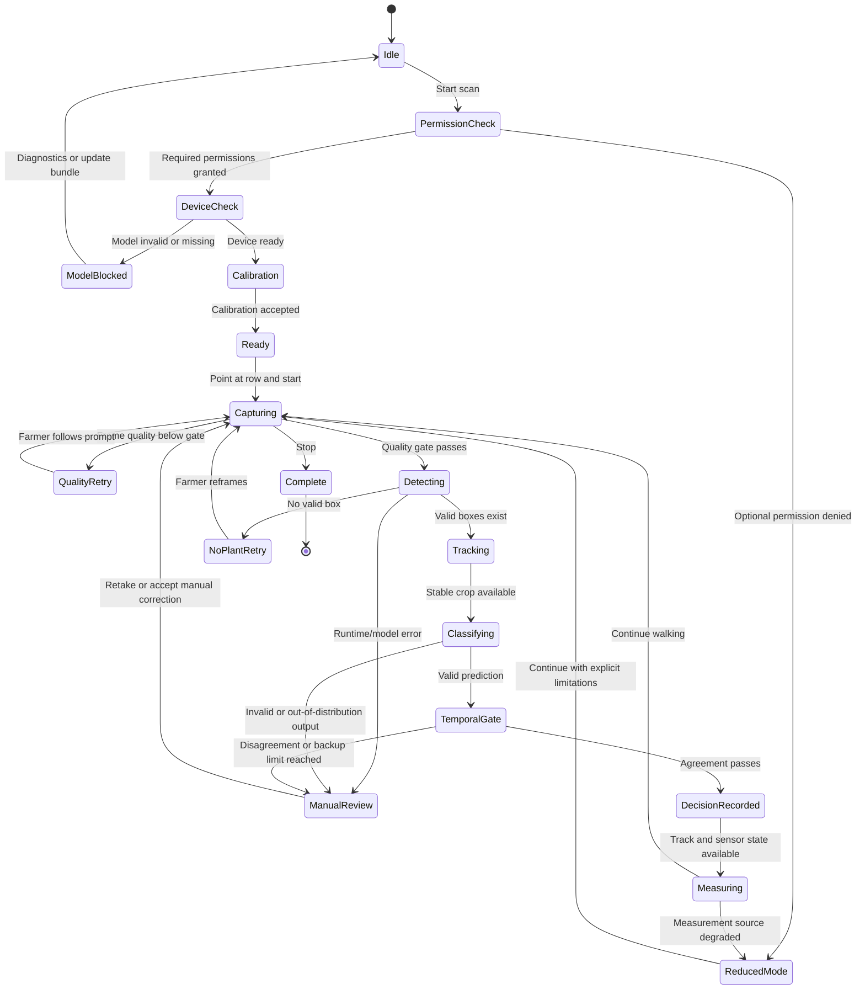

# Agribot Accuracy, Safety, and Farmer-First Guardrails

**Status:** Living capability contract, implementation blueprint, and release gate<br>
**Date:** 2026-08-02<br>
**Audience:** Agribot product, Android, ML, data, deployment, and field-pilot teams<br>
**Primary surface:** `agribot_android_app/android/`<br>
**Related documents:** [`FARMER_FOCUSED_IMPROVEMENT_GUIDE.md`](FARMER_FOCUSED_IMPROVEMENT_GUIDE.md), [`agribot_android_app/FIELD_PILOT_RUNBOOK.md`](agribot_android_app/FIELD_PILOT_RUNBOOK.md), [`agribot_android_app/README_APK.md`](agribot_android_app/README_APK.md)

This document defines how Agribot should remain trustworthy when the camera is
dirty, the light is poor, the phone is moving, GPS is unavailable, sensors are
missing, the model sees an unfamiliar plant, or the operator does not understand
what the app is asking them to do.

It is intentionally stricter than a feature list. A farmer should never receive
a confident-looking answer merely because the software had to return something.
When evidence is weak, the correct product behavior is to say what is weak, give
one clear recovery action, and preserve the observation for review.

---

## 1. The central product decision

Agribot must treat every automatic result as a chain of evidence, not as a single
model score:

```text
usable frame
  -> valid preprocessing
  -> valid detector output
  -> valid plant crop
  -> valid classifier output
  -> stable plant identity
  -> consistent multi-frame decision
  -> trustworthy position and measurement
  -> useful field summary
```

An automatic result is actionable only when the required links in that chain pass.
If a link fails, Agribot must **abstain, retry, or request human review**. It must
not silently substitute a default such as `Healthy`, `Uncertain`, zero metres, or
the previous plant's location.

### 1.1 What the farmer should experience

The farmer should not need to understand tensors, IoU, letterboxing, GPS accuracy,
or probability calibration. The app should translate technical states into one
short explanation and one next action:

| Technical condition | Farmer-facing meaning | One next action |
| --- | --- | --- |
| Frame blur too high | “Photo is not clear.” | “Hold steady.” |
| Plant partly outside frame | “Plant is cut off.” | “Move the phone slightly back.” |
| Detector has no valid box | “No plant found in this view.” | “Point at one plant.” |
| Classifier and frames disagree | “Agribot is not sure.” | “Take one more photo.” |
| GPS has no fresh fix | “Field position is approximate.” | “Continue scanning; GPS will retry.” |
| Motion sensor has no usable signal | “Distance cannot be measured reliably.” | “Walk normally or reset the walk.” |
| Model bundle is invalid | “Plant checking is unavailable.” | “Open diagnostics; do not scan.” |
| Storage is almost full | “Evidence cannot be saved safely.” | “Free space or turn off evidence.” |

The app may show technical detail behind a **Diagnostics** panel, but the main scan
screen should remain readable in bright sun and on a low-end phone.

---

## 2. Scope and non-goals

### 2.1 In scope

- Plant detection and bounding-box correctness.
- Classifier confidence, calibration, abstention, and temporal agreement.
- Plant identity, count, duplicate suppression, and occlusion handling.
- Phone sensor and GPS lifecycle, health, fallback, and measurement provenance.
- Field dimensions, plant-size estimates, and the limits of sensor-only estimates.
- Automatic field maps and the meaning of “leading problem.”
- Offline operation, optional future sync, privacy, and recovery.
- Farmer-facing language, voice, accessibility, permission education, and error UX.
- Test strategy, release gates, model governance, and field-pilot acceptance.

### 2.2 Explicit non-goals

Agribot must not promise any of the following without a separate agronomist- and
product-approved capability:

- A diagnosis that is guaranteed to be correct from one frame.
- Exact plant height, leaf area, or disease severity from GPS alone.
- Causal proof that one disease caused another field condition.
- Exact pesticide dosage, chemical selection, or legally binding treatment advice.
- Automatic cloud upload or background tracking during a normal offline scan.
- Silent model downloads or model replacement from an untrusted network.
- A precise field map for areas that were never scanned.
- A single “confidence percentage” that is presented as a measured probability
  before the model has been calibrated and validated on representative phones,
  crops, lighting, and field conditions.

---

## 3. Current baseline and truth boundary

The current native app already has a useful foundation:

- Native Kotlin/Compose Android application with on-device TensorFlow Lite
  inference.
- Detector and classifier assets are bundled locally and checked by a model
  manifest.
- The production manifest intentionally does not request `INTERNET`.
- Side Scan and Front Row Overview are separate workflows.
- Plant boxes are tracked with `PlantTracker`.
- Distance has a step/motion estimator and an optional GPS reference.
- Decisions use a multi-frame `PlantDecisionGate`.
- Local run storage and export exist.
- Existing regression coverage protects tensor layout, letterbox mapping, RGB
  preprocessing, sensor fallback, and confidence mapping.

The current verified evidence is still not the same as field accuracy. JVM tests,
image geometry tests, instrumentation compilation, and a successful APK build do
not prove that every physical phone will classify every field condition correctly.
The physical-phone pilot in `agribot_android_app/FIELD_PILOT_RUNBOOK.md` remains a
release gate for device-specific camera, thermal, GPS, motion, and performance
behavior.

The following files are the current repair anchors:

| Area | Current anchor | Guardrail implication |
| --- | --- | --- |
| Detector tensor layout | `ml/.../inference/DetectorTensorLayout.kt` and `TFLiteDetector.kt` | Reject unsupported shapes instead of guessing. |
| Detector preprocessing | `ml/.../inference/DetectorInputPreprocessor.kt` | Keep RGB, preserve aspect ratio, and invert padding exactly. |
| Detector output | `ml/.../inference/DetectorOutputParser.kt` | Reject non-finite scores and invalid boxes before tracking. |
| Classifier | `ml/.../inference/TFLiteClassifier.kt` and `ClassifierDecision.kt` | Normalize output safely and never relabel a valid high-score prediction as uncertain. |
| Crop path | `FrontCandidateClassifier.kt` and `FrontCandidateCropper.kt` | Do not apply the whole-frame mask a second time to a detector crop. |
| Motion/GPS | `featurescan/.../tracking/PlantTracker.kt` and `MotionDistanceEstimator.kt` | Report the active source and degrade explicitly when a signal is absent. |
| Decision lifecycle | `featurescan/.../SideScanViewModel.kt` and `PlantDecisionGate.kt` | Record only after temporal evidence passes. |
| Farmer workflow | `featurescan/.../AgribotScreens.kt` | Explain the next action instead of exposing implementation jargon. |

---

## 4. Trust model: four kinds of truth

Every displayed number and label should carry an internal provenance state. The
UI can simplify the wording, but the data model must not collapse these states.

| Type | Meaning | Example | Allowed wording |
| --- | --- | --- | --- |
| **Observed** | Directly measured or stored from the device. | Camera frame timestamp, sensor event, GPS fix accuracy. | “Observed” / no qualifier needed. |
| **Estimated** | Computed from observed inputs with known assumptions. | Walk distance from steps and calibrated step length. | “Estimated” or “Approx.” |
| **Inferred** | Model or rules infer a plant state from evidence. | Likely Early blight from several crops. | “Likely”, “Model result”, or “Needs check”. |
| **Recommended** | A human-facing next action based on an inferred state. | Inspect the underside of a leaf. | “Suggested check”, never “guaranteed treatment”. |

### 4.1 Source-of-truth rules

These rules are product invariants:

1. **Count comes from confirmed plant tracks, not frame detections.** A plant seen
   in ten frames is still one plant.
2. **Distance comes from a motion path.** GPS may correct or anchor that path when
   the fix is fresh and accurate; stale GPS must never overwrite a good sensor
   path with zero.
3. **GPS describes field position and field envelope.** GPS cannot measure the
   width of an individual leaf or plant.
4. **Plant size needs camera geometry and calibration.** Phone sensors can provide
   movement, tilt, and a scale reference, but true physical size cannot be
   recovered from accelerometer/step/GPS data alone. Without calibration, show a
   relative canopy estimate and its source, not a falsely precise centimetre value.
5. **A map reports observed distribution, not causality.** Use “leading observed
   issue” rather than “cause” unless a separate agronomic causal analysis exists.
6. **A missing value is different from zero.** `0 m` means measured zero; `unknown`
   means no trustworthy measurement was available. The UI must never use zero as a
   silent fallback.
7. **Raw evidence is immutable.** A manual correction creates a new event linked to
   the original observation; it must not rewrite the model output.

---

## 5. Canonical scan state machine

The app should implement one explicit state machine for both scan modes. The UI
can use friendly labels, but the state transitions must be deterministic and
testable.



### 5.1 Hard-stop states

The app must stop automatic classification and explain why when:

- The model file is missing, checksum-invalid, label-invalid, or incompatible
  with the runtime tensor contract.
- Input preprocessing cannot produce the model's declared dimensions.
- Detector or classifier output contains NaN, infinity, an impossible score, or an
  incompatible shape.
- No valid plant crop can be constructed.
- The local database cannot persist the run safely.
- A storage failure means the app cannot preserve the evidence needed to audit a
  result.

Hard-stop does not mean the app should crash. It means the scan is paused, the
failure is logged locally, and the farmer receives a recovery path.

### 5.2 Soft-degradation states

The app may continue counting and classifying while marking measurements as
limited when:

- GPS is disabled, unavailable, stale, or too inaccurate.
- Step permission is denied but linear acceleration is usable.
- Linear acceleration is unavailable but a raw accelerometer fallback is usable.
- The phone is hot or battery is low, but the runtime remains safe.
- An evidence-frame preference is disabled by the farmer.

The status must be visible in the scan summary and exported with each decision.

---

## 6. Capture-quality gate: protect the model from bad evidence

The highest-leverage accuracy feature is often refusing to classify a bad frame.
The capture gate should run before detector inference and return machine-readable
reasons rather than one generic “failed” value.

### 6.1 Signals to measure

Recommended signals:

- **Sharpness:** Laplacian variance or another deterministic blur measure.
- **Exposure:** percentage of very dark and very bright pixels.
- **Glare:** large clipped regions that hide leaf texture.
- **Motion:** frame-to-frame displacement and phone motion events.
- **Framing:** plant box is not cut off by the image edge.
- **Occupancy:** plant is large enough to classify but not so large that the leaf
  texture is missing.
- **Occlusion:** hand, bag, stake, heavy shadow, water drops, or another plant
  blocks too much of the crop.
- **Orientation:** frame rotation has been applied exactly once.
- **Freshness:** the frame timestamp is newer than the last processed frame.

Every signal should have three outcomes: `pass`, `retry`, or `block`. A numeric
quality score alone is not enough because the recovery action depends on the
failure reason.

### 6.2 Suggested recovery copy

Use one action at a time. Do not show a wall of warnings.

| Failure | English draft | Hindi draft for native-speaker review |
| --- | --- | --- |
| Blur | “Hold the phone steady.” | “फोन स्थिर रखें।” |
| Too far | “Move a little closer.” | “थोड़ा पास जाएँ।” |
| Too close | “Move a little back.” | “थोड़ा पीछे जाएँ।” |
| Cut off | “Keep the whole plant inside the box.” | “पूरा पौधा बॉक्स के अंदर रखें।” |
| Too dark | “Find more even light.” | “थोड़ी समान रोशनी में जाएँ।” |
| Glare | “Tilt the phone to remove the reflection.” | “चमक हटाने के लिए फोन थोड़ा झुकाएँ।” |
| No plant | “Point at one plant.” | “एक पौधे की ओर कैमरा करें।” |
| Disagreement | “Agribot needs one more clear photo.” | “एग्रीबॉट को एक और साफ़ फोटो चाहिए।” |

Translations must be reviewed by native speakers who understand farming terms.
Machine translation should not be the final authority for disease names or
treatment language.

### 6.3 Capture behavior

- Use CameraX `KEEP_ONLY_LATEST` semantics or an equivalent bounded queue. Never
  allow a slow model to build an unbounded frame backlog.
- Close every `ImageProxy` exactly once, including rejected frames.
- Do not count a plant or advance the cooldown for a frame rejected by the quality
  gate.
- When the phone is moving too quickly, pause inference and show “Move slower”;
  do not merely lower the confidence of a blurred frame.
- Keep a short, bounded evidence window for the last rejected frame so the farmer
  can retake without losing the current track context.
- Use a visible “Hold steady” ring or progress cue only while the app is actually
  waiting for a quality-passing frame.

---

## 7. Detector guardrails

The detector is the geometry foundation. A wrong box contaminates classification,
tracking, measurement, and the field map, so detector errors must fail early.

### 7.1 Make the model contract explicit

The manifest should declare, and startup validation should enforce:

- Input width, height, channel order, data type, and normalization.
- Output layout by name, not only by dimension heuristics. For example:
  `raw_yolo_features_first` for `[1,5,1344]` or `nms_xyxy_score_class` for
  `[1,candidates,6]`.
- Coordinate space: model pixels or normalized coordinates.
- Score semantics: probability, objectness, or combined confidence.
- Class count and label order.
- Minimum supported Android API, CPU delegate, and thread policy.
- SHA-256 for every model and label asset.

If the runtime sees a tensor layout not named in the manifest, it must report
“model bundle incompatible” and stop. Guessing based on whether a dimension is
large is acceptable only as a migration diagnostic, never as a production path.

### 7.2 Sanitize every output before NMS

For every candidate:

1. Confirm all required values are finite.
2. Confirm score is in the declared range.
3. Convert coordinates through the exact preprocessing transform.
4. Clamp to the original frame only after inverse mapping.
5. Reject non-positive width/height.
6. Reject impossible aspect ratios and boxes below the validated small-box gate.
7. Apply class-aware or class-appropriate NMS with a documented IoU threshold.
8. Cap the number of candidates to protect memory and latency.
9. Record the reason for every rejected candidate in diagnostics, not in farmer
   copy unless it affects the next action.

The sanitizer must be a pure, JVM-testable component. Add fuzz/property tests for
NaN, infinity, negative widths, huge coordinates, empty arrays, duplicate boxes,
odd image sizes, one-pixel borders, and mixed coordinate spaces.

### 7.3 Preserve geometry exactly

- Always use aspect-preserving letterbox preprocessing for the detector.
- Store the actual rounded resize dimensions and padding in a transform object.
- Map model-space boxes back through that transform; never map as if the frame had
  been stretched.
- Use one channel convention end to end. `RgbImage` should remain RGB unless a
  named conversion explicitly says otherwise.
- Keep detector crops in original frame coordinates and add only a small, bounded
  context pad.
- Test boxes that touch all four frame edges and boxes that sit entirely in the
  letterbox padding. Padding-only boxes must be rejected.

### 7.4 Detector fallback policy

If the detector fails, do not classify the full frame as though it were a plant.
The only safe fallbacks are:

- retry with a newer good-quality frame;
- ask the farmer to reframe;
- offer a manual crop/review flow;
- preserve the frame as a rejected evidence item if the farmer opted into it.

“No detector result” must never become “Healthy,” “one plant,” or a blank map
coordinate.

---

## 8. Classifier and confidence guardrails

### 8.1 Separate score, probability, and decision

The current UI and data model use the word “confidence” broadly. Internally,
separate these concepts:

- `rawModelOutput`: values exactly as returned by TFLite.
- `normalizedProbability`: only after the output contract is known and validated.
- `calibratedProbability`: probability adjusted against a held-out validation set.
- `decisionThreshold`: policy value for a particular crop, phone profile, and
  action risk.
- `decisionStatus`: `OK`, `UNCERTAIN`, `MANUAL`, or `SKIPPED`.

Until calibration is demonstrated, the farmer-facing copy should prefer:

```text
Likely Late blight
Model score: high
Evidence: 4 clear frames
Action: inspect this plant
```

Do not display `87%` as though it means “87% chance this diagnosis is correct” if
it is only an uncalibrated softmax score.

### 8.2 Add ambiguity tests

In addition to a top-1 threshold, inspect:

- top-1 vs top-2 margin;
- entropy or another ambiguity measure;
- whether the top label changes across adjacent good frames;
- whether the crop is outside the model's supported visual domain;
- class-specific validation performance.

High top-1 with a nearly equal top-2 is not strong evidence. A class-specific
policy may be safer than one global threshold because a false “Healthy” result and
a false disease alert have different field costs.

### 8.3 Preserve abstention correctly

- A label with valid evidence above the active threshold must not be overwritten
  with `Uncertain` by a later UI layer.
- A low score must remain uncertain even if the label string is non-empty.
- A missing or invalid label must remain unknown/uncertain; it must never default
  to `Healthy`.
- A decision gate must receive the same active threshold used by the classifier.
- Front Overview and Side Scan must use one policy source, not separate hard-coded
  thresholds.
- Any manual correction must preserve the original uncertain/model result and
  record who corrected it, when, and why.

### 8.4 Crop policy

The classifier should see the distribution it was trained for:

- Whole-frame scans may use the vegetation-mask crop path.
- Detector crops should be classified directly, with bounded context padding.
- Never mask a detector crop again unless the model contract explicitly requires
  that operation.
- Test red/brown disease pixels, green leaves, soil, sky, skin, and low-saturation
  objects through the same Android and training-side color logic.

---

## 9. Temporal evidence and plant identity

### 9.1 Decision gate policy

The current two-frame agreement plus backup frame is a good simple baseline, but
the gate should also require:

- the same stable track identity or a defensible crop overlap;
- acceptable quality for each contributing frame;
- a bounded time window so a decision cannot mix frames from different plants;
- no cooldown advancement until a decision is emitted or explicitly skipped;
- a documented reason such as `primary_agreement`, `backup_majority`,
  `low_confidence`, or `disagreement`.

If the farmer walks backward, pauses, or changes rows, reset the evidence window
instead of combining unrelated plants.

### 9.2 Tracking invariants

- A track ID must not jump between plants without an explicit identity reset.
- One frame can match at most one existing track.
- A new track must not immediately be counted as a new physical plant if it is a
  duplicate of an active nearby track.
- Occluded plants remain visible as “temporarily not seen,” not as healthy.
- Stale tracks expire deterministically and are retained in the run history as
  closed tracks, so exported counts remain auditable.
- Track confidence, label confidence, and geometry confidence are separate fields.
- The map must use confirmed track positions, not the last raw detector box from a
  failed frame.

### 9.3 Count vocabulary in the UI

Show distinct counters:

```text
Plants confirmed: 24
Needs another check: 3
Temporarily not visible: 2
Raw detections this run: 91   [diagnostics only]
```

Never show one number labelled “plants” if it mixes detections, tracks, and
decisions.

---

## 10. Sensor, motion, and GPS guardrails

### 10.1 Fallback hierarchy

The runtime should select the best **working** source, not the best sensor that
exists in the device catalogue:

```text
step detector events + calibrated step length
        -> linear acceleration integration
        -> accelerometer with gravity removal
        -> motion unavailable / measurement degraded
```

The presence of a step sensor is not proof that it is emitting events. The app
must observe events for a short window and automatically fall back when no events
arrive. Activity Recognition permission should be requested just in time and only
when the device exposes a step sensor that the scan can use.

### 10.2 Motion estimator safety

Acceleration integration drifts. It must therefore:

- clamp impossible `dt`, speed, and distance increments;
- apply a noise floor and bounded velocity decay;
- detect stationary periods and reset velocity toward zero;
- detect implausible jumps and mark the segment suspect;
- expose `motionEventsObserved`, `lastEventAge`, and `source`;
- avoid treating a long sensor silence as zero distance while still recording the
  silence as a quality problem;
- allow the farmer to press **Reset walk measurement** without deleting plants;
- checkpoint the path so an app pause/resume cannot duplicate distance.

Recommended farmer-facing statuses:

| Internal state | Farmer-facing status | Measurement behavior |
| --- | --- | --- |
| Step events fresh | “Walking distance active” | Use step path, optionally corrected by GPS. |
| Step permission denied, acceleration active | “Motion estimate active” | Use acceleration path; show approximate. |
| Sensors present but silent | “Motion signal weak” | Keep scanning/counting; mark distance degraded. |
| No usable sensor | “Distance unavailable” | Do not show zero as a measurement. |
| Implausible jump | “Measurement reset needed” | Exclude suspect segment and ask for reset. |

### 10.3 GPS policy

GPS is a reference and field-envelope source, not an individual plant-size sensor.

- Request location only when the farmer has enabled field reference.
- Use the best permitted provider available; keep provider identity in diagnostics.
- Record fix age, horizontal accuracy, provider, and whether the fix was accepted.
- Reject stale, inaccurate, impossible, or physically implausible jumps.
- Do not treat a missing GPS fix as `(0,0)` or as an empty field.
- Use GPS to bound or correct cumulative motion drift only when the fix passes the
  reliability gate.
- When GPS becomes stale, smoothly return to the motion path and mark the source
  as “phone sensors”; do not snap the map to a stale point.
- Stop location updates when the scan stops or the app is backgrounded.
- Never collect location in the background just because the app was installed.

### 10.4 Measurement source display

Every measurement card should show a short source line:

```text
Distance: approx. 18 m
Source: phone motion + GPS reference
GPS: fresh, accuracy 9 m
```

or:

```text
Distance: approximate
Source: phone motion only
GPS: not available
```

This is more honest and more useful than showing a precise number with no source.

---

## 11. Plant size and field dimensions

This is the area most likely to create a dangerous false sense of precision.

### 11.1 Separate the measurements

Store and display these separately:

1. **Walk distance:** integrated phone motion, optionally GPS-corrected.
2. **Field envelope:** width/length inferred from accepted GPS points and/or a
   calibrated motion path.
3. **Plant image size:** bounding-box width and height in pixels.
4. **Estimated canopy footprint:** image size converted using camera distance,
   orientation, and calibration assumptions.
5. **True physical plant size:** only when the calibration quality supports it.

GPS can help estimate the field envelope. It cannot turn a detector box into a
true plant dimension by itself.

### 11.2 Calibration modes

Offer three understandable modes:

| Mode | Setup | What Agribot may show |
| --- | --- | --- |
| Quick walk | Choose row spacing and plant spacing; walk normally. | Approximate path, row position, relative canopy size. |
| Guided field calibration | Walk a known distance or confirm a known row segment. | Better field envelope and position estimate. |
| Reference-object calibration | Place a known-size marker beside a representative plant. | Physical canopy estimate with a visible calibration confidence. |

If no calibration has passed, the UI must say **Relative size** rather than
**Plant size**. The export should include `calibrationStatus` and
`measurementConfidence`.

### 11.3 Prevent false precision

- Round approximate dimensions to a sensible resolution; do not display `0.4371 m`.
- Display an uncertainty band where possible, for example “about 0.4–0.6 m”.
- Do not update plant size on every noisy frame; smooth only within one stable track.
- Reject measurements made while the phone is tilted beyond the configured range,
  the plant is truncated, or the camera distance is unknown.
- Keep the last valid value with its timestamp and source; never replace it with
  zero when the next measurement fails.

---

## 12. Field map and “leading problem” logic

The farmer wants to know where to act. The map must therefore be simple, spatially
honest, and explicit about how much of the field was actually observed.

### 12.1 Required map layers

The first useful map should contain:

- scanned path;
- confirmed plant positions;
- healthy / likely issue / uncertain / not observed states;
- field boundary or envelope with a visibly different style from measured points;
- unscanned areas shown as unobserved, never as healthy;
- GPS quality and motion-only segments;
- row/plant identifiers when a row layout is configured;
- last scan time and coverage denominator.

### 12.2 Leading observed issue algorithm

Use a conservative aggregation:

```text
confirmed plants only
  -> exclude skipped and invalid-geometry observations
  -> group by normalized label
  -> count unique track IDs, not frames
  -> calculate issue rate over inspected plants
  -> attach coverage, quality, and uncertainty
  -> show a leader only when the sample and margin rules pass
```

Recommended policy, to be confirmed with an agronomist:

- A leader needs a minimum number of confirmed inspected plants.
- The denominator must be displayed: “Late blight: 6 of 31 checked plants.”
- A class with only one uncertain observation cannot lead the field.
- If the top two issues are too close, show “No clear leading issue.”
- A leader must remain stable across a re-scan or be marked “provisional.”
- Unscanned areas cannot contribute healthy or sick votes.
- Map interpolation must never create fake detections between two points.
- The headline should say **Leading observed issue**, not **Cause**, unless causal
  evidence is separately established.

### 12.3 Map copy

Good:

```text
Leading observed issue: Early blight
7 of 38 checked plants
Coverage: 2 of 5 rows
Confidence: provisional
Next: recheck the orange area before treatment
```

Bad:

```text
Cause of field problem: Early blight 87%
```

The second version hides the denominator, coverage, uncertainty, and difference
between a model result and a causal explanation.

---

## 13. Farmer-first interaction design for India

The primary user is outdoors, often in bright sun, possibly using one hand, with
limited time and potentially limited comfort with English or complex menus. These
are design assumptions to validate with real farmers, not stereotypes to encode
without testing.

### 13.1 One primary job per screen

The home screen should answer three questions immediately:

1. What field or row am I working on?
2. What should I tap now?
3. Is the app ready and trustworthy enough to scan?

Recommended primary navigation:

- **Start scan**
- **Continue previous scan**
- **Review results**
- **Export/share**
- **Settings and diagnostics** behind a secondary action

Do not expose advanced thresholds, thread counts, model IDs, or sensor jargon on
the first screen.

### 13.2 Permission education

Request permissions at the moment they become useful:

- Camera: required to scan; explain with “Needed to see plants.”
- Location: optional reference; explain with “Helps draw the field path.”
- Activity Recognition: optional motion fallback; explain with “Helps measure
  walking distance.”

If a permission is denied, explain what still works. A farmer should never infer
that the entire app is broken just because GPS was denied.

### 13.3 Language and literacy

- Ship a professionally reviewed Hindi experience first if that is the initial
  field cohort, then add region-specific language packs based on pilot locations.
- Keep disease names in a consistent glossary with local-language explanation,
  pronunciation, and a crop-specific “what to look at” phrase.
- Use large, short sentences and action verbs.
- Provide offline text-to-speech for critical prompts and optional spoken result
  summaries.
- Keep the English technical name available for agronomists and exports without
  forcing it onto the primary farmer screen.
- Do not translate disease names independently in different screens. Use one
  reviewed label catalog.
- Support units chosen by the farmer: metre/feet, acre/hectare, and regional land
  units only when the state-specific conversion is explicitly selected. “Bigha”
  is not a universal conversion and must not be treated as one.

### 13.4 Outdoor accessibility

- Sun mode with high contrast and no low-contrast tinted text.
- Never communicate health using colour alone; pair colour with text, icon, and
  shape.
- Touch targets at least 44 dp where layout allows.
- Strong focus and screen-reader semantics for every action.
- Dynamic text sizing without hiding the Start, Retake, Skip, Stop, or Review
  actions.
- Haptic confirmation for capture and decision, with a quiet-mode option.
- Avoid long animations and avoid requiring precise dragging.
- Use tabular numerals for changing counts and distances so the layout does not
  jump.
- Ensure the camera overlay and labels remain readable against soil, foliage, and
  bright sky.

### 13.5 Explain results without blame

Never say “You used the camera incorrectly.” Say:

```text
The plant is partly hidden.
Move back until the whole plant is visible.
```

The farmer should always have **Retake**, **Review later**, and **Skip with reason**
when a decision cannot be made.

---

## 14. Result cards and action safety

Every plant result should show the minimum evidence needed to decide what to do:

```text
Plant 12
Likely: Late blight
Evidence: 4 clear frames, stable box
Model evidence: high / calibrated later
Position: Row B, plant 12
Measurement: approximate; phone motion + GPS reference

[Take another photo] [Mark checked] [View details]
```

Details should include:

- model bundle ID and app version;
- frames used and temporal reason;
- detector score and classifier score as separate diagnostics;
- image-quality status;
- track/geometry confidence;
- sensor/GPS source;
- whether the result was automatic, uncertain, skipped, or manually corrected;
- a “why” explanation in farmer language.

Treatment guidance must be conservative:

- show “inspect,” “isolate/monitor,” or “ask a local agronomist” when appropriate;
- do not give chemical dosage from a classifier alone;
- show crop, disease, severity, and local-label assumptions before any future
  treatment guidance;
- preserve a manual note and photo for the farmer’s own record.

---

## 15. Offline-first and optional backend behavior

Normal scanning must remain fully local:

- no network request for camera inference;
- no network request for GPS, sensor, count, measurement, or map generation;
- no background upload;
- no automatic model download;
- no remote command that can alter a running scan;
- no requirement for an account or a server to open previous local runs.

If synchronization is added later, it should be an explicit user action with a
separate capability boundary:

1. Farmer taps **Export**, **Share**, or **Sync now**.
2. The app explains exactly what leaves the phone.
3. The farmer chooses Wi-Fi/mobile data if relevant.
4. A resumable, idempotent outbox uploads a signed export, not a live sensor stream.
5. The local original remains until the farmer confirms retention policy.
6. Failed uploads can retry without duplicating runs or decisions.
7. Model files are never accepted from the sync endpoint without signature,
   checksum, compatibility, and rollback validation.

Prefer a build flavor or explicit module boundary for online features so the
offline production APK cannot accidentally gain a network dependency. A local
LAN server used to distribute an APK is a deployment convenience, not a runtime
backend requirement.

### 15.1 Privacy defaults

- Store only the location precision required for the chosen field map.
- Do not collect location while no scan is active.
- Make evidence-frame retention visible and configurable.
- Use a clear local delete/export action for runs.
- Redact logs and diagnostics from raw image pixels, names, phone numbers, and
  unnecessary precise coordinates.
- Manual sharing must be visible and reversible where possible.

---

## 16. Local data and evidence model

The current run database should evolve toward an evidence-first record. A decision
should be reproducible from its local metadata without relying on a live server.

### 16.1 Recommended record fields

```text
Run
  runId, appVersion, modelBundleId, thresholdProfileId
  fieldId, rowId, startedAt, endedAt, scanMode
  calibrationId, unitProfile, privacyProfile

FrameEvidence
  frameId, timestampNanos, width, height, rotation
  sharpness, exposure, glare, motion, framing, qualityStatus
  retainedPath?, retentionReason?

DetectionEvidence
  detectionId, frameId, bbox, detectorScore, coordinateSpace
  preprocessorVersion, cropRect, finiteOutput, nmsGroup

PlantTrack
  plantId, firstSeen, lastSeen, trackState, identityQuality
  confirmedFrameCount, duplicateSuppressionReason

PredictionEvidence
  predictionId, plantId, frameId, rawLabel, rawOutputDigest?
  normalizedScore, calibratedScore?, top2Margin?, entropy?
  classifierThreshold, modelStatus, predictionStatus

MeasurementEvidence
  plantId, distance, size, fieldPosition
  source, gpsAccuracy, gpsAge, motionSource, calibrationStatus
  measurementConfidence, suspectSegment

DecisionEvent
  decisionId, plantId, label, status, action, reason, framesUsed
  automaticOrManual, operatorReason?, createdAt
```

Names can differ from the final Room schema, but the distinctions must survive in
exports. Do not overload one `confidence` field with detector, classifier,
geometry, and measurement quality.

### 16.2 Export invariants

- Every decision references a run and a plant track.
- Every automatic result has a model bundle ID.
- Every uncertain/manual result has a reason.
- Every physical measurement has a source and calibration state.
- Every map point has coverage status and coordinate quality.
- Corrections append events; they do not delete original model evidence.
- Export is atomic: write to a temporary file, validate, then promote.
- A failed export leaves the run intact and gives a retry path.

---

## 17. Model governance and dataset safeguards

### 17.1 Release a model bundle, not a loose file

Each model release should include:

- immutable bundle ID;
- classifier and detector files;
- labels and label order;
- input/output tensor contract;
- preprocessing and postprocessing versions;
- class-specific thresholds;
- calibration report;
- validation dataset fingerprint;
- phone/ABI/runtime compatibility;
- SHA-256 hashes and signing information;
- rollback target.

The app should refuse partial bundles. “Classifier updated but labels stayed old”
must be impossible to ship as a ready bundle.

### 17.2 Measure more than average accuracy

Every release candidate should report at least:

- detector recall and precision by plant size;
- detector false positives on soil, sky, hands, stakes, bags, and weeds;
- duplicate rate and track-switch rate;
- classifier precision/recall by disease and Healthy;
- confusion matrix with Healthy vs disease errors called out;
- calibration error and reliability curves;
- abstention rate and coverage;
- performance by phone model, resolution, lighting, motion, and crop stage;
- map leader stability after re-scan;
- sensor distance error against a measured walk;
- GPS acceptance/rejection rate and stale-fix behavior.

Do not report only a single test-set accuracy number. A model that is accurate on
clear close-ups but abstains or fails on walking frames is not ready for Side Scan.

### 17.3 Data collection and feedback

- Preserve uncertain and manually corrected examples as a review queue only with
  farmer consent.
- Record why a frame was uncertain: blur, crop, label disagreement, OOD, sensor,
  or geometry.
- Never auto-train on unreviewed farmer data.
- Remove duplicate frames before measuring dataset improvement.
- Split train/validation/test by field, date, and capture session where possible;
  otherwise the same plant or lighting setup can leak across splits.
- Include negative examples and difficult backgrounds.
- Maintain a native-speaker and agronomist glossary for labels and explanations.

---

## 18. Proposed accuracy targets and hard invariants

The following are **proposed pilot gates**, not claims about the current model.
They should be agreed with an agronomist and measured on representative field
data before being made contractual.

### 18.1 Hard invariants: zero tolerance

- Zero accepted non-finite model values.
- Zero invalid tensor-contract bundles presented as ready.
- Zero automatic decisions without a valid plant crop.
- Zero automatic decisions using a stale or mismatched track identity.
- Zero map points silently created for unscanned areas.
- Zero physical measurements without a source and calibration state.
- Zero background network activity during offline scanning.
- Zero silent conversion of missing data to numeric zero.
- Zero lost local runs after a recoverable app/process failure.
- Zero duplicate decision events after retrying the same export or sync operation.

### 18.2 Recommended quality gates for a pilot

Set the final values after baseline measurement, but begin with explicit gates for:

- visible-plant detector recall by size bucket and lighting condition;
- duplicate count rate and track identity switches;
- automatic decision precision for every disease class;
- calibrated probability error;
- abstention rate and manual-review rate;
- distance error on a measured course;
- field-envelope error with and without GPS;
- time-to-first-good-scan for a new farmer;
- recovery success after each common failure prompt;
- battery/thermal impact for a complete row scan;
- export integrity after app restart, low storage, and interrupted sharing.

Do not lower thresholds to improve a dashboard's number of decisions. If quality
gets worse, increase abstention and improve capture guidance first.

---

## 19. Test strategy: catch the bugs that look plausible

The most dangerous Agribot bugs produce believable output. Tests must therefore
target invariants and known failure modes, not just line coverage.

### 19.1 Pure unit tests

Required test groups:

- Tensor layout classification for every supported and unsupported shape.
- Letterbox resize and inverse mapping for landscape, portrait, odd, tiny, and
  edge-touching frames.
- RGB channel order and mask parity for green, red/brown, grey, blue, soil, and
  glare pixels.
- Output sanitization for NaN, infinity, out-of-range scores, negative boxes,
  duplicate boxes, and huge coordinates.
- Classifier probability normalization and threshold mapping.
- Top-1/top-2 ambiguity and abstention policy.
- PlantDecisionGate agreement, disagreement, backup, reset, and track-switch
  behavior.
- Tracker one-to-one matching, occlusion, duplicate suppression, stale expiry,
  and cooldown behavior.
- Motion estimator step path, acceleration fallback, stale events, noise, reset,
  impossible timestamps, and bounded speed.
- GPS reliability, stale fix, accuracy, provider fallback, jump rejection, and
  sensor-only continuation.
- Field-map aggregation, coverage denominator, leader tie, and unscanned areas.
- Unit conversion and region-specific land-unit configuration.

### 19.2 Model-integration tests

On a real TFLite runtime, execute the bundled model assets against:

- a deterministic synthetic image for startup health;
- known healthy and disease crops;
- online/public field-like frames;
- hard negatives and out-of-domain images;
- portrait and landscape camera frames;
- multiple crop sizes and edge positions.

Record latency, output shape, finite values, score range, candidate count, and
decision status. A model can “run” and still be unusable if it returns no boxes,
stretched boxes, or uncalibrated scores.

### 19.3 Sensor simulation tests

Build a deterministic event harness that can replay:

- normal step events;
- no step events but usable linear acceleration;
- no linear acceleration but raw accelerometer movement;
- stationary phone;
- phone rotation without translation;
- event timestamp gaps;
- permission denial;
- stale GPS, accurate GPS, inaccurate GPS, provider changes, and jumps;
- app pause/resume and scan reset.

The expected result is a status and a bounded measurement, not merely a non-zero
number.

### 19.4 Camera and UI tests

- Verify each rejected frame closes exactly once.
- Verify the UI never advances count/cooldown for a rejected frame.
- Verify camera, location, and activity permissions can be denied independently.
- Verify the app still scans with camera-only permission.
- Verify screen-reader labels, large text, sun mode, Hindi strings, and long
  translations do not hide primary actions.
- Verify the same failure has the same wording and recovery action in Side Scan,
  Front Overview, history, and export review.

### 19.5 Physical-phone matrix

Before a field-ready declaration, test representative devices across:

- Android API levels supported by the APK;
- arm64 low/mid/high performance tiers;
- camera rotations and aspect ratios;
- phones with and without step detector/linear acceleration/gyroscope;
- permission granted, denied, and revoked while the app is open;
- GPS disabled, cold start, weak signal, and network-only provider;
- low battery, thermal throttling, and low storage;
- Hindi and the first pilot-region language;
- bright sun, shade, glare, dust, wind, and walking motion.

An emulator can validate wiring. It cannot replace this hardware matrix.

---

## 20. Diagnostics and local observability

Diagnostics should make a field failure explainable without requiring a backend.

Each run should record a compact local summary:

- app version and model bundle;
- device model, API level, ABI, screen and camera analysis dimensions;
- active thresholds and calibration profile;
- frame quality rejection counts by reason;
- detector candidates, rejected candidates, and NMS counts;
- classifier latency and invalid-output count;
- decision-gate reasons and frames used;
- confirmed, uncertain, occluded, skipped, and duplicate tracks;
- motion source, event age, distance, reset count, and quality;
- GPS provider, accepted/rejected fixes, accuracy, stale time, and field envelope;
- battery/thermal/storage warnings;
- export and recovery failures.

The farmer sees a short summary. A support export can include the detailed version.
Do not log raw camera frames, precise location, names, or credentials by default.

Recommended diagnostic actions:

- **Run sensor check**: 10-second guided movement test.
- **Run camera check**: sharpness/exposure/frame-shape test without storing a photo.
- **Check model bundle**: checksum, tensor contract, labels, and synthetic invoke.
- **Export support report**: redacted JSON plus selected evidence only.
- **Reset measurement path**: resets motion integration, not plant history.

---

## 21. Architecture handoff

Keep policy pure and keep device mechanics at the edges.

| Module | Recommended responsibility | Test boundary |
| --- | --- | --- |
| `domain` | Decision policy, evidence states, measurement provenance, map aggregation, unit conversion. | Pure Kotlin unit tests; no Android imports. |
| `ml` | Model contract, preprocessing, output sanitizer, detector/classifier adapters, calibration metadata. | JVM golden tests plus TFLite integration tests. |
| `camera` | Camera lifecycle, bounded frame flow, YUV/RGB conversion, frame-quality signals. | Image conversion, lifecycle, and frame-closure tests. |
| `featurescan` | Scan session state machine, permission UX, tracking coordination, farmer actions. | ViewModel/state tests and Compose semantics tests. |
| `data` | Room persistence, immutable event append, export, local recovery, optional outbox. | Migration, atomic export, restart, and retry tests. |
| `designsystem` | Sun mode, contrast, typography, touch targets, status components, localization scaffolding. | Screenshot/semantics/accessibility tests. |
| `app` | Hilt wiring, manifest, release configuration, permissions, model assets. | Manifest, APK, instrumentation, and release smoke tests. |

Recommended domain capabilities:

- `CaptureQualityGate`;
- `ModelContractValidator`;
- `DetectionSanitizer`;
- `PredictionPolicy`;
- `TrackLifecyclePolicy`;
- `MotionMeasurementPolicy`;
- `GpsReliabilityPolicy`;
- `FieldMapAggregator`;
- `FarmerMessageResolver`;
- `RunRecoveryPlanner`.

Each should return immutable values and typed failure reasons. Avoid putting model
policy, persistence, or sensor mathematics directly in Compose functions.

---

## 22. Prioritized delivery plan

### P0: Trust and data safety

Do before expanding features:

- Enforce the explicit model contract and fail closed.
- Make all invalid outputs and missing measurements typed states.
- Add capture-quality gating and clear retry prompts.
- Make classifier, gate, and Front Overview thresholds come from one profile.
- Make sensor/GPS source and health visible in every relevant export.
- Ensure no frame, track, decision, or export is silently lost.
- Keep offline scan free of backend/network dependencies.
- Add regression tests for each bug found.

### P1: Accuracy under field conditions

- Add blur/exposure/glare/motion/occlusion signals.
- Add top-2 ambiguity and calibration reporting.
- Add stronger track identity and duplicate suppression.
- Keep the guided walk calibration and measurement reset covered by physical-phone acceptance tests.
- Add conservative leading-issue map aggregation with coverage denominators.
- Run the physical-phone and field-media matrix.

### P2: Native Indian farmer usability

- Ship reviewed Hindi copy for the full critical flow.
- Add pilot-region language selection and glossary.
- Add optional offline voice prompts and spoken summaries.
- Simplify the home screen to one primary action.
- Add accessible sun mode, large text, haptics, and screen-reader semantics.
- Run moderated usability sessions with farmers and field staff; measure whether
  they can start, recover a bad frame, understand an uncertain result, and export
  without technical assistance.

### P3: Controlled learning and optional sync

- Add opt-in uncertain/manual review queue.
- Add signed model-bundle rollout and rollback.
- Add explicit resumable sync/export only after local integrity is proven.
- Add agronomist review workflow and approved treatment-content governance.
- Add drift monitoring from consented, reviewed field samples.

### Features to postpone until the foundations pass

- Automated treatment prescriptions.
- Remote model updates.
- Causal field-disease claims.
- Exact plant-size promises without calibration.
- Gamification that rewards more detections instead of more reliable detections.
- Cloud dashboards that become a hidden dependency for scanning.

---

## 23. Open decisions that need a named owner

These are product or field decisions, not implementation details to guess:

1. Which crop and Indian regions are in the first physical pilot?
2. Which disease classes are safe for automatic “inspect” guidance, and which must
   always require human review?
3. What precision/recall and abstention trade-off is acceptable per class?
4. What minimum sample and margin make a field-map leader trustworthy?
5. What calibration method can farmers realistically perform in the pilot?
6. Which units and land-area conventions should be enabled by state/region?
7. Which two languages must be reviewed before the first field deployment?
8. What data may be retained locally, shared manually, or used for model review?
9. Which phone models and Android versions are in the supported hardware matrix?
10. Who owns agronomic content review and emergency correction of a bad label?
11. What is the field-pilot rollback plan if a model or release causes excessive
    uncertain results or duplicate counts?
12. What evidence is required before moving from “pilot” to “routine use”?

Until these are answered, keep the corresponding behavior conservative and label
it provisional in the UI and exports.

---

## 24. Definition of done for a field-ready release

Agribot is ready for a controlled physical pilot only when all of the following
are true:

- Model contract, assets, labels, hashes, and runtime self-test pass.
- Detector geometry and classifier crop golden tests pass.
- Invalid output and missing-signal tests pass.
- Capture-quality retry states are implemented and understandable.
- Count, track, decision, measurement, and map semantics are distinct in data and
  UI.
- Every displayed measurement has source and calibration status.
- No clear leader is shown when map coverage or evidence is insufficient.
- Offline scan works with no backend and no network permission.
- Permission denial and sensor/GPS absence have useful reduced modes.
- Local persistence survives process death, pause/resume, low storage, and export
  retry without duplicate decisions.
- All critical strings are reviewed in the first pilot language.
- Accessibility and sun-mode checks pass.
- Physical-phone model latency, thermal, battery, camera, GPS, and sensor checks
  pass on the supported matrix.
- A real field export is validated using [`FIELD_PILOT_RUNBOOK.md`](agribot_android_app/FIELD_PILOT_RUNBOOK.md).
- The pilot owner signs off on class-specific precision, recall, abstention, map
  coverage, and measurement-error gates.
- Rollback and support-report procedures are tested before the model is promoted.

The final release statement should say exactly which gates passed, which are
pending, and what the farmer should do when the app is uncertain. “The APK built”
is necessary evidence; it is not the definition of field readiness.

---

## 25. Short farmer promise

The product promise should be simple enough to translate and repeat:

> Agribot will show what it saw, tell you when it is not sure, explain what to do
> next, and never pretend that a missing measurement is a real zero.

That promise is the standard for every future model, sensor feature, map, backend
integration, and UI change.

---

## 26. Current implementation snapshot

The blueprint is now connected to concrete safeguards in the native app. This
section prevents the document from being mistaken for a claim that field
validation is complete.

### 26.1 Implemented safeguards

- CameraX analysis crops the YUV planes using the actual `ImageProxy.cropRect`,
  then applies rotation once before inference. Malformed plane buffers degrade to
  a quality-gated frame instead of crashing the analyzer.
- Detector output is finite-checked, score-bounded, geometry-checked,
  letterbox-inverted, NMS-filtered where applicable, and capped before tracking.
- Side Scan keeps every valid detector box for the overlay and track identity but
  bounds classifier work to the candidates nearest the phone centre. Unclassified
  boxes are explicitly detector-only and cannot become an actionable disease
  decision.
- Unknown, unfamiliar, and ambiguous classifier outputs remain review states even
  when a raw score is high. A previous track's confidence cannot leak into a new
  label.
- A plant count is based on confirmed multi-frame tracks. One-frame previews are
  shown as previews and are excluded from the leading-issue summary.
- Hardware step events are used when observed. If the advertised step stream is
  silent, acceleration events are used as a conservative step-like fallback;
  acceleration magnitude is not naively integrated into distance. Raw
  accelerometer fallback also activates when the linear stream is stale or
  repeatedly zero, and the gravity filter is seeded before motion is evaluated.
- The phone-only path has an optional guided walking calibration. The operator
  enters a known 3–100 m distance, walks it at a normal pace, and the app saves
  a stride only when at least three steps produce a realistic 0.35–1.50 m
  stride. Invalid, partial, backgrounded, or mid-run calibration never replaces
  the existing profile; the profile status and stride are persisted and exported
  for support. This improves distance estimates but does not turn them into a
  surveyed field dimension or make GPS unnecessary.
- Fresh GPS is a reference and field-envelope source. A first fix may truthfully
  report `0 m` as a zero-length anchor, but it cannot overwrite a non-zero phone
  motion path with zero. Stale, weak, or jumping fixes are rejected from the
  trusted path. Accepted fixes are projected into a bounded, run-local
  east/north path with provider and quality metadata. When GPS is unavailable or
  heading is not validated, the UI explicitly falls back to distance-only motion
  instead of inventing 2D positions.
- Absolute plant dimensions are not invented from GPS or walking distance. Until
  a reference-object/camera calibration is accepted, size is labelled relative
  to the frame and carries its source and quality.
- Diagnostics and exports preserve model, frame-quality, detection, decision,
  motion, GPS, and measurement provenance. GPS path snapshots persist bounded
  local coordinates in the append-only run event log without raw latitude or
  longitude. Missing data is serialized as missing, not as a misleading numeric
  default.
- Critical scan actions have English and Hindi resources, large touch targets,
  reduced-mode guidance, optional activity-recognition permission, visible
  diagnostics, and recovery actions. Native-speaker review remains a release
  gate for terminology and regional language choices.
- The Android manifest remains offline-first: no normal scan depends on a backend,
  and no network permission is required for local capture and inference.

### 26.2 Verification boundary

The following evidence is useful but deliberately limited:

| Evidence | What it proves | What it does not prove |
| --- | --- | --- |
| Pure Kotlin tests | Policy, geometry, parsing, motion fallback, and decision invariants. | Correctness on every camera/sensor vendor. |
| Android compilation/instrumentation compilation | Module contracts, resources, Room/export wiring, and APK integration compile. | Runtime thermal, permissions, camera, or sensor behavior on a physical phone. |
| Synthetic/public field-media stimulation | Frame quality, coordinate transforms, box bounds, and deterministic map/count rules. | Model generalization to unseen crops, diseases, phones, or lighting. |
| Signed debug/release APK metadata checks | Package IDs, embedded assets, manifest, and signing structure. | A field-ready accuracy or performance claim. |
| Physical-phone pilot export | End-to-end camera, motion, GPS, storage, and farmer workflow evidence. | Generalization beyond the tested phone/crop/region matrix. |

No release may be described as field-ready until the physical-phone pilot and a
real exported run pass the gates in Section 24. The correct interim label is
"controlled pilot candidate" when local verification passes but device evidence
is still pending.

### 26.3 Latest local verification record

On 2026-08-02, after the guided walking-calibration change:

- `:app:assembleDebug` and `:app:assembleRelease` completed successfully.
- `:domain:test`, `:data:test`, and `:feature-scan:testReleaseUnitTest` completed
  successfully; an independent Kotlin run covered 18 calibration, settings, and
  motion-estimator tests.
- `:app:compileDebugAndroidTestKotlin` completed successfully.
- The complete Python regression suite passed 62 tests. The field-media
  stimulation passed, but remains a geometry/frame-quality harness rather than
  an unseen-field accuracy claim.
- `aapt2` resource compilation passed, and the release APK contains the new
  English and Hindi walking-calibration strings.
- The signed APK readiness report is `development_ready=true` and
  `field_ready=false`. The remaining blockers are intentionally explicit: no
  physical-phone benchmark and no real field export bundle were available in
  this workspace. `adb devices` reported no connected phone.

### 26.4 Latest GPS reference-path verification record

On 2026-08-02, after the GPS path and distance-only fallback change:

- `:domain:test` passed, including four `GpsPathPolicyTest` cases covering local
  projection, invalid coordinates/accuracy, antimeridian wrap, sub-meter noise,
  and bounded history. `RunEventFactoryTest` passed 10 cases, including the
  privacy-preserving GPS path snapshot event.
- `:feature-scan:testReleaseUnitTest` passed after the path state and Compose map
  card were compiled. `:data:test` and `:app:compileDebugAndroidTestKotlin`
  also passed.
- `:app:assembleDebug` and `:app:assembleRelease` completed successfully. The
  current copied artifacts are:
  - debug SHA-256 `E0C59F5EDEED67E443417216E4B7DF9DF2105C95DA2FAD57DACD4FA1DF06D599`;
  - release SHA-256 `51312DA98B0CFC751607D6AB30CD166065A2FC60D7CB8B0D0524E7E6E9DA1001`.
- The Python regression suite passed 62 tests and public field-media stimulation
  passed. These remain local/geometry evidence, not a claim of unseen-field
  model accuracy.
- APK readiness remains `development_ready=true` and `field_ready=false`:
  physical-phone performance/sensor/GPS evidence and a real field export bundle
  are still missing. `adb devices` has no connected physical phone.

This record is local engineering evidence only. It does not waive the physical
phone, supported-hardware, real-field, native-speaker, or agronomist sign-offs
required by Section 24.

---

## 27. Additional fallback and guardrail contract

The safeguards above describe the minimum trustworthy product. This section
answers the harder operational question: **what should Agribot do when one part
of the evidence chain fails while the farmer is already in the field?**

The correct answer is not to force every capability to keep producing a number.
It is to keep the useful parts of the workflow alive while lowering the claim to
match the remaining evidence. A fallback may preserve continuity, but it must
never upgrade a weak signal into a stronger-looking result.

### 27.1 The monotonic fallback ladder

Every fallback must move down, or stay at the same level, in both quality and
claim strength. The app should preserve the original failure reason and expose
the active source in diagnostics.

| Capability | Preferred evidence | Safe fallbacks | What may continue | What must never happen |
| --- | --- | --- | --- | --- |
| Camera frame | Sharp, well-exposed frame with a complete plant | Wait for a newer frame; change angle/light; manual crop/review | The scan coach and already-confirmed tracks | Classify a blurred, cut-off, or stale frame because the farmer is waiting |
| Plant detection | Valid detector box in original-frame coordinates | Reframe; retry; manual review of a retained frame | Camera preview and “no plant found” guidance | Treat the whole frame as one plant or turn no box into Healthy |
| Plant classification | Valid crop, calibrated model output, temporal agreement | Use another good frame; mark Unknown/Needs review; farmer or agronomist correction | Confirmed detection and evidence capture | Reuse the previous plant’s label or turn a high raw score into a guaranteed diagnosis |
| Count | Confirmed multi-frame track identity | Conservative association; mark occluded; manual “already counted” action | A lower-bound confirmed count | Count every detector box or every video frame as a new plant |
| Walk distance | Fresh step detector events with a valid stride profile | Linear-acceleration pulses; raw-accelerometer pulses; calibrated short-course reset | Approximate one-dimensional distance with source label | Naively integrate acceleration noise, report a stale value as fresh, or show missing as zero |
| 2D field path | Accepted GPS fixes with age and accuracy checks | GPS plus a validated row/heading reference; show distance-only motion segments | GPS reference path, envelope, or a clearly labelled distance-only scan | Invent east/north positions from distance alone or snap to a stale GPS point |
| Plant size | Camera geometry plus an accepted reference object/calibration | Relative box/canopy size; Unknown physical size | A relative size comparison within a stable track | Convert GPS distance or field dimensions directly into leaf/plant centimetres |
| Field boundary | Accepted GPS path or a surveyed/known-length boundary | Guided walk with known distance; farmer-drawn boundary; “boundary unavailable” | A bounded approximate envelope with uncertainty | Present an unscanned or extrapolated area as surveyed field truth |
| Local record | Append-only Room/evidence event | Atomic temporary export; recovery queue; support bundle | A recoverable local run | Drop a decision silently, overwrite model evidence, or duplicate an event on retry |
| Backend | No backend required for scan | Explicit Export/Share/Sync action; resumable idempotent outbox | Local scan, history, map, and export | Upload in the background, require an account, or make live inference depend on connectivity |

This ladder should be represented in the domain model rather than inferred from
nullable UI fields. A farmer-facing status such as “approximate” must be backed
by a source, timestamp/age, quality state, and reason code.

### 27.2 Capability status must be composable

Do not use one global `confidence` value for the entire app. A result can have a
strong detector box, an uncertain disease label, an approximate distance, and no
GPS path at the same time. The UI should combine these independent states into a
short explanation:

```text
Plant found: confirmed
Condition: needs another clear view
Distance: approximate, phone motion
Field path: GPS reference unavailable
Size: relative only
```

Recommended typed states are:

- `UNAVAILABLE`: no trustworthy evidence exists;
- `OBSERVED`: directly observed or persisted without an estimation step;
- `ESTIMATED`: computed from a known but imperfect assumption;
- `REFERENCED`: anchored to an accepted GPS or field reference;
- `CALIBRATED`: derived using an accepted calibration procedure;
- `SUSPECT`: a signal exists but failed a plausibility or freshness check;
- `REVIEW_REQUIRED`: the app must not turn the evidence into an automatic action.

State transitions must be monotonic within one event. A later sensor failure may
degrade a value to `UNAVAILABLE` or `SUSPECT`, but it must not erase the earlier
source metadata. A later good frame may create a new observation, but it must not
rewrite the old rejected frame.

### 27.3 Every fallback needs one recovery action

Fallback design is incomplete if it only changes a label. Each failure should
have:

1. a machine-readable reason;
2. a short farmer-facing explanation;
3. exactly one recommended next action;
4. a safe continuation state;
5. a support diagnostic event;
6. a test that proves the app does not silently promote the fallback.

If the same issue repeats, the prompt should become more helpful rather than more
urgent: after repeated blur, show a steadier-hold illustration or suggest moving
slower; after repeated GPS rejection, explain that scanning can continue without
the map; after repeated model abstention, offer manual review instead of showing
the same percentage again.

---

## 28. High-value accuracy features to add

These are the additions most likely to improve real-world accuracy without
pretending that a sensor or model can measure something it cannot observe.

### 28.1 A pre-scan readiness check

Before the farmer enters the live camera screen, run a short, local readiness
check and show a simple result:

- model bundle checksum, labels, tensor contract, and synthetic invoke;
- camera availability, rotation, analysis resolution, and frame delivery;
- available motion sensors and whether they have emitted fresh events;
- location permission/provider state if the farmer enabled field reference;
- writable storage and available free space;
- battery and thermal warnings;
- selected language, unit profile, and calibration profile.

The check should not block a reduced mode unnecessarily. For example, a missing
GPS fix should show “camera and phone-distance scan ready; field map will be
limited,” while an invalid model bundle must stop automatic detection. The check
must run again after process recreation because hardware and permissions can
change while the app is open.

### 28.2 A capture coach that selects evidence, not just frames

The viewfinder should help the farmer create a classifiable crop:

- show a centre guide for one plant, with a larger tolerant target for leaves and
  plants that naturally spread;
- show “move closer/back” from plant occupancy, not from a fixed pixel guess;
- use a short burst and retain only the best quality frame for classification;
- require two or more nearby good frames for confirmation, but do not count the
  burst as multiple plants;
- pause inference while the frame is moving too quickly;
- detect edge truncation and ask for the whole plant only when the workflow needs
  a whole plant;
- distinguish “no plant” from “plant too dark/blurred/occluded”; and
- let the farmer tap **Mark for review** without forcing a made-up label.

Burst selection must be bounded in memory and time. It should not become a hidden
video recorder. Evidence retention must obey the farmer’s privacy setting.

### 28.3 Domain-aware model abstention

Add an explicit unfamiliar-input path rather than squeezing every image into one
of the known labels. Useful signals include:

- top-1/top-2 margin and entropy;
- class-specific thresholds;
- disagreement across adjacent quality-passing frames;
- crop occupancy and edge truncation;
- colour/texture distribution far outside the validated dataset;
- invalid or unstable model outputs; and
- a model-bundle crop/camera compatibility check.

Optional test-time augmentation may be used only if it is validated as a separate
policy. It must not hide disagreement: if transformed views disagree, preserve
`REVIEW_REQUIRED`. A high score is not a reason to suppress an unfamiliar-input
flag.

The result card should separate three questions:

```text
Did Agribot find a plant?       Yes, confirmed
What does the model suggest?   Likely early blight
Should the farmer act on it?   Inspect again before treatment
```

This prevents a technically successful inference from being mistaken for an
agronomic prescription.

### 28.4 Stronger track and duplicate protection

Plant identity should be treated as a first-class safety feature. Add or retain:

- a track lifecycle of preview → candidate → confirmed → occluded → expired;
- one-to-one assignment per frame with a distance/IoU gate;
- a cooldown after a confirmed plant leaves the centre zone;
- a row-direction or scan-direction hint when the farmer configures a row;
- explicit duplicate suppression when the camera reverses direction;
- a “plant already counted” manual action that appends a correction event; and
- an identity-switch diagnostic whenever the label or box jumps to another track.

When identity is uncertain, the app may display a detector overlay but must not
increment the confirmed count or add a second map point.

### 28.5 Sensor health and cross-checks

The app should expose a sensor-health score built from observable facts, not from
the mere existence of a sensor object:

- event freshness and timestamp monotonicity;
- event rate and repeated-zero watchdog;
- stationary detection while the farmer says they are moving;
- bounded speed and acceleration pulses;
- reset count and rejected-segment count;
- step-length profile and calibration age; and
- agreement or disagreement with fresh GPS displacement.

Cross-checking should be conservative. GPS can flag a large mismatch, but it
should not automatically overwrite a valid short phone-motion segment when GPS is
noisy. A mismatch should create a suspect segment, show “measurement needs a
reset,” and preserve both raw sources for support.

The reset action must be scoped:

- **Reset measurement path** clears the current motion/GPS reference and starts a
  new segment;
- it does not delete plant tracks, decisions, or the run;
- it records the reason and the time;
- it requires a clear anchor or guided restart before showing a new distance.

### 28.6 GPS as a reference layer, not a size sensor

GPS should be useful even when it is imperfect, but its limits must be encoded:

- record provider, fix age, horizontal accuracy, accepted/rejected reason,
  latitude/longitude validity, and jump distance;
- accept a first fix as a zero-length anchor only when its quality passes;
- store a bounded path of accepted fixes in a local coordinate system;
- show one GPS reference path and separate motion-only segments;
- use an envelope or polygon only when enough accepted points surround it;
- mark the field boundary as approximate until it closes or is confirmed; and
- stop location updates when scanning stops or the app is backgrounded.

When the device has no trusted heading, a sensor distance value can remain useful
as a one-dimensional walk estimate but cannot provide a truthful 2D position. A
compass/gyro heading may be used for row-relative mapping only after its quality,
magnetic interference, and reset behavior have been validated on the supported
phone matrix. Otherwise the map must say “distance only” instead of drawing a
false path.

### 28.7 Two-stage plant-size calibration

Plant size should have two separate features:

1. **Relative size now:** detector-box width/height and canopy fraction within a
   stable track, labelled relative and useful for comparing plants captured at a
   similar distance.
2. **Physical size after calibration:** a known-size reference marker, known
   camera distance, or an approved camera-intrinsics/depth procedure, with an
   uncertainty band and calibration expiry.

The farmer should be able to skip physical calibration and still scan. In that
case, no screen, export, or map may use a centimetre/metre plant-size value. GPS
may estimate the field envelope; it cannot determine the plant’s physical width
from a bounding box.

Calibration guardrails:

- reject a marker that is partly hidden, tilted beyond the validated range, or
  smaller than the camera can resolve;
- verify the marker size and units twice before saving;
- retain the original calibration image or digest only when consented;
- expire calibration after camera change, crop/view change, or a configured time;
- show “calibration needed” after a large change in camera distance or angle; and
- allow a farmer to reset calibration without deleting the run history.

### 28.8 Coverage-aware map and leading observed issue

The map should compute a lower-risk summary from evidence, not from colour alone:

- denominator = unique confirmed plants with an inspected/valid decision;
- coverage = observed plants/rows/area versus the configured field plan or
  accepted boundary, with “unknown” when the denominator is unavailable;
- healthy, issue, uncertain, not observed, and motion-only states remain distinct;
- a leader needs a minimum sample, a minimum margin over the runner-up, and a
  stable result across a recheck;
- show issue count and denominator, not only a percentage;
- use a conservative interval or lower-bound rule when sample size is small;
- require spatial clustering before calling an area a hotspot;
- never interpolate a plant between two observations;
- never call an unscanned area healthy; and
- say **leading observed issue**, never **cause**, unless a separately reviewed
  causal method exists.

An example of a safe result is:

```text
Leading observed issue: possible early blight
6 of 31 confirmed plants need inspection
Coverage: 2 of 5 planned rows
Map quality: GPS reference for 38% of the path; distance-only for the rest
Status: provisional — recheck the orange cluster
```

The word “possible” and the denominator are not cosmetic. They prevent a farmer
from treating a small, biased sample as a diagnosis of the entire field.

---

## 29. Farmer-first features for Indian field conditions

Accuracy is partly a human-factors problem. A farmer who cannot understand a
prompt will generate bad evidence even when the model and sensor mathematics are
correct. The interface should reduce cognitive load without hiding uncertainty.

### 29.1 The first-minute flow

The first run should have a guided path that can be completed without reading a
manual:

1. Choose crop/field or create a local field name.
2. Choose language and units.
3. Explain camera, optional GPS, and optional activity permission in one sentence
   each; request them only when needed.
4. Run the readiness check.
5. Offer optional 3–100 m walking calibration with a visible skip button.
6. Show one illustrated example of a good plant view.
7. Start scan with one primary button.

The farmer must be able to skip GPS, calibration, language audio, and advanced
setup without being trapped. Skipping must change the accuracy wording, not make
the app appear broken.

### 29.2 Language, glossary, and voice

Support should be designed around a reviewed language catalog, not independent
strings scattered across screens:

- one stable glossary for crop, plant part, disease, “uncertain,” “inspect,” and
  “not observed”;
- Hindi plus the first pilot-region language reviewed by native speakers and an
  agronomist familiar with that region;
- short text paired with a clear icon and a spoken version for critical prompts;
- offline text-to-speech where the device supports it, with a visible mute option;
- technical English label available in details/export for field staff; and
- a safe fallback to the reviewed default language if a translation key is
  missing, never a blank card or an untranslated machine-generated diagnosis.

Do not rely on colour alone. Pair red/amber/green with text, shape, pattern, or
icon because sunlight, colour-vision differences, and inexpensive displays can
make colours unreliable.

### 29.3 Sun, dust, heat, and one-handed use

Add an outdoor mode with:

- high-contrast surfaces and text;
- large touch targets and a persistent primary action;
- no essential action hidden behind a small icon;
- readable status chips at arm’s length;
- optional haptic/voice confirmation after capture;
- a lens-clean reminder after repeated blur/glare failures;
- thermal/battery messaging that pauses safely rather than corrupting a run;
- low-power analysis settings that preserve the same decision policy; and
- pause/resume that retains the run without claiming that a paused interval was
  scanned.

### 29.4 Understandable result cards

Every result should answer, in this order:

1. What did Agribot see?
2. How sure is the evidence, and why?
3. Where/when was it seen?
4. What should the farmer do next?

For example:

```text
Plant 12 — needs another look
The camera found a plant, but two clear views disagreed.
Location: row 2, near the current scan path
Next: take one closer, steady view; do not treat from this result alone.
```

The result must offer **Retake**, **Mark for review**, and **Continue** when
appropriate. “Uncertain” without a recovery action is not an acceptable UX.

### 29.5 Local measurements and practical units

Let the farmer choose a small, validated unit profile once. Display approximate
values with sensible rounding and familiar land units where the pilot has approved
the conversion. Keep the canonical SI value in export, along with the unit
profile and conversion version.

Never show a precise decimal merely because the internal float has one. “About
18 m” or “approximately 0.4–0.6 m” communicates the evidence better than
“18.037 m” or “0.4371 m.”

### 29.6 Low storage, offline, and interrupted-session recovery

The app should proactively protect evidence:

- warn before storage becomes too low to write the next event;
- offer “keep results, discard optional images” before deleting anything;
- write events atomically and rebuild an interrupted run on next launch;
- show the last successfully saved timestamp;
- allow export to a local file or share sheet without a backend;
- retry exports idempotently and never duplicate decisions; and
- make deletion explicit, scoped, and recoverable where the platform allows it.

If a process dies after the model decision but before the UI updates, the local
event ledger should be the authority on restart. The UI must reconcile from the
ledger instead of blindly replaying the last frame.

### 29.7 Backend only when the farmer asks

The safest architecture is an offline scan build that does not contain a normal
runtime network dependency. If a future product needs sync:

1. the farmer taps **Sync now**, **Share**, or **Upload this report**;
2. the app lists what will leave the phone, including approximate or precise
   location and images;
3. the farmer confirms the network and retention choice;
4. a signed, encrypted, resumable, idempotent export is uploaded;
5. the local run remains available until the farmer explicitly removes it;
6. errors show a retry path and never erase the local evidence; and
7. model bundles are accepted only after signature, checksum, contract, and
   rollback checks.

No backend should be able to start the camera, enable tracking, change thresholds,
or replace a model silently. A local LAN address can distribute an APK or receive
an explicit export, but it must not become an invisible runtime dependency.

---

## 30. Operational and model-governance guardrails

### 30.1 Release a signed, reversible model bundle

Every detector/classifier release should carry an immutable bundle ID, labels,
input/output contract, preprocessing version, threshold profile, calibration
report, validation fingerprint, supported-device notes, SHA-256 hashes, signature,
and rollback target. The app must fail closed on a partial or incompatible bundle.

Do not silently change a threshold, label order, or preprocessing rule through a
remote configuration. A change that can affect a farmer’s result must be versioned
and included in the export.

### 30.2 Measure error where the farmer experiences it

Release evaluation should be stratified by:

- crop, variety, growth stage, and disease severity;
- field, date, operator, and capture session;
- phone model, camera aspect ratio, Android version, and performance tier;
- sun, shade, glare, dust, wind, blur, occlusion, and background;
- plant size and position in the frame;
- detector recall/precision, duplicate rate, identity switches, and box geometry;
- classifier precision/recall, Healthy-versus-disease confusion, calibration,
  abstention, and manual-review rate;
- distance error, GPS acceptance/rejection, path coverage, and envelope error;
- result-map leader stability after a re-scan; and
- battery, heat, frame latency, storage, and recovery behavior.

Split evaluation by field and session, not only by image. Near-duplicate frames
from the same plant can otherwise make a weak model look reliable.

### 30.3 Consent-based learning loop

Uncertain or manually corrected observations are valuable, but they must not
become automatic training data:

- retain them only with clear farmer consent;
- preserve the original model result and correction reason;
- strip unnecessary identity and precise-location data;
- review labels with a qualified agronomist/native speaker where relevant;
- deduplicate and split by field/session before measuring improvement; and
- require a new signed bundle and rollback plan before promotion.

The app should never reward the model for reducing the Unknown count unless the
new labels are demonstrably correct. Lower abstention is not the same as higher
accuracy.

### 30.4 Support and incident response

Add an offline support report that contains a redacted run summary, app/model
versions, device/runtime details, failure counters, measurement sources, and event
IDs. Raw photos and precise coordinates should be opt-in.

For a suspected bad release:

1. stop promotion of the bundle;
2. preserve affected local exports;
3. compare the support report against the last known-good bundle;
4. roll back without deleting farmer history;
5. notify field staff in the reviewed language; and
6. add a regression case before the next release.

### 30.5 Anti-gaming guardrail

Do not optimize the product for “number of detections,” “percentage classified,”
or “fewest uncertain cards” in isolation. Those metrics can reward false boxes,
duplicate counts, and unsafe guesses. The primary quality dashboard should pair
coverage with precision, abstention, identity integrity, map coverage, and
farmer-confirmed usefulness.

---

## 31. Verification matrix for the added safeguards

Each safeguard needs an observable test and an evidence tier. Passing a JVM test
does not satisfy a physical-device gate; passing an emulator test does not satisfy
a real-field gate.

| Scenario | Expected behavior | Minimum evidence |
| --- | --- | --- |
| Invalid model shape/hash/labels | Automatic scan blocked; clear diagnostics; no crash | Unit + APK startup smoke |
| NaN/infinite/negative detector output | Candidate rejected; no count or map point | Parser/property tests |
| Blurry, dark, glare, or cut-off plant | One actionable retake prompt; no decision | Camera/frame-quality tests + physical phone |
| Detector box but classifier disagreement | Detector overlay may remain; state is review/uncertain | ML integration + UI semantics test |
| High raw score with unfamiliar/ambiguous crop | No automatic treatment-style conclusion | Classifier policy test + held-out OOD set |
| Same plant across many frames | One confirmed track, not many counts | Tracking replay test + field video |
| Plant leaves and re-enters view | Duplicate protection or explicit review state | Tracking replay + physical walk |
| Step stream silent | Acceleration fallback or distance unavailable; never zero masquerade | Sensor simulation + supported phones |
| Sensor events freeze or timestamps jump | Watchdog downgrades/reset prompt; no unbounded distance | Sensor simulation |
| Fresh accurate GPS | Reference path/envelope can update; source is visible | Location replay + physical phone |
| Stale/inaccurate/jumping GPS | Fix rejected; motion-only continuation; no snap-to-zero | GPS policy tests + field walk |
| GPS unavailable | Scan/count continue; path marked unavailable or distance-only | Permission/device tests |
| No validated heading | No invented 2D sensor path | Domain policy test |
| No size calibration | Relative size only; no physical unit | Domain/export test |
| Reference marker invalid | Calibration rejected without replacing old profile | Calibration tests + physical camera |
| Partial field scan | Unscanned area remains unobserved; no clear leader if evidence is weak | Map aggregation test |
| Tied or tiny issue sample | “No clear leading observed issue” or provisional result | Map statistics test |
| Low storage/process death | Run recovers or stops before data loss; export retry is idempotent | Instrumentation + fault injection |
| Backend not requested | No network activity and no permission dependency | Manifest/static inspection + runtime network check |
| Explicit sync retry | Same run/event IDs, no duplicates; local original remains | Integration/outbox test |
| Hindi/region-language missing key | Reviewed default-language fallback; no blank/unsafe label | Resource and UI tests + native-speaker review |
| Large text/sun mode | Primary action/status remains visible and usable | Accessibility/physical-display checks |
| Model release regression | Promotion blocked or rollback available | Evaluation report + signed bundle test |

### 31.1 Public and online media are regression evidence only

Online field images or videos can be useful for deterministic stimulation of
cropping, box geometry, frame quality, tracking, and map aggregation. They are not
proof of generalization because licensing, compression, camera viewpoint, crop,
and label quality may differ from the pilot.

For every media item used in testing, record its source/license, download hash,
frame extraction settings, expected geometry if known, and whether it was used for
development or held out for evaluation. Do not train on evaluation media. A public
media test may move a local regression gate from failing to passing; it may not
move the release from “controlled pilot candidate” to “field-ready” by itself.

### 31.2 Evidence levels

Use these labels in release reports:

- **Level A — static/unit:** pure policy, geometry, parser, persistence, and
  serialization invariants;
- **Level B — runtime/emulator:** Android wiring, permissions, resources, APK,
  lifecycle, and bounded inference behavior;
- **Level C — physical phone:** camera, sensors, GPS, thermal, battery, storage,
  and permissions on named devices;
- **Level D — real field:** farmer workflow, field export, agronomic review,
  map coverage, accuracy, and recovery under actual conditions.

The release label must state the highest level achieved and list every missing
level. “Build passed” is Level B evidence at most.

---

## 32. Recommended implementation order

The order matters because user-facing polish cannot compensate for an unsafe
measurement or model contract.

### P0 — preserve trust

- Keep missing values distinct from zero across domain, UI, database, and export.
- Keep invalid model outputs, stale tracks, and impossible sensor/GPS segments
  fail-closed.
- Ensure every fallback has a reason, source, next action, and regression test.
- Preserve append-only evidence and atomic recovery across process death and
  export retry.
- Keep scanning local and backend-free unless the farmer explicitly starts an
  external action.

### P1 — improve field accuracy

- Add the readiness check and capture-quality coach.
- Add bounded GPS path points with provider/age/accuracy and motion-only segment
  status.
- Add explicit “distance-only” behavior when heading is not validated.
- Add reference-object size calibration while keeping relative-size fallback.
- Add coverage-aware leading-observed-issue statistics and spatial clustering.
- Complete physical-phone sensor, camera, GPS, and thermal acceptance tests.

### P2 — make the safe path easy

- Finish reviewed Hindi and pilot-region language coverage.
- Add offline voice prompts, haptics, sun mode, large text, and colour-independent
  status cues.
- Add guided row setup, pause/resume, low-storage recovery, and manual review.
- Test the first-minute flow with farmers who did not build the app.

### P3 — controlled operations

- Add consented support exports and an agronomist review queue.
- Add signed model bundles, canary promotion, rollback, and drift reports.
- Add opt-in, resumable, idempotent sync only after offline integrity is proven.

Do not add treatment prescriptions, causal disease claims, silent remote model
updates, or gamification based on detection volume until the earlier gates pass.

---

## 33. Non-negotiable product decisions

These decisions should remain true even if a future model, backend, or UI rewrite
changes the implementation:

1. **A lower-quality fallback is better than a confident fabrication.**
2. **GPS can anchor field position and envelope; it cannot measure plant size from
   a camera box.**
3. **Sensors can estimate movement; they cannot provide a truthful 2D path without
   a validated direction reference.**
4. **A model score is not a diagnosis, and a map leader is not proof of cause.**
5. **Uncertainty must have an action, not just a warning.**
6. **Offline scanning is the default; the backend is an explicit user action.**
7. **Every important result must be explainable from local evidence after the
   phone goes offline.**
8. **No release is field-ready until physical-device and real-field evidence is
   recorded.**

Production-grade should mean fail-closed, observable, recoverable, reversible,
and validated on the devices and fields where farmers will use the app. It should
not mean claiming that software can have literally zero defects or that a local
simulation proves every real-world condition.

---

## 34. Final feature checklist

Before promoting a future release, ask:

- Can the farmer complete a scan when GPS, step detection, network, or language
  audio is unavailable?
- Does the app visibly explain which evidence source is active?
- Can every “uncertain” result be retaken, reviewed, or safely skipped?
- Can a repeated frame or reverse walk create a duplicate plant?
- Can any path, field boundary, or size value be drawn without a valid source?
- Can an invalid model, low-storage condition, process death, or export retry lose
  or duplicate a decision?
- Can a backend start work or change a model without the farmer explicitly asking?
- Does the leading issue include denominator, coverage, spatial evidence, and a
  provisional state when appropriate?
- Are Hindi and regional terms understandable to the actual pilot farmers?
- Which claims are still only Level A/B evidence, and who owns the Level C/D gate?

If any answer is unclear, the feature is not ready to be presented as reliable.
