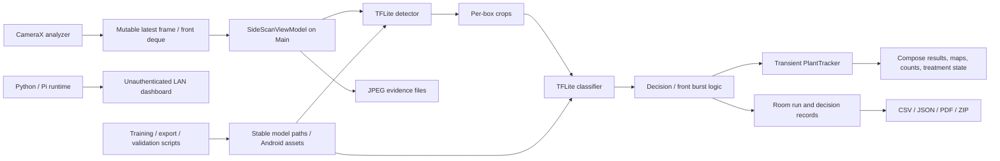
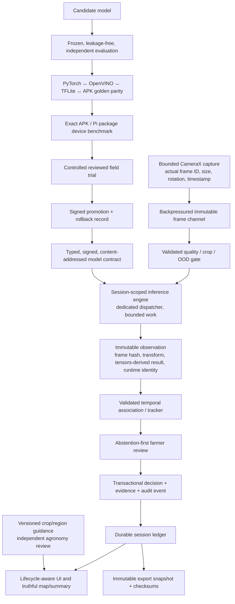

# Agribot production-grade app audit and remediation specification

**Audit window:** 2026-08-11 to 2026-08-12 (Asia/Calcutta); filename retains the start/snapshot date  
**Repository:** repository root (.)
**Branch / indexed base:** main / sanitized publication snapshot
**Scope:** the Android application, on-device TFLite runtime, camera/tracking/measurement stack, Room persistence and exports, Python ML/data/evaluation pipeline, Raspberry Pi runtime, browser dashboard, deployment tooling, CI/release configuration, tests, documentation, data/model manifests, and checked-in evidence artifacts.  
**Deliverable type:** production-app engineering audit. This is not a paper review.

---

## 1. Executive decision

### Release verdict

**Agribot is not production-ready, field-ready, or ready for a public store release in the audited state.** It is a substantial development prototype with useful local controls and a successfully buildable signed release variant, but several independent failure chains can produce wrong farmer-facing results, lose or misattribute records, freeze the UI, overstate physical location and model certainty, expose unsafe chemical guidance, or turn failed ML validation into a green deployment result.

The consolidated ledger contains **42 P0 release blockers, 67 P1 high-priority defects, 46 P2 hardening items, and 20 P3 architecture/repository actions: 175 enumerated closure items in total.** Closely related symptoms were consolidated under a shared root cause where doing so preserved a single testable fix; cross-cutting acceptance matrices remain separate because they require different evidence classes.

The **2026-08-11 baseline** readiness artifact supports the negative field boundary: `dist/android_release_readiness.json:2-8` records `development_ready=true` and `field_ready=false`. It is **not exact-release evidence for the current APK**: the stored baseline benchmark/readiness/CI/instrumentation paths name `com.sakshyam.agribot`, while that historical rebuild used `com.sakshyam.agribot.field` (`app/build.gradle:66` in the baseline; release `aapt` inspection). That artifact corroborates the baseline “not field-ready” conclusion only; it is not a claim about the current implementation-pass package. Even “development ready” must not be interpreted as lint-clean, fully instrumented, physically benchmarked, empirically accurate, legally cleared, or operationally production-grade.

### Immediate stop-ship conditions in the audited baseline

The following list describes the 2026-08-11/12 baseline that motivated the remediation pass. Current disposition for each chain is recorded in “Prior stop-ship status after the implementation pass” above; the historical wording and ledger anchors are intentionally preserved for auditability.

1. Release lint fails with **128 errors and 183 warnings**; navigation lint checks were also skipped because of an API-version incompatibility.
2. TFLite inference is invoked from `viewModelScope` without an inference dispatcher. Saved emulator evidence records roughly **3.33 seconds average classifier latency** and **0.70 seconds detector p95**, so the current execution path can freeze or ANR the UI.
3. Pause, stop, restart, mode changes, and front-review transitions do not reliably cancel or invalidate in-flight inference and do not consistently stop sensors/tracking.
4. Front-overview processing can perform as many as 224 sequential classifications, can accept one observation as “temporal consensus,” and derives plant positions from fixed 640×480 assumptions and an arbitrary five-bucket mapping rather than calibrated geometry.
5. Treatment status and notes are not persisted; older live tracks and their treatment state are deleted after five seconds; the exported and on-screen history can therefore lose farmer work.
6. Disease decisions are assigned `DecisionStatus.OK`, while summary/PDF code labels `OK` as healthy. A diseased plant can be counted both healthy and sick.
7. A decision can be saved with a JPEG from a later global frame, UI/index state advances before persistence succeeds, and retaking a decision with no geometry can retain stale prior geometry.
8. The app presents precise chemical names, dosage-like amounts, and application intervals from unconfirmed, crop-agnostic model observations without a governed agronomy/regulatory safety layer.
9. The Python runtime suite, model promotion scripts, Pi validators, and readiness tests contain false-green paths. A failed current run can be summarized from stale passing rows, validation scripts print `FAIL` but exit zero, and a candidate can overwrite the stable model without enforced evaluation.
10. Detector evaluation is contaminated by cross-split source/augmentation overlap and repeated reuse of the nominal test split for threshold selection, optimization, and calibration. The tracked detector also fails its documented F1 target (`0.7360`, 99 FP, 71 FN).
11. No repository artifact establishes physical-phone performance for the exact signed APK, Raspberry Pi sustained thermal/power behavior for the exact package, model accuracy on an independent multi-field holdout, calibrated/OOD selective risk, or a real reviewed field export.
12. The LAN dashboard server binds broadly and exposes unauthenticated state-changing endpoints with wildcard CORS; deployment tooling includes a reusable tracked hotspot credential and a path-handling flow that can archive/delete outside the intended root.

### Readiness matrix

| Readiness dimension | Audited state | Decision |
|---|---:|---|
| Canonical source builds | Fresh release assembly succeeds locally for `com.sakshyam.agribot` | Pass as a development control only |
| JVM/Python regression suites | Android JVM task set and 70 Python tests passed in the implementation pass | Pass as local logic evidence only |
| Release lint | 0 errors; 8 warnings remain (dependency notices, outdated third-party Navigation registries, intentional arm64-only ChromeOS warning) | **Conditional / review warnings** |
| Measured coverage | No Kover/JaCoCo report or enforced threshold | **Unknown / fail gate** |
| Android instrumentation | Five suites / 14 `@Test` methods present in source; not re-executed in this audit. Existing connected output covers only `AgribotLaunchUiTest` (6 tests) on an AVD, plus a one-decision/one-evidence instrumented export | **Unknown / fail gate** |
| Exact APK identity | Signed release APK can be built and hashed | Partial; no install/device/field binding |
| UI responsiveness | Inference and blocking export/evidence work moved off Main; exact-device latency is unmeasured | **Partial / device gate open** |
| Data durability/integrity | Room v4, replacement/deletion, evidence, event, export and IO fixes implemented; fault/process-death evidence is missing | **Partial / instrumentation gate open** |
| Farmer safety | Unconfirmed diagnosis and chemical guidance; false precision | **Fail** |
| Model validity | Leaky/tuned test data, weak sample sizes, detector target failure | **Fail** |
| Runtime parity | Android/Pi thresholds, gates, manifests, and entrypoints diverge | **Fail** |
| Security/privacy | Local dashboard/Pi write boundary, paths, CORS, headers, formula exports and tracked credential exposure remediated; no independent review | **Partial / review gate open** |
| Accessibility/localization | Resource/semantics/contrast/localization pass completed; no assistive-tech run | **Partial / accessibility evidence open** |
| Physical phone | No exact-artifact target-device matrix/soak evidence | **Missing** |
| Raspberry Pi | No exact-package sustained target-hardware evidence | **Missing** |
| Real field trial | No independently reviewed real-field export for this release | **Missing** |
| Licensing/governance | No complete SBOM, NOTICE, dataset/model license ledger, privacy/security policy | **Fail / legal review required** |

### What the product should claim today

The defensible scope is: **an offline, development-stage scouting assistant that records reviewable observations and can run embedded models locally.** It must not currently claim validated diagnosis, autonomous plant counting, surveyed field mapping, 3D localization, treatment prescription, production-grade performance, or field readiness.

The production-worthy product idea is still strong if narrowed and made evidence-first:

- detect a possible plant/issue;
- preserve the exact observation, model/runtime identity, uncertainty, and farmer review;
- abstain aggressively when quality, crop, model, location, or runtime contract is unsupported;
- present an inspection queue rather than a diagnosis or prescription;
- map only independently supported row/plant identities;
- keep Pi/dashboard operation as a separately secured deployment profile rather than an implicit extension of the phone app.

### Implementation-pass update — 2026-08-22

The repository has now received a broad remediation pass across the native Android app, embedded-model runtime, Python/Pi tooling, local dashboard, deployment scripts, UI, accessibility, localization, and release workflow. This is a new implementation snapshot, not a retroactive claim that the historical 175-item ledger is closed.

The post-pass inventory contains 299 present, non-generated paths, including 283 text/configuration files and approximately 59,102 text lines. Generated Gradle intermediates, caches, APK/AAR/JAR/DEX/native outputs, and binary model/media artifacts remain inventory evidence rather than source prose; the embedded model files were hashed and their runtime contract is covered by Android tests.

The current candidate is materially safer and more internally consistent:

- Room schema v4 persists treatment status/notes; migration and mapper tests cover legacy rows. Decision replacement/deletion now removes stale geometry, evidence and run artifacts deliberately, and event IDs include a UUID suffix to avoid same-timestamp collisions.
- JSONL/CSV/PDF/ZIP exports include treatment fields, correct percentages, complete decision pagination, and ZIP-root-relative manifest paths. Blocking file/PDF/ZIP/evidence work is dispatched away from the UI thread.
- CameraX analysis validates frame bounds and timestamps, closes every `ImageProxy`, handles malformed YUV data defensively, applies explicit rotation, and samples with bounded backpressure.
- The detector contract is explicit: the embedded raw detector is declared as feature-first with 1,344 candidates, one `crop` class, model-input-pixel coordinates, RGB/0–1 preprocessing, and FLOAT32 tensors. Letterbox preprocessing has an inverse transform, parser scoring handles objectness/class channels, finite-value/geometry/NMS rejection is fail-closed, and local diagnostics record tensor shape/type, raw/accepted counts, maximum confidence and rejection reasons.
- Inference runs on a bounded single-worker dispatcher. Side/front jobs are cancelled or generation-invalidated on pause, stop, restart, mode changes and background transitions; front review requires distinct-frame consensus and never fabricates coordinates when calibration is absent. Candidate classification is capped rather than unbounded.
- The UI now distinguishes model errors, no-detection and review/quality states, includes confidence/region/retry guidance, adds Hindi/Spanish resource coverage where advertised, improves semantics/contrast, and removes stale generated launcher/splash resources.
- Python runtime, export, benchmark, training, Pi preflight/end-to-end and deployment paths now reject non-finite/incomplete/stale evidence, prevent unsafe overwrite/reuse, neutralize CSV formulas, bound subprocess/network work, and remove the tracked reusable hotspot credential. The local dashboard has bounded JSON/body/query/workers, path containment, authenticated optional writes, explicit CORS, security headers, atomic layout writes, and no API caching.
- The CI workflow now runs release lint/build/test gates and checks the exact package/ABI/SDK/asset boundary. Release package identity is unified as `com.sakshyam.agribot` (no `.field` suffix).

Fresh local evidence for this snapshot:

| Gate | Result | Boundary |
|---|---|---|
| Python compile + unittest | `70` tests passed | Workstation/runtime evidence only |
| Android JVM suites | Domain/data/camera/ML/feature/app test tasks passed after a clean rebuild | JVM evidence, not camera/field evidence |
| Android instrumentation source compilation | Passed | No emulator/phone execution in this session |
| `:app:lintRelease` | 0 errors; 8 warnings (dependency update notices, skipped outdated Navigation lint registries, intentional arm64-only ChromeOS warning) | Warnings are recorded; no release lint error remains |
| `:app:assembleRelease` | Passed | Exact artifact below |
| Final release APK | `dist/agribot-field-app-release.apk`, 69,502,946 bytes, SHA-256 `A38220A2DB1415720094A841636543F581E38E4AC4CCA3F24F2B1BFBAB7126F0` | Package `com.sakshyam.agribot`, min/target 26/35, arm64-v8a; APK Signature v2 verifies; certificate identity still requires release-key custody review |
| Model bundle | Manifest and embedded model/label hashes match local assets; no legacy Capacitor/Pi assets in the APK | Does not establish model accuracy |
| ADB/device | No connected device; mDNS endpoint `192.168.1.38:41269` refused connection and then disappeared | Real plant, digital-image, negative-image, latency and install evidence unavailable |

Prior findings that depend on physical phone behavior, independent crop/field accuracy, agronomy/legal review, accessibility assistive technology, thermal/storage soak, signed release-key provenance, or real field exports remain open. The current defensible status is **development-ready with improved controls, not field-ready or production/store-ready**.

### Prior stop-ship status after the implementation pass

| Historical risk chain | Current code status | Evidence still required |
|---|---|---|
| Main-thread inference / overlapping stale jobs | Remediated in source with dispatcher, bounded work and generation cancellation | Exact-device latency/thermal/ANR soak |
| Heuristic detector layout / score / letterbox mismatch | Remediated with explicit manifest contract, parser/preprocessor tests and runtime dtype checks | Actual target-device images and independent detector metrics |
| Front one-frame consensus / fabricated geometry | Remediated to distinct-frame consensus and explicit unknown calibration | Calibrated physical front-overview protocol |
| Treatment/evidence/geometry loss and export inconsistencies | Remediated in Room v4, repositories, serializers and focused tests | Process-death, upgrade and filesystem-fault instrumentation |
| False-green Python/Pi promotion and unsafe overwrites | Remediated fail-closed validators and explicit opt-ins | Independent pipeline review and real deployment rehearsal |
| LAN dashboard writes/CORS/path traversal/credential reuse | Remediated with bounded/authenticated/path-contained platform boundary and credential removal | Penetration test, secret rotation verification and Pi hardware run |
| Missing localization/semantics/legacy resource noise | Substantially remediated; stale resources removed | TalkBack, large-font, RTL and disabled-user validation |
| Unvalidated model accuracy and field readiness | **Open** | Frozen external holdout, calibration/OOD/selective risk, target-phone benchmark and reviewed field export |

---

## 2. Audit boundary, method, and honesty contract

### What “entire codebase” means here

The working tree is intentionally dirty and contains much of the modern Android implementation as untracked files. The audit preserved that state and did not reset, delete, stage, commit, or rewrite user work.

The audit census found:

- 136 indexed paths;
- 197 visible, non-ignored untracked paths;
- 333 version-control-visible names total;
- 9 indexed paths deleted in the working tree, leaving 324 present paths;
- 293 present text/configuration files recognized by a broad extension census, totaling 55,058 lines;
- 31 present binary/other artifacts, including TFLite models, PNG/JPEG fixtures, the Gradle wrapper JAR, and script/data formats requiring non-source inspection;
- 88 pre-existing `git status --porcelain` entries before this report was created.

Canonical first-party text was read or routed through focused, read-only audits. Generated Gradle intermediates, virtual environments, caches, downloaded datasets, compiled bytecode, APK/AAR/JAR/DEX/native outputs, and duplicate ignored build trees were inventoried but not pretended to be semantically “read” as source. Relevant binaries were instead hashed, metadata-inspected, visually inspected where appropriate, or treated as evidence requiring target-runtime execution.

### Evidence levels

| Code | Evidence level | What it can establish | What it cannot establish |
|---|---|---|---|
| S | Static source/config/data inspection | A reachable defect mechanism, missing validation, contradictory contract, or provable computation | Real-world failure rate, device latency, model accuracy |
| L | Local automated execution | Deterministic behavior on this workstation/JVM/Python environment | Phone/Pi performance, camera behavior, field generalization |
| A | Checked-in artifact inspection | What a report/APK/manifest claims and the bytes/hashes present | Freshness, representative sampling, target-environment validity unless bound |
| E | Emulator execution/evidence | Android integration in that emulator configuration | Physical camera, thermal, sensor, ARM performance, field behavior |
| D | Physical target-device evidence | Behavior on the named device and exact artifact | Other device tiers or field generalization without a matrix |
| F | Controlled real-field evidence | Behavior in the tested farm/site/crop/conditions | Broader deployment without stratification and replication |
| X | Independent expert/legal/security review | Domain or compliance approval for the reviewed scope | Future changes or jurisdictions not covered by the review |

### Path shorthand used in findings

To keep the ledger readable, an unqualified Android filename means its canonical file under `agribot_android_app/android/<module>/src/...`. The most frequently cited paths are:

- `SideScanViewModel.kt`, `AgribotScreens.kt`, `EnhancedRecordingScreen.kt`, `DataAnalysisScreen.kt` → `android/featurescan/src/main/java/com/sakshyam/agribot/featurescan/`;
- `PlantTracker.kt`, `PlantTrackingMath.kt`, `MotionDistanceEstimator.kt` → `android/featurescan/src/main/java/com/sakshyam/agribot/featurescan/tracking/`;
- `FrontBurstProcessor.kt`, `FrontGeometryMapper.kt`, `PlantDecisionGate.kt`, `RunSummaryReducer.kt`, `ExportSerializer.kt`, `TreatmentGuide.kt` → `android/domain/src/main/java/com/sakshyam/agribot/domain/logic/`;
- `TfliteInferenceRepository.kt`, `TFLiteClassifier.kt`, `TFLiteDetector.kt` and tensor/preprocessing code → `android/ml/src/main/java/com/sakshyam/agribot/ml/inference/`;
- `FileEvidenceRepository.kt`, `FileExportRepository.kt`, `RoomRunRepository.kt` → `android/data/src/main/java/com/sakshyam/agribot/data/repository/`;
- `Entities.kt`, `Daos.kt`, `AgribotDatabase.kt` → `android/data/src/main/java/com/sakshyam/agribot/data/db/`;
- root Python, Pi, deployment, platform, dataset, `dist`, and documentation paths are relative to the repository root.

Line anchors identify the audited working-tree snapshot and will move as fixes are implemented. Preserve this report with the source snapshot or use Git blame/diff when resolving later revisions.

### Severity definitions

- **P0 — release blocker:** must be closed before any production or farmer-facing field pilot. P0 does not mean every item is remotely exploitable; it means shipping while it remains would make the product, evidence, or safety case invalid.
- **P1 — high:** must be closed before a broad pilot or external production review.
- **P2 — medium:** must be closed or explicitly risk-accepted with an owner before production.
- **P3 — hygiene:** maintainability, clarity, and future-risk work that belongs in the production backlog.

### Guarantee boundary

No finite static audit can prove that “there are no more bugs,” and no engineering document can guarantee that a store reviewer, security assessor, agronomist, regulator, funder, competition judge, or customer has no lawful basis to reject an app. This report therefore does the rigorous version of the requested task:

1. it records every defect and omission found in the audited repository;
2. it gives a concrete closure test for each material finding;
3. it identifies evidence that cannot be produced from source inspection;
4. it defines a release chain that fails closed when evidence is stale, incomplete, or bound to different bytes;
5. it makes third-party, physical-device, legal, accessibility, and field validation explicit rather than inventing passes.

An item is not closed because code was edited or a test was added. It is closed only when the stated acceptance evidence exists for the exact candidate artifact.

---

## 3. Current system and required target architecture

### Current execution shape



The principal architectural error is that transient perception state, durable business state, physical measurement, evidence provenance, product guidance, and release proof are interleaved. Main-thread orchestration and mutable global frame/state references turn timing into data correctness.

### Required production architecture



Required separation of concerns:

- **Capture:** owns CameraX use cases and exact immutable frames.
- **Inference:** owns interpreter lifecycle, dispatcher, model contract, runtime health, and immutable provenance.
- **Association:** owns active tracks only; it never serves as the durable results database.
- **Session ledger:** owns farmer-visible observations, reviews, treatments, and stable identifiers.
- **Measurement:** reports source, timestamp, uncertainty, calibration, and “unknown” rather than invented precision.
- **Guidance:** is governed content, not an unversioned function of a classifier label.
- **Release evidence:** is content-addressed and bound to the exact code, assets, certificate, device, protocol, and data.

---

## 4. Baseline verification before the implementation pass

The following table records the verification run against the 2026-08-11/12 baseline, before the 2026-08-22 implementation pass. It is preserved as historical evidence; the fresh implementation-pass evidence is in §1 above and supersedes these baseline results for current source status.

| Verification | Result | Evidence boundary |
|---|---:|---|
| `python -m unittest discover -s tests -p 'test_*.py'` with bundled Python 3.12.13 | 62 tests, all pass | Local Python contracts only |
| `py_compile` over all 65 Python files | Pass | Syntax/import compilation only |
| Gradle JVM suites: domain, data, camera, ML, feature-scan release, app release | 64 XML suites; 346 executions; 0 failures, 0 errors, 0 skips | Host JVM/Robolectric-style logic only; no phone |
| Per-module test counts | app 2; camera 8; data 12; domain 114; feature-scan 148; ML 62 | Counts executions, not coverage or adequacy |
| `:app:lintRelease` | **Fail: 128 errors, 183 warnings** | Release blocker |
| Lint breakdown | 128 `MissingTranslation`; 167 `UnusedResources`; 4 `GradleDependency`; 3 obsolete lint checks; other icon/SDK/plural issues | Navigation checks were skipped due lint API mismatch |
| `git diff --check` | Pass, with line-ending warnings only | Patch whitespace only |
| Debug/release assembly | Successful | Local buildability; final forced-rebuild hash recorded in §15 |
| APK signature verification | Release verifies with APK Signature Scheme v2; one RSA-4096 signer | Signature mechanics only; key governance still unproven |
| APK metadata | `com.sakshyam.agribot.field`; version 1 / 1.0; min 26; target/compile 35; `arm64-v8a` only | Package inspection only |
| Model asset digest comparison | Classifier, detector, and labels match `model_manifest.json` | Positive integrity control; not semantic/accuracy proof |
| Android instrumentation | Not re-executed; five suites / 14 test methods found in source. Existing connected XML covers one suite / 6 `AgribotLaunchUiTest` tests on an AVD; checked-in instrumented export validation contains one decision and one evidence file | Required exact-release/device evidence missing |
| Coverage | No Kover/JaCoCo configuration/report found | 80% claim cannot be made |
| Physical phone/Pi/field | Not executed | Required promotion evidence missing |

The first attempted assembly experienced a transient Gradle transform-cache move race while another Gradle process was running. A subsequent single-worker assembly succeeded. That transient tooling collision is not classified as an app defect.

### Existing benchmark/readiness evidence

- `dist/embedded_model_benchmark.json:3,6-31` identifies the base package `com.sakshyam.agribot`, `Google sdk_gphone64_x86_64`, `is_emulator=true`, classifier average 3332.366 ms, classifier p95 3553.378 ms, detector average 697.807 ms, detector p95 703.474 ms, with only 5 and 3 measured iterations respectively. It diagnoses a bad development path but is not bound to the rebuilt `.field` APK.
- `dist/android_release_readiness.json:2-8,56-61` says field readiness is false and has no real-field export.
- `ONLINE_FIELD_MEDIA_STIMULATION.json` and `50_stimulate_field_media.py:194-211` are geometry/quality stimulation evidence; they explicitly do not prove Android model inference, phone performance, accuracy, or field behavior.
- Existing connected-test XML covers only six `AgribotLaunchUiTest` methods on an AVD; `dist/android_app_export_instrumented.validation.json:4-5` records only one decision and one evidence file. `dist/android_app_export_instrumented.zip` is Android-test evidence, not a real farmer field run or broad instrumentation proof.
- `screen1.png` shows an Android camera permission dialog behind “System UI isn't responding.” That image cannot attribute the incident to Agribot, so it is an unresolved reproduction item, not proof of an Agribot ANR.

### Positive controls that must be preserved

- The app manifest does not request Internet access; cleartext traffic is disabled; backup is disabled.
- FileProvider exposure is scoped to configured export paths rather than the entire private directory.
- `.tflite` assets are stored uncompressed.
- The runtime verifies classifier, detector, and labels SHA-256 digests before reporting readiness.
- Detector input/output dtypes and several tensor/layout conditions are checked.
- Atomic temporary-file patterns exist in portions of export/evidence handling.
- Useful unit coverage exists for parser behavior, crop/letterbox math, digest verification, decision gates, geometry logic, tracker math, YUV stride/crop/rotation, and export serialization.
- Room schema exports and explicit v1→v2 and v2→v3 migrations exist.

These controls reduce risk; none of them convert missing device, accuracy, safety, or field evidence into a pass.

---

## 5. Baseline P0 release blockers and closure ledger

The findings in §§5–14 are the original baseline ledger. They remain useful as traceable root-cause and acceptance criteria, but their “required correction” text is not a statement that the current source still has the defect. Current disposition is summarized in “Prior stop-ship status after the implementation pass” (§1).

### P0-001 — Inference executes synchronously on the UI thread

**Evidence:** `featurescan/.../SideScanViewModel.kt:988-998,1129-1137,1270-1285,1695-1727,1827-1836`; `ml/.../TfliteInferenceRepository.kt:85-138`; `TFLiteDetector.kt:74-117`; `TFLiteClassifier.kt:73-115`. `viewModelScope.launch` uses Main and the repository/interpreter calls never switch dispatcher.  
**Impact:** multi-second UI freezes, missed frames, ANR risk, delayed stop/pause, and timing-dependent state corruption.  
**Required correction:** inject a bounded, single-owner inference dispatcher/executor; perform all preprocessing/interpreter/postprocessing work with `withContext`; apply backpressure/drop policy; never hold Main while awaiting inference.  
**Closure evidence:** release APK on representative low/mid/high phones, ≥20 warmups and ≥100 measured runs per path, zero main-thread inference/disk violations, zero stalls >100 ms attributable to inference, no ANRs, and a preregistered end-to-end p95 SLO.

### P0-002 — Stale inference can mutate a paused, stopped, or restarted run

**Evidence:** only a pre-launch recording check at `SideScanViewModel.kt:943-945`; asynchronous mutation/recording at `:988-1122,1522-1632`; stop at `:820-857`; `currentSessionId` at `:107` is not used as a result-generation guard.  
**Impact:** results can be appended after stop, evidence can enter the wrong run, and a new run can receive an old result.  
**Required correction:** explicit serialized run state machine; monotonic session generation and immutable run ID attached to work; cancel jobs on every transition; revalidate generation/state immediately before every tracker, UI, evidence, Room, and audit mutation.  
**Closure evidence:** delayed fake inference tests for pause, stop, mode switch, navigation, permission loss, process death, and stop→restart; stale work produces zero mutations.

### P0-003 — Front burst creates unbounded duplicate work

**Evidence:** per-frame/per-box classification at `SideScanViewModel.kt:1827-1836`; 5–9 accepted frames and grouping at `FrontBurstProcessor.kt:14-49,60-84`; detector cap 32 at `ScanConstants.kt:31-34`. A typical 7-frame burst can issue 224 classifier calls.  
**Impact:** latency, heat, battery drain, UI starvation, duplicate plants, and correlated evidence misrepresented as consensus.  
**Required correction:** detect frames, associate observations temporally, select a bounded representative crop per track, classify only bounded representatives, and enforce distinct-frame support.  
**Closure evidence:** golden bursts with misses, duplicates, nearby plants, crossings, occlusion, blur, and conflicting labels; one decision per physical plant, bounded call count, explicit minimum distinct-frame support, device latency/memory/thermal pass.

### P0-004 — “Temporal consensus” accepts one observation

**Evidence:** `FrontBurstProcessor.kt:18-49,60-77`; candidates contain no frame identity; `FrontBurstProcessorTest.kt:103-121` explicitly treats one candidate in a seven-frame burst as ready.  
**Impact:** a transient false detection can become a confirmed front-row decision.  
**Required correction:** add immutable frame ID/timestamp and track identity to candidates; require support from multiple distinct frames and label stability; account for correlated adjacent frames.  
**Closure evidence:** one-positive-plus-six-empty, one-positive-plus-six-conflicting, and duplicate-same-frame cases abstain; stable multi-frame tracks pass.

### P0-005 — Front geometry is fabricated rather than calibrated

**Evidence:** fixed 640×480/default pose at `SideScanViewModel.kt:1764-1785`; `FrontGeometryMapper.kt:14-50` ignores camera height, camera distance, tilt, row spacing, plant spacing, and frame width, and maps vertical center into five hardcoded buckets.  
**Impact:** confidently wrong row/plant numbers and false location precision.  
**Required correction:** use actual frame dimensions/rotation, camera intrinsics, explicit pose, surveyed references, bounded row capacity, and independent uncertainty; otherwise return unknown/approximate.  
**Closure evidence:** surveyed fixtures across phones, resolutions, rotations, heights, tilts, distances, and row spacings; preregistered row/plant error and coverage; out-of-support cases abstain.

### P0-006 — Detector “bilinear” resize rounds the interpolation weight

**Evidence:** `ml/.../DetectorInputPreprocessor.kt:103-106`; postfix `.roundToInt()` binds to the weight rather than the full interpolated channel expression.  
**Impact:** nearest-neighbor-like sampling and preprocessing drift from training/export, directly changing predictions.  
**Required correction:** parenthesize/round the complete channel interpolation; define one reference preprocessing contract.  
**Closure evidence:** exact pixel goldens against the exporter/reference library for up/downscales, odd sizes, borders, non-square letterbox, random images, and all channels.

### P0-007 — Non-finite model output fails open and can crash front processing

**Evidence:** `TFLiteClassifier.kt:134-144`; `ClassifierDecision.kt:15-21`; `FrontBurstProcessor.kt:93-109`. NaN survives `coerceIn`; comparisons against NaN do not trigger low-confidence rejection; `.single()` can run on an empty confident-label set.  
**Impact:** an invalid tensor may become actionable or crash scanning.  
**Required correction:** reject every non-finite logit, probability, confidence, threshold, margin, entropy, latency, coordinate, and calibration value into a typed model-failure/abstention state.  
**Closure evidence:** unit/property/fuzz tests with NaN, ±Infinity, blanks, empty/corrupt tensors, invalid thresholds and coordinates; fail closed without throwing.

### P0-008 — Evidence is not atomically bound to its inference frame

**Evidence:** decision construction at `SideScanViewModel.kt:1522-1595`; evidence attachment reads mutable global `latestFrame` at `:1596-1616`; UI/index advances before persistence completes at `:1617-1628`; `latestFrame` changes at `:943-971`.  
**Impact:** a decision can carry a later/different JPEG, and failed writes still appear recorded.  
**Required correction:** immutable decision context containing frame ID/time/hash, crop/box/transform, track, raw prediction, model/runtime identity; transactionally persist decision, evidence reference, and event before advancing UI.  
**Closure evidence:** delayed storage, rapid frame advance, injected I/O/Room failures, cancellation, and process-death tests; evidence digest always matches the originating frame; no optimistic phantom decision.

### P0-009 — Front review leaves sensor/tracker resources active

**Evidence:** `SideScanViewModel.kt:1743-1753` transitions to ready/null run without `plantTracker.stopTracking()`; confirm/discard at `:1288-1395` also omit it, while other exits stop explicitly.  
**Impact:** GPS/sensors continue after capture, drain battery, and mutate future measurement state.  
**Required correction:** one lifecycle owner and one transition function that starts/stops CameraX, inference, tracker, GPS, and sensors for every state including error and `onCleared`.  
**Closure evidence:** registration counters and instrumentation assert exactly zero active listeners/use cases outside recording across all transitions.

### P0-010 — Thermal protection is decision-dependent and absent in front mode

**Evidence:** side path only sets a future pause at `SideScanViewModel.kt:999-1005`, applied after a recorded decision at `:1629-1632`; front path `:1138-1164` does not enforce the policy.  
**Impact:** detector-only/no-decision and front scans can continue indefinitely under severe thermal conditions.  
**Required correction:** independent thermal state observer; immediately stop scheduling new work at severe/critical, invalidate stale work, use hysteresis for recovery, apply identically across modes.  
**Closure evidence:** fake thermal tests plus 30–60 minute physical soaks on supported tiers with pause latency, temperature, throttling, battery, and dropped-frame measurements.

### P0-011 — Tracker state is falsely used as durable plant history and count

**Evidence:** tracks expire after five seconds at `tracking/PlantTracker.kt:669-731`; treatment state lives only in tracks at `:570-579`; home/results/counts consume `trackedPlants` at `AgribotScreens.kt:151-154` and `DataAnalysisScreen.kt:62-93`; current count uses active map size.  
**Impact:** earlier plants, counts, results, and treatment edits disappear as the farmer walks; count can decrease.  
**Required correction:** separate active tracks from an immutable persisted observation/decision ledger; maintain durable unique-count policy with explicit re-entry semantics.  
**Closure evidence:** observe plant A, leave frame >6 seconds, observe B, stop/restart; A and B and their evidence/review/treatment remain exactly once in UI/export.

### P0-012 — Tracker “appearance” identity is only bounding-box geometry

**Evidence:** `PlantTrackingMath.kt:75-151`; `PlantTracker.kt:604-623`; features are center, width, height, confidence, aspect, and area, with permissive motion tolerance and greedy matching.  
**Impact:** adjacent/crossing plants merge or switch; count and mapped identity are not production-valid.  
**Required correction:** validated association with motion prediction/global assignment, consecutive confirmation, row constraints, explicit re-entry policy, and optional real appearance embeddings; label counts estimates until validated.  
**Closure evidence:** annotated target-phone field videos with adjacent plants, crossings, occlusion, camera reversal, glare, weeds and repeat passes; preregister count error, IDF1, ID switches, misses, and false counts.

### P0-013 — Sensor fusion and “3D” position claims are technically false

**Evidence:** `PlantTracker.kt:95-99,129-157,738-753,841-899`; magnetometer is not registered, gyro events are ignored but improve “quality,” rotation-matrix success is unchecked, and “3D” output is raw pixel x/y with null z.  
**Impact:** invented confidence, invalid orientation, and a misleading physical-location claim.  
**Required correction:** use validated rotation vector or freshness/accuracy-checked fusion; remove unused sensors from quality; call pixels image-space observations unless calibrated pose/depth exists.  
**Closure evidence:** sensor replay and device rotation ground truth, missing/low-accuracy/stale sensor cases, plus surveyed targets if retaining a 3D claim.

### P0-014 — GPS distance integrates stationary noise

**Evidence:** `PlantTracker.kt:294-315,385-406,916`; fixes up to 50 m accuracy and segments ≥0.5 m are accumulated with no timestamp ordering, uncertainty-relative gate, innovation filter, or stationary detector; `MotionMeasurementResolver.kt:39-65,190-194` blends sources arbitrarily.  
**Impact:** stationary GPS jitter becomes walking distance and corrupts plant position.  
**Required correction:** reject stale/out-of-order fixes; uncertainty-aware filtering and stationary detection; never integrate displacement below uncertainty; preserve sources and confidence intervals.  
**Closure evidence:** surveyed stationary/straight/turn/canopy/poor-GPS paths with bias, drift, completeness, and 95% error bounds.

### P0-015 — Treatment state and notes are not persisted

**Evidence:** fields exist at `domain/.../DomainModels.kt:351-352`; absent from `data/.../Entities.kt:73-124`; omitted by `RepositoryMappers.kt:88-140,165-227` and `ExportSerializer.kt:28-75,329-380`; UI setter only changes tracker at `SideScanViewModel.kt:768-775`.  
**Impact:** farmer work disappears on expiry/process death and cannot be trusted in exports.  
**Required correction:** Room v4 columns/migration, repository update operation, mapper/export/PDF support, durable UI source.  
**Closure evidence:** set status/note, expire track, kill/relaunch, reopen/export; exact values survive; v3→v4 migration fixture passes.

### P0-016 — Diseased decisions are counted as healthy

**Evidence:** `PlantDecisionGate.kt:95-103` and `FrontBurstProcessor.kt:104-128` use `DecisionStatus.OK` for actionable disease; `RunSummaryReducer.kt:13-23` counts `OK` as healthy while also counting treatment action as sick; PDF calls `ok` healthy at `FileExportRepository.kt:88-96`.  
**Impact:** contradictory health totals and misleading farmer reports.  
**Required correction:** separate inference validity from health state; define healthy from an explicit canonical health class/action, not `OK`.  
**Closure evidence:** one healthy, one late blight, one uncertain → total 3, healthy 1, sick 1, uncertain 1 in UI, JSON, CSV and PDF.

### P0-017 — Audit events overwrite instead of forming an audit trail

**Evidence:** second-precision IDs at `RunEventFactory.kt:169-179`; fixed manual override ID at `:153-167`; primary-key `@Upsert` at `Entities.kt:156-163` and `Daos.kt:89-98`.  
**Impact:** pauses, warnings, exports, and repeated overrides silently erase history.  
**Required correction:** UUID/ULID or database-generated immutable IDs; optional separate idempotency key; foreign key/index on run ID.  
**Closure evidence:** same-instant duplicate event types and repeated override events all survive, order, restart, and export distinctly.

### P0-018 — Retakes can preserve obsolete geometry

**Evidence:** `RoomRunRepository.kt:62-66` only upserts non-null geometry; `Daos.kt:68-87` provides no corresponding delete.  
**Impact:** a replacement decision with unknown location inherits an old box/row/position.  
**Required correction:** delete geometry in the same transaction whenever replacement mapping is null.  
**Closure evidence:** persist geometry, replace with null geometry, reload/export; every geometry field is absent.

### P0-019 — Deleting data does not delete evidence or export files

**Evidence:** Room-only deletion at `RoomRunRepository.kt:69-71,103-107`; files under `filesDir/exports` in `FileEvidenceRepository.kt:29-68` and `FileExportRepository.kt:133-176`.  
**Impact:** supposedly deleted private images/PDFs/ZIPs remain on disk and potentially shareable.  
**Required correction:** coordinated retention/deletion service for DB, JPEG, temp, PDF, ZIP and URI grants; transactional intent plus retry ledger for partial filesystem failures; user-visible delete-all.  
**Closure evidence:** create full run/exports, delete, restart; no rows, files, temp artifacts, grants, or resolvable content URI remain.

### P0-020 — Export manifest and archive paths disagree

**Evidence:** metadata/latest-run point to `runs/<raw-run-id>/...` at `ExportSerializer.kt:199-215,431-439`; ZIP entries are root-level at `FileExportRepository.kt:166-176`; integration test expects root at `AgribotRoomExportIntegrationTest.kt:140-153`. A cumulative directory can also contribute stale/orphan files.  
**Impact:** consumers cannot resolve declared files; deleted/retaken artifacts may leak into later bundles.  
**Required correction:** immutable per-export snapshot directory, one canonical archive root, normalized/sanitized names, checksums/content manifest, no reuse of mutable run directories.  
**Closure evidence:** resolve and hash every declared path inside ZIP; no orphan/stale/deleted artifact; repeated export is deterministic apart from declared timestamp.

### P0-021 — Blocking file/PDF/ZIP work runs on caller context

**Evidence:** `FileEvidenceRepository.kt:20-53` and `FileExportRepository.kt:27-177` perform file I/O, `fd.sync`, PDF generation and ZIP compression inside `suspend` functions without switching dispatcher; callers use `viewModelScope`.  
**Impact:** UI blocking and ANR on large runs even after inference is moved.  
**Required correction:** injected IO dispatcher and cancellation-safe `withContext`; bounded streaming; cleanup incomplete temp files.  
**Closure evidence:** StrictMode zero main-thread disk operations; largest-supported export while a UI heartbeat remains within frame budget; cancellation leaves no partial shareable file.

### P0-022 — Specific chemical recommendations bypass a safety/governance gate

**Evidence:** `TreatmentGuide.kt:11-60` includes fungicides, pesticides, dosage-like quantities and intervals; `DataAnalysisScreen.kt:125-143,367-417` exposes them for selectable live/unconfirmed tracks; crop setting is ignored. Onboarding explicitly promises treatment recommendations at `app/src/main/res/values/strings.xml:9-12`; README claims also conflict with `AGRIBOT_ACCURACY_AND_FARMER_GUARDRAILS.md:81-92`.  
**Impact:** unsafe or unlawful application, crop damage, residue/re-entry/pre-harvest risk, and misleading medical/agronomic authority.  
**Required correction:** default to inspect/rescan; no chemical action from pending/uncertain/model-only results; independently reviewed, versioned crop/region/product-label content with provenance, PPE, contraindications, resistance, intervals and local-authority confirmation.  
**Closure evidence:** agronomist/regulatory signoff for each supported scope; unknown context yields no chemical instruction; pending/uncertain/one-frame observations cannot be marked treated or expose chemical advice.

### P0-023 — Native field maps invent geography and truncate observations

**Evidence:** `AgribotScreens.kt:599-628` chunks list order into rows of 12 and shows four rows; `DataAnalysisScreen.kt:212-262` chunks into 16 and shows eight. They do not use persisted row IDs, GPS, geometry, or scan positions.  
**Impact:** list order is presented as spatial truth; plants after 48/128 vanish.  
**Required correction:** render only persisted, validated row/plant coordinates; otherwise call it recent-observation preview; paginate/virtualize with no silent truncation.  
**Closure evidence:** input shuffling cannot move mapped plants; >128 observations remain discoverable; missing coordinates produce explicit map-unavailable state.

### P0-024 — Service-worker cache is relabeled “Live from Pi”

**Evidence:** when the worker is active (for example on localhost or a future HTTPS deployment), `agribot_platform/service-worker.js:18-29` caches API GET responses; `app.js:277-282` rewrites `savedAt` and marks them fresh; `app.js:496-509` renders “Live from Pi.” The ordinary phone-over-LAN HTTP deployment has a separate secure-context failure in P1-029.  
**Impact:** stale disease/location output appears current during an outage.  
**Required correction:** do not cache live API data, or preserve immutable server timestamp/provenance and visibly gate stale actions.  
**Closure evidence:** online load → disconnect → refresh announces offline cache with original time/age and never says live.

### P0-025 — LAN dashboard has unauthenticated state-changing endpoints

**Evidence:** wildcard CORS at `agribot_platform/run_platform.py:228-232`; POST/write routing at `:246-254,343-399`; configuration rewrite at `:743-758`; default bind `0.0.0.0` at `:761-775`; Python `http.server` is used without authentication, CSRF protection, TLS, rate limiting, concurrency/revision control, or safe error disclosure. `read_request_json` does enforce 8 KiB/64 KiB Content-Length ceilings at `:343-352,388`, which is a positive control, but normalization is not a substitute for authenticated authorization or a complete versioned schema.  
**Impact:** any reachable hotspot/LAN origin can read or change farm layouts/configuration; cross-origin pages can drive writes; resource exhaustion and information leakage are possible.  
**Required correction:** authenticated, authorization-checked API; same-origin allowlist; CSRF defense; TLS or explicitly isolated local transport; request/body/schema limits; rate limiting; structured non-leaking errors; atomic revisioned updates; hardened production server.  
**Closure evidence:** threat-model tests for unauthenticated/cross-origin writes, malformed/oversized bodies, traversal-like fields, replay/races, brute force, slow clients and error leakage; all fail safely.

### P0-026 — Deployment ships a reusable credential and prints it

**Evidence:** nonempty tracked hotspot password in `farmer_config.json:86-95`; the same reusable default/state is present in `agribot_inference_data/network_state.json:1-7`; predictable/default credential and output in `deployment/18_enable_direct_phone_hotspot.sh:4-6,26-29`; propagation/printing in `deployment/20_install_final_field_system.sh:11-20,45-90,104-107`; package/default/output paths in `39_package_pi_deployment.py:508-529,686-743,946-975`; and default/printing paths in `44_farmer_one_touch.py:202-233,328-354,409-422`. The secret value is intentionally not reproduced here.  
**Impact:** cloned devices share a credential; repository readers and logs can gain network access.  
**Required correction:** revoke/rotate any deployed instance, replace tracked value with placeholder, generate unique first-boot secret, store with restricted permissions/secret management, QR/on-device enrollment, never print it.  
**Closure evidence:** secret scan finds no reusable credential; two fresh devices receive different high-entropy values; logs/process args/world-readable files contain none; rotation/recovery tested.

### P0-027 — Archive option can escape the intended root and delete originals

**Evidence:** `44_farmer_one_touch.py:756-790,924-927` accepts `--extra-archive`, combines paths without a resolved-root allowlist, and can remove originals when configured.  
**Impact:** `..`, absolute paths, symlinks, or reparse points can archive/delete unrelated user/system data.  
**Required correction:** resolve every source and destination; reject absolute/out-of-root paths and symlink/reparse escapes; no deletion until verified archive checksum; default keep originals; explicit manifest and dry run.  
**Closure evidence:** property/security tests for `..`, absolute/UNC paths, symlink/junction escapes, case variants, races and partial archives; no outside-root read/delete.

### P0-028 — ML suite can report success from stale evidence

**Evidence:** `10_export_runtime_models.py:115-130,162-187` catches failures and returns success; `30_run_runtime_suite.py:42-92` continues unless optional stop flag and returns success; `runtime_suite_common.py:133-165` upserts cumulative rows without run/artifact identity; `31_summarize_runtime_results.py:55-95` reads cumulative history.  
**Impact:** a failed current export/benchmark can inherit an older green row and produce a deployment recommendation.  
**Required correction:** immutable run directory/ID; exact code/data/model/config/dependency hashes on each record; required stages fail nonzero; summarize only the current complete run; atomic result publication.  
**Closure evidence:** seed stale pass, force current failure; suite exits nonzero, emits no recommendation, and cannot consume stale rows.

### P0-029 — Accuracy/target failures exit zero

**Evidence:** `34_benchmark_tomato_crop_disease.py:300-366`; `38_sweep_classifier_confidence_gate.py:269-283,380-418`; parent validators `40_pi_end_to_end_validation.py:200-328`, `41_pi_tomato_crop_disease_validation.py:170-256`; `43_low_power_5v3a_experiment.py:828-917,1115-1127`.  
**Impact:** detector F1 0.736, negligible coverage, or accuracy failure can still become a successful Pi validation.  
**Required correction:** gates enforce declared targets by default and exit nonzero; parents parse fresh child JSON and independently require accuracy, coverage, class safety, latency, thermal/power, identity and completeness.  
**Closure evidence:** zero-accuracy but fast candidate and current failing detector cause every parent production validation to fail with no “validated” output.

### P0-030 — Candidate training can overwrite the stable model without passing evaluation

**Evidence:** `37_train_deployment_fastcrop_classifier.py:347-455,495-515`; evaluation has no enforced minimum and promotion occurs when evaluation is skipped; `46_prepare_android_model_bundle.py:222-236` copies primarily on existence.  
**Impact:** an empty, skipped, failed, or regressed model can enter the APK.  
**Required correction:** immutable candidate stage separate from promotion; signed/content-addressed evidence manifest; independent per-class, calibration, OOD, coverage, parity and runtime gates; atomic promotion with retained rollback.  
**Closure evidence:** skipped/zero-sample/0%-accuracy candidates never change production hash; approved promotion is atomic and rollback restores exact prior bytes/config.

### P0-031 — Detector splits leak source scenes and augmentations

**Evidence:** random individual-image split at `2_prepare.py:220-248`; confirmed sibling/exact overlaps in `dataset/split_manifest.json`, including `005_jpg` train vs test (`:21` vs `:1093`), tomato healthy source 6 across splits (`:773` vs `:973`/`:1133`), and a byte-identical transplant image (`:589` vs `:957`). Nine to ten normalized source families cross splits depending normalization. Related paths exist in `35_prepare_tomato_crop_disease_yolo.py:57-68` and `36_prepare_combined_crop_detector_yolo.py:153-201`.  
**Impact:** held-out metrics measure memorized scenes/augmentations rather than unseen farms/plants/devices.  
**Required correction:** group by original capture/farm/session before augmentation; exact and perceptual dedupe; frozen external site holdout sealed before tuning.  
**Closure evidence:** zero exact/perceptual/source/session/augmentation-family overlap; every derivative follows its source split; holdout hashes predate training/tuning.

### P0-032 — Nominal test data is used for tuning and calibration

**Evidence:** threshold selection `4_calibrate_threshold.py:11-17,193-237`; detector optimization `32_optimize_openvino_deployment.py:43-56,112-205`; detector threshold sweep `34_benchmark_tomato_crop_disease.py:39-48,300-314`; classifier threshold sweep `38_sweep_classifier_confidence_gate.py:58-77,371-418`; INT8 fallback at `16_openvino_retry.py:230-270`.  
**Impact:** optimistic final metrics and a test set that is no longer independent.  
**Required correction:** distinct grouped train, quantization-calibration, tuning-validation, and sealed one-shot test sets.  
**Closure evidence:** provenance proves no test hash entered training/augmentation/calibration/tuning; test is accessed once after code/model/preprocessing/threshold freeze.

### P0-033 — Current detector fails its own release target

**Evidence:** `dataset/runtime_tracking/tomato_crop_disease_detector_best.json:2-13` and results CSV record F1 0.7360248, precision 0.7054, recall 0.7695, 99 FP, 71 FN, `target_pass=false`; `RUNTIME_TESTING.md:526` documents F1 ≥0.90. “Image hit rate” excludes meaningful negative behavior.  
**Impact:** wrong/missed boxes flow into classification and location; 100% image-hit language hides false positives.  
**Required correction:** fixed-threshold box metrics on independent positive, negative, no-plant, OOD, site/condition slices; confidence bounds; do not promote until preregistered target passes.  
**Closure evidence:** tracked 0.736 result is rejected; independent release candidate meets global and worst-slice lower-bound targets including negative-frame FP ceiling.

### P0-034 — No real model-accuracy or field-validation corpus is present

**Evidence:** `android_test_assets/README.md:7-25` describes required media, but only README/schema/example JSONL exist; `AgribotEmbeddedModelIntegrationTest.kt:25-61` uses synthetic pixels, permits zero detections, and checks labels only against the vocabulary.  
**Impact:** no evidence for recall, disease accuracy, preprocessing parity, calibration, OOD, tracking/counting, geometry, or camera robustness.  
**Required correction:** immutable licensed/deidentified raw device captures with plant/box/class/track/geometry ground truth, negative/OOD/adverse-condition slices, and sealed provenance.  
**Closure evidence:** independent holdout reports classwise confidence bounds, detector metrics, calibration/ECE/Brier, coverage-risk/AURC, OOD, tracking/count, and surveyed geometry errors.

### P0-035 — Model manifest is not an executable contract

**Evidence:** asset fields at `app/src/main/assets/model_manifest.json:8-30`; domain `ModelManifest` drops preprocessing/output fields at `DomainModels.kt:503-524`; runtime hardcodes RGB `/255` in `TFLiteDetector.kt:127-135` and `TFLiteClassifier.kt:122-131`; `ModelManifestValidator.kt:10-30` validates only a subset.  
**Impact:** changed model semantics can pass readiness while runtime preprocesses/parses incorrectly.  
**Required correction:** typed immutable contract for dtype, layout, color, range, resize, letterbox, padding, quantization, axes, coordinate encoding, objectness/classes and postprocessing; compare to interpreter metadata and fail closed.  
**Closure evidence:** mutate every contract field and readiness fails; byte/tensor/prediction goldens match exporter, Python, TFLite and Android.

### P0-036 — Detector layout inference is ambiguous

**Evidence:** dimension heuristics at `DetectorTensorLayout.kt:34-54`; fixed raw XYWH/confidence assumptions at `DetectorOutputParser.kt:67-118`.  
**Impact:** a valid but different `[1,candidates,6+]` or objectness/class layout can be misparsed rather than rejected.  
**Required correction:** exact manifest-declared output signature/model family/axes/semantics; reject ambiguity.  
**Closure evidence:** real tensor fixtures for each supported export; deliberately ambiguous shapes fail closed.

### P0-037 — Runtime provenance can be overwritten by UI settings

**Evidence:** manifest collected at `SideScanViewModel.kt:142-169`; settings overwrite bundle/thread state at `:200-229`; public bundle ID mutation at `:479-481`; records consume state at `:589-604,1572,1580`; actual interpreter thread options are fixed in `TfliteInferenceRepository.kt:97-114,278-297`.  
**Impact:** exports can claim a bundle/thread configuration that did not produce the decision.  
**Required correction:** inference engine owns immutable runtime identity including all asset/manifest hashes, interpreter options, app build, ABI and delegate; UI cannot mutate it.  
**Closure evidence:** settings mutations do not change engine provenance; every saved decision reproduces the loaded engine identity exactly.

### P0-038 — Android readiness tests read the initial `Checking` value

**Evidence:** readiness begins nonterminal at `TfliteInferenceRepository.kt:40-64`; tests call immediate `.first()` at `AgribotEmbeddedModelIntegrationTest.kt:21-24` and `AgribotEmbeddedModelBenchmarkTest.kt:22-24`.  
**Impact:** racy or deterministically wrong release-gate results.  
**Required correction:** sealed `Checking/Ready/Failed`; `withTimeout { first { terminal } }`; surface initialization errors.  
**Closure evidence:** delayed initialization repeated ≥100 times produces only correct terminal outcomes.

### P0-039 — Benchmark math and identity are not release-valid

**Evidence:** only 5 classifier/3 detector iterations and floor-index percentile at `AgribotEmbeddedModelBenchmarkTest.kt:98-102,153-154`; `47_android_model_benchmark.py:92-154` accepts non-finite values and does not require physical/target mode by default; report lacks complete hashes. With n=3 the current “p95” is effectively the median.  
**Impact:** stale, emulator, tiny-sample, malformed, or wrong-model timing can satisfy readiness.  
**Required correction:** ≥20 warmups, ≥100 measured samples/scenario, nearest-rank/HDRHistogram, finite/count validation, mandatory physical target profile, freshness nonce, exact APK/cert/model/labels/config/device hashes.  
**Closure evidence:** NaN/Infinity/stale/wrong-hash/wrong-cert/emulator reports fail; percentile golden tests; representative device matrix passes sustained and cold-start cases.

### P0-040 — Readiness gate is weaker than the documented field contract

**Evidence:** documentation requires physical sensor/GPS behavior and reviewed field evidence at `AGRIBOT_ACCURACY_AND_FARMER_GUARDRAILS.md:1865,1904` and `FIELD_PILOT_RUNBOOK.md:50`; `49_validate_android_field_export.py:116-227` mainly checks basic metadata/rows/start event/JPEG presence; `48_android_release_readiness.py:180-187` treats this plus latency/signing as sufficient.  
**Impact:** a synthetic or incomplete bundle can be labeled field-ready without the evidence the project itself promises.  
**Required correction:** one machine-readable production contract covering exact artifact identity, physical phone, sensors/GPS, farmer review, real-field provenance, accuracy/coverage, accessibility, safety and signoff.  
**Closure evidence:** missing any required provenance, GPS/sensor/review/physical/accuracy field causes `--require-field-ready` to exit nonzero.

### P0-041 — Release lint is red and partially blind

**Evidence:** `:app:lintRelease` reports 311 issues: 128 `MissingTranslation` errors, 167 unused resources, dependency/SDK/icon/plural findings, and three obsolete custom checks. Navigation checks were skipped because lint API 14 did not match current API 16; Gradle also warns of Gradle-9-incompatible deprecated features.  
**Impact:** release quality gate fails, localization is incomplete, and some navigation defects may be invisible.  
**Required correction:** resolve every error; intentionally suppress only documented false positives with owners; align lint/tool/plugin versions; fail CI on skipped checks/new warnings; remove obsolete resources and warnings.  
**Closure evidence:** clean `lintRelease` from a clean checkout, zero skipped checks, SARIF archived and bound to commit/artifact.

### P0-042 — There is no exact-artifact physical/field proof

**Evidence:** present evidence is local, synthetic, test-only, or emulator-based; missing files include `dist/embedded_model_benchmark_target_phone.json`, `dist/android_release_readiness.field.json`, and a real field-export ZIP. No target Pi soak exists.  
**Impact:** release claims would rely on inference rather than the shipped bytes operating in the intended environment.  
**Required correction:** complete the promotion chain in §§11–14 using the exact signed APK and exact Pi package.  
**Closure evidence:** signed evidence manifest binds commit/tree, reproducible source archive, APK SHA-256, signer certificate digest, package/version, every model/label/config hash, device/OS/camera/sensor identity, protocol, raw results, reviewer, and rollback candidate.

---

## 6. P1 high-priority production defects

### P1-001 — Run start, front confirmation, decision persistence, and stop are not serialized

`SideScanViewModel.kt:543-624,1288-1351,1596-1628` launches repository work without a mutex/idempotent busy state, updates UI optimistically, and permits stop to complete independently. IDs also use second-level time at `:574,2106-2109`. Rapid taps can create duplicate/colliding runs, and immediate stop can complete before detached decision writes. Implement a serialized state machine, UUID/ULID IDs, awaited transactional writes, idempotency keys, and disabled busy controls. Close with rapid-tap, delayed-repository, immediate-stop, failure, cancellation, and process-death tests proving exactly-once state.

### P1-002 — Evidence retention limits race and exclude the incoming payload

`EvidenceRetentionPolicy.kt:13-33` performs count/byte checks before write without reserving the incoming JPEG; `FileEvidenceRepository.kt:20-63` writes independently. Concurrent captures or one large JPEG can exceed both 100-frame and 50 MB limits. Move an incoming-byte reservation into one serialized repository transaction. Close by racing at least 20 writers at both boundaries and proving final count/bytes never exceed policy.

### P1-003 — PDF statistics are numerically wrong and results are silently truncated

`FileExportRepository.kt:96-102` prints 0–1 fractions as percentages without multiplying by 100 and renders only `take(50)` decisions without disclosure; `RunSummaryReducer.kt:22-24` confirms fractional units. Correct formatting and paginate all decisions, or state “first 50 of N” prominently. A 1-of-2 uncertain run must show 50.0%, confidence 0.8 must show 80.0%, and decision 51 must appear or be explicitly disclosed.

### P1-004 — Room migrations have no historical-fixture tests

Migrations exist at `AgribotDatabase.kt:28-49` and are wired at `DataModule.kt:29-33`, but the integration test creates only the current in-memory schema at `AgribotRoomExportIntegrationTest.kt:45-53`. Add `MigrationTestHelper` fixtures for 1→2, 2→3, 1→3 and the required 3→4 treatment migration, with real old rows/null/default semantics. Run them against the release schema in CI.

### P1-005 — Scan settings allow non-finite and contradictory thresholds

`ScanSettingsValidator.kt:7-23` lets NaN survive `coerceIn` and does not require high-confidence threshold ≥ ordinary threshold. `ScanSettingsDataStore.kt:27-29` has no scoped `IOException` recovery. Reject all non-finite settings, define cross-field invariants, and recover only from storage I/O with a visible diagnostic. Add NaN/Infinity, reversed thresholds, corruption, and write-failure tests.

### P1-006 — Field layout identity and invariants are weak

`SideScanMapper.kt:7-20,38-53` uses mutable display name as field/plant-key identity, follows storage order, and silently falls back to row zero for an invalid active row. `FarmerConfigImporter.kt:24-38,53-77,101-134` accepts duplicate IDs/indices, non-finite dimensions, and unbounded counts. Introduce immutable `FieldId`, unique/sorted/bounded finite row contracts, explicit active-row membership, and structured errors. Property-test malformed/colliding configs.

### P1-007 — Recovery omits persisted transitional states

`RunRecoveryPlanner.kt:7-30` recognizes only recording/paused; process death in `STARTING` or `STOPPING` can strand a run. `Daos.kt:49-50` ignores affected-row count. Define the complete legal transition/recovery matrix, version it, detect stale/nonexistent updates, and kill/restart at every persisted transition.

### P1-008 — App/camera provenance is hardcoded or placeholder data

`RoomRunRepository.kt:24-41` hardcodes app version `1.0`; `DiagnosticsPresenter.kt:22-23` defaults to `rear-default` and placeholder sizes; caller `SideScanViewModel.kt:1976-1988` omits real camera values. Persist immutable build ID/version, APK hash, actual camera ID, resolution, rotation, lens facing, model hashes and relevant device data from runtime APIs. Verify exported values against the installed artifact/device.

### P1-009 — Exports leak app-private absolute paths

`RunEventFactory.kt:92-98,130-142` records full paths and `ExportSerializer.kt:222-255` exports diagnostics, while decision evidence is deliberately relativized at `:420-427`. Replace private paths with logical artifact IDs/relative bundle paths. CI must scan bundles for `/data/`, `/data/user/`, Windows drive paths, checkout paths and package-private roots.

### P1-010 — Privacy-sensitive collection defaults on without adequate consent/retention UX

Evidence and GPS default true at `DomainModels.kt:143-160` and `ScanSettingsDataStore.kt:76-80`; onboarding `values/strings.xml:7-16` does not explain automatic image/GPS-derived retention. Make optional collection opt-in or obtain explicit granular consent with purpose, retention, export/delete controls, and revocation behavior. Test denial, revocation, relaunch, per-run deletion and delete-all.

### P1-011 — Room paths are N+1, timestamps mutate, and enums are brittle

N+1 loads exist at `RoomFieldLayoutRepository.kt:17-30` and `RoomRunRepository.kt:83-98`; `RepositoryMappers.kt:27-38` resets `createdAt` on every save; `valueOf` deserialization at `:76-86,165-227` can crash after corruption/rename. Use transactional relations/joins, preserve creation time, and store stable wire codes with unknown handling. Query-count a 1,000-decision run and fuzz unknown codes.

### P1-012 — Repeated observations can manufacture a leading issue

`ObservedIssue.stableId` exists at `MeasurementModels.kt:64-70`, but `LeadingIssuePolicy.kt:20-31` counts every observation. Repeated frames of one plant can satisfy coverage/votes. Deduplicate by stable plant identity using a documented latest/best-evidence rule. Ten repeated observations of one ID must count as one and cannot promote an issue.

### P1-013 — Motion resolver discards useful sensor data and hides disagreement

`MotionMeasurementResolver.kt:35-80,187-194` discards sensor distance unless speed is also present and blends/clamps fixed weights without exposing disagreement. Resolve distance and speed independently, retain raw sources/freshness/uncertainty, and mark disagreement suspect. Validate against physical walking traces rather than tuning arbitrary weights.

### P1-014 — Manual actions remain available while paused and claim 100% confidence

Controls at `EnhancedRecordingScreen.kt:278-292` and methods at `SideScanViewModel.kt:930-940,1178-1188` lack a run-state guard; manual decisions hardcode confidence 1.0. Gate both UI and domain methods, store manual provenance with confidence null/not-applicable, and reject direct calls outside recording. UI/export must say “farmer marked,” never “100% model confidence.”

### P1-015 — Detector-only boxes are presented as diagnoses

`PlantTracker.kt:688-705` marks classification pending, but `EnhancedRecordingScreen.kt:371-430` voices/draws label/confidence and colors nonhealthy labels red. Pending boxes must be neutral and say only “plant box found—center it.” A detector-only fixture must never render/speak disease, sickness, or classifier confidence; later classification updates the same track.

### P1-016 — Navigating to results or losing permission can leave an inconsistent active scan

Results remain enabled during recording at `EnhancedRecordingScreen.kt:246-248`; routing removes camera UI at `AgribotScreens.kt:109-126`; `enterDataMode` at `SideScanViewModel.kt:777-783` only toggles a flag; permission loss at `:277-302` pauses UI without stopping tracking. Transactionally pause/stop camera/inference/sensors before navigation or permission-error state. Instrument active use-case/listener counts and explicit recovery.

### P1-017 — Sensor/GPS copy communicates unsupported precision

`PlantTracker.kt:893-899` creates “quality” from registered-sensor count and tilt; UI calls it “X% stable” at `AgribotScreens.kt:409-412` and `EnhancedRecordingScreen.kt:187-207`. GPS min/max is called a field envelope at `PlantTracker.kt:424-485`; speed can remain stale at `MotionDistanceEstimator.kt:134-141`. Replace invented percentages with validated qualitative/uncertainty states; call min/max a path bounding box; age speed to unavailable/zero.

### P1-018 — Fixed 5 Hz polling and lifecycle-unaware state collection waste battery

`SideScanViewModel.kt:133-139,235-274,1963-2004` loops every 200 ms and rebuilds broad state; `AgribotScreens.kt:91` uses `collectAsState()` rather than lifecycle-aware collection. Convert to callback/Flow sources active only while lifecycle started and scanning, `distinctUntilChanged`, sampled state slices, and `collectAsStateWithLifecycle`. Battery/perf traces must show no idle/background polling.

### P1-019 — Web map can create 100,000 focusable buttons every five seconds

`agribot_platform/index.html:97-111` and `app.js:159-198,564-586,776-787` allow 100×1000 plants, render a button per plant with no action, and rebuild periodically. Use virtualization/canvas plus a semantic paginated table/summary; noninteractive tiles must not be buttons; suspend polling when hidden. Benchmark the maximum supported layout and keyboard traversal.

### P1-020 — Web ordering, thresholding, and “probable location” semantics are wrong

`app.js:251-274,496-500` relies on response order, takes the last array item as latest, reclassifies at a hardcoded 0.765, and calls highest classifier confidence “Most probable location.” Validate/sort authoritative timestamp/sequence; consume server decision status/contract; rename the statistic to what it computes. Shuffled response order must render identically.

### P1-021 — Web saves race, hang, reset stale state, and close before success

Overlapping debounced writes at `app.js:408-449`, no fetch timeout at `:277-292`, refresh suppression at `:689-703`, stale render on selection at `:752-761`, and pre-success modal close at `:765-773` can lose edits. Implement an immutable draft, revisioned single-writer queue, `AbortController`, response version checks, retry/recovery, and keep the editor open until acknowledged. Test reverse-order responses and hung/failed POSTs.

### P1-022 — Localization claims exceed shipped localization

Base Android app has 164 strings and Hindi only 36, producing 128 lint errors. Feature-scan has broader EN/HI resources but still hardcodes prominent text/semantics in `AgribotScreens.kt` and `EnhancedRecordingScreen.kt`. Web advertises 14 languages at `i18n.js:4-19`, while nine aliases define only 24 keys and inherit English at `:549-576,753-756`; ARIA is not localized at `:810-819`. Use one typed message layer, parity/placeholder CI, professional review, pseudolocale/RTL/format tests, and advertise only complete locales.

### P1-023 — Accessibility semantics are incomplete or misleading

Examples include state-inaccurate start descriptions at `AgribotScreens.kt:241-256`, unlabeled settings controls at `:693-709,824-829`, bare clickable onboarding skip/progress at `OnboardingScreen.kt:91-120`, rapidly changing per-track focus nodes and no live regions at `EnhancedRecordingScreen.kt:97-130,228-243,371-395`, and untranslated web ARIA/table/dialog focus handling at `index.html:22-28,51,121,158` and `app.js:390-406,711-716`. Add state-accurate merged semantics, labels, progress/state descriptions, live regions, bounded overlay summary, captions/scope, focus trap/inert background/return focus. Close with scripted TalkBack and NVDA keyboard flows plus users with disabilities.

### P1-024 — Layouts are not robust to small screens, large fonts, landscape or cutouts

Non-scroll onboarding/fixed 220 dp illustration at `OnboardingScreen.kt:61-123`; fixed top/bottom recording overlays and equal-width actions at `EnhancedRecordingScreen.kt:67-139,264-317`; one-row result header and four-metric summary at `DataAnalysisScreen.kt:66-83,172-177`; no safe-drawing inset policy. Use adaptive constraints, scrolling/lazy content, wrapping/stacking, insets and ≥48 dp targets. Test 320 dp, 200% font, Hindi, RTL, landscape, split-screen, gestures and cutouts.

### P1-025 — Dark-theme status text fails contrast

Fixed status colors at `designsystem/.../AgribotTheme.kt:87-95` are used as text. Against dark surface `#111411`, calculated ratios are healthy 3.70:1, sick 2.84:1, uncertain 3.77:1, below 4.5:1 for normal text. Define per-theme on-status/container pairs, retain icon/text cues, and automate WCAG contrast checks for every state/scheme.

### P1-026 — Empty front review can complete a run; destructive actions lack guarded state

`FrontReviewScreen.kt:85-115` keeps confirm enabled when empty; `SideScanViewModel.kt:1288-1351` completes it. Discard/exit/stop at `FrontReviewScreen.kt:58` and `EnhancedRecordingScreen.kt:152-155,272-292` lack confirmation/busy/idempotency. Empty review must retry/discard but not complete; double taps ignored; unsaved work prompts; operations show progress and recoverable failure.

### P1-027 — Export/share failures are silent

`AgribotScreens.kt:901-928` returns on missing files and swallows missing handlers. Surface localized actionable errors, preserve/copy the export path, and offer retry. Deleted-file, permission/provider and no-viewer tests must announce recovery.

### P1-028 — Production branding still uses Capacitor artwork

Manifest launcher references at `AndroidManifest.xml:15-17`, splash style at `styles.xml:19`, and visual inspection of high-density assets show default Capacitor branding. Replace all legacy/adaptive/monochrome icon and splash variants with approved Agribot artwork. Verify API 26–36 masks, light/dark splash, density and store listing.

### P1-029 — Phone-over-LAN PWA/offline behavior cannot use its service worker

`agribot_platform/app.js:780-781` registers the service worker and silently catches failure, while `run_platform.py:761-780` and deployment docs advertise a phone URL on a numeric LAN IP over plain HTTP. Service workers require secure contexts; development exceptions cover localhost/loopback, not an ordinary `http://10.42.0.1`-style phone origin. The normal phone deployment therefore cannot rely on the worker for offline caching/install/update, and the UI provides no explanation. Separately, `manifest.webmanifest:1-9` has no icons/minimal identity; `service-worker.js:9-15` deletes every other cache on the origin and uses cache-first static assets without revalidation at `:32`. Use an authenticated trusted HTTPS/local-device secure-origin design, report registration state, complete install metadata/icons, namespace cache deletion, version/revalidate assets, and explicit update/offline UX. Acceptance: a stock supported phone—not a developer flag—installs/updates/works offline exactly as claimed; activation preserves unrelated caches. Secure-context basis: <https://www.w3.org/TR/service-workers/#security-considerations>.

### P1-030 — Camera frame path is allocation-heavy and unbounded

`camera/.../SideScanAnalyzer.kt:30-58,108-114` copies all three YUV planes, allocates RGB and unconditionally creates JPEG; `CameraPreview.kt:55-58` has no bounded analysis resolution; `SideScanViewModel.kt:96-99,943-971` retains seven full frames. Bound resolution and byte budget, reuse/direct buffers, encode JPEG only after an accepted evidence request, and store downscaled front frames. Run a 30–60 minute low-RAM allocation/GC/OOM soak.

### P1-031 — Camera callback and ViewModel frame state have data races

Analyzer callback runs on a camera executor at `SideScanAnalyzer.kt:30-58`, while `SideScanViewModel.kt:96-99,943-982,1195,1708` accesses a mutable deque, `latestFrame`, and `inferenceInFlight` without confinement/synchronization. Confine frame state to one dispatcher/channel with immutable snapshots and atomic generation. Stress rapid capture/stop/mode changes for ordering and corruption.

### P1-032 — Camera binding errors and disposal races are unhandled

`CameraPreview.kt:50-84` calls provider `get()`/bind without scoped error handling, then globally `unbindAll()` and shuts the executor on disposal. Catch/provider-map permission/no-camera/bind failures to user-recoverable state; bind/unbind owned use cases with generation guards. Test revocation, no camera, conflicts, rotation/navigation during startup, repeated mount/unmount.

### P1-033 — Track diagnosis flickers from the latest frame

`PlantTracker.kt:1011-1039` replaces label/confidence on each detection. Separate identity from track-level diagnostic evidence; use calibrated temporal aggregation/hysteresis and retain abstention. Alternating/noisy label videos must not oscillate into confident advice.

### P1-034 — Frame quality is an unvalidated whole-frame texture heuristic

`FrameQualityAnalyzer.kt:31-78,97-102` samples brightness, variance and long-step gradients with fixed constants. Textured blur may pass and smooth healthy leaves may fail; background can dominate. Evaluate plant ROI, motion blur, exposure/glare/saturation and device conditions; publish false-accept/reject rates on a labeled capture corpus.

### P1-035 — Thresholds, margin, entropy and “high confidence” are not calibrated release evidence

Manifest/`FrontBurstProcessor.kt:16` uses 0.765; `PlantDecisionGate.kt:8-13,86-88` uses fixed margin/entropy; high threshold equals ordinary threshold in the current manifest. This audit does not assert the numbers are necessarily wrong; it asserts evidence is missing. Fit only on grouped validation data, bind calibration artifact hash, and report per-class operating points, ECE/Brier, risk/coverage/AURC, OOD performance and confidence bounds.

### P1-036 — Interpreter lazy initialization is racy

Nullable engine fields at `TfliteInferenceRepository.kt:50-51` and check/create/store at `:97-114,273-297` allow concurrent first calls to create/leak duplicate large interpreters. Use a `Mutex` or safe lazy owner and explicit close lifecycle. Fifty concurrent first calls must construct one engine and close once.

### P1-037 — Retry/error policy catches cancellation and permanent failures too broadly

`TfliteInferenceRepository.kt:73-80,121-137,327-339` and broad ViewModel `RuntimeException` catches can retry digest/shape faults and swallow coroutine cancellation; JVM `Error` classes must not be normalized. Classify transient/permanent failures, rethrow cancellation, trip a health circuit on permanent model faults. Tests: cancellation propagates; OOM/linkage not retried; digest/shape execute once.

### P1-038 — Runtime model failure does not revoke “ready” state

`SideScanViewModel.kt:1114-1117` updates text/error after an interpreter exception but readiness remains usable and scheduling can continue. Repository must own live health and publish degraded/failed state; VM pauses and requires explicit validated reload. Injected interpreter failure must yield one error, no retry storm, and no further inference.

### P1-039 — Malformed YUV buffers are silently converted to black/neutral pixels

`Yuv420FrameConverter.kt:31-38` substitutes values for out-of-range plane accesses. Validate crop, buffers, row/pixel strides and rotation before conversion; reject corrupt frames with reason/telemetry. Test odd/vendor layouts, interleaved UV, cropped buffers, rotations/mirroring and raw target-device `ImageProxy` fixtures.

### P1-040 — Android bundle generation can misname INT8 content and has a constant bundle ID

`46_prepare_android_model_bundle.py:239-291` hardcodes float32 application filenames and `agribot-model-bundle-v001`, then reuses the manifest for INT8. Current artifact/generator behavior has drifted. Parameterize names/types, content-address bundle ID, include quantization/preprocessing/output contract, and validate semantics. Any byte change must change identity; INT8 manifest must name INT8 files.

### P1-041 — Pi package embeds “validated” metrics not bound to selected bytes

`39_package_pi_deployment.py:760-865` carries known-good/calibrated metrics without binding them to chosen model, thresholds, package, device or environment; helper benchmark at `:207-243` is classifier-only. Include claims only from a signed evidence manifest matching every package byte/config/runtime/device/protocol; otherwise mark unverified. A one-byte or threshold change must invalidate the status.

### P1-042 — Classifier evidence is underpowered and mismatched to serving

`clf_dataset/split_stats.json:38-42` gives potassium only eight test examples; `8_eval_clf.py:50-64,198-246` enables TTA by default, skips missing classes, and is not the Android/Pi serving path; shared reports lack calibration/selective metrics. Acquire adequate independent per-class field samples, test exact serving preprocessing, predeclare classwise lower bounds and coverage, and fail missing/undersized classes.

### P1-043 — Dataset preprocessing mutates source evidence and understates misses

`5b_crop_tomatovillage.py:97-139,161-196` overwrites inputs; fallback at `:124-129` returns success so no-detect accounting is wrong. Inputs must be immutable; write content-addressed derivatives atomically with source/output hashes, crop box, detector-found flag and fallback reason. Source hashes remain unchanged and forced no-box increments miss plus fallback.

### P1-044 — Training silently changes pretrained-to-scratch semantics and overwrites runs

`3_train.py:184-214` falls back from missing `.pt` to scratch YAML while messaging still describes pretrained training; `:231-281` allows run reuse; `7_train_clf.py:226-260` moves/overwrites outputs. Fail closed unless explicit `--allow-scratch`; immutable run IDs; record seed/determinism/dependencies/device/code/data/config. New runs never mutate prior artifacts.

### P1-045 — Untrusted `.pt` checkpoint loading is executable-code risk

User-configurable PyTorch/Ultralytics checkpoints are loaded across training, calibration, inference, export and bundling scripts. Treat them as code: trusted allowlist, verify SHA-256 before loader invocation, use safe formats where supported, isolate conversion with minimal privileges/network/filesystem. A malicious/mismatched fixture must be rejected before any side effect.

### P1-046 — Taxonomy mixes concepts and lacks crop/OOD support

The eight closed-set classes mix diseases, pest, nutrient deficiencies and healthy; the deployed string `Pottassium Deficiency` appears in Python/Android assets and domain. Unsupported crops/background/novel symptoms are forced toward known labels primarily by confidence. Introduce stable canonical IDs, taxonomy version/legacy alias migration, reviewed localized display names, crop/quality/OOD gates, and unsupported state. Test old-record migration and non-tomato/background/novel-symptom false-action ceilings.

### P1-047 — Provenance, licensing, dependency locking and distribution compliance are incomplete

`1_download.py:4-21,57-63,88-108`, `5_download_plantvillage.py:6-33,90-110`, dataset manifests and `requirements-runtime-pi.txt:3-12` lack complete source revisions, checksums, licenses and fully hashed environments; API-key CLI use can expose credentials; Ultralytics metadata identifies AGPL-3.0; package scripts bundle artifacts without an approved license manifest. Create dataset/model cards, consent/deidentification where relevant, exact source/hash/license ledger, fully locked wheelhouse/dependencies, SBOM/NOTICE and legal distribution review. Read secrets from secure environment/stdin, never CLI/history.

### P1-048 — Benchmark completeness and thermal protocol are not fail-closed

`benchmark_rpi.py:106-146` and `benchmark_rpi_pi.py:158-268` skip unreadable/incomplete samples without a strict completion gate; timing protocols lack consistent warmup, sustained duration, percentiles, thermal/power/CPU frequency metadata. Track discovered/decoded/completed/failed counts; all-corrupt/interrupted/undersized runs fail; production reports require minimum duration/count and full device state.

### P1-049 — Pi preflight is advisory and label validation is incomplete

`42_pi_preflight_no_inference.py:141-156,195-243` omits required components from the main gate, does not fully validate YOLO numeric/class semantics, and exits zero by default after failures. Production preflight must be profile-aware and nonzero on missing classifier/OpenVINO, NaN/Infinity/out-of-range coordinates, nonpositive boxes, invalid class IDs, wrong hashes or unsupported device/runtime.

### P1-050 — Android and Pi decision semantics diverge

`inference_rpi.py:430-477` lacks Android `PlantDecisionGate.kt:40-88` ambiguity/top-two/entropy semantics and compares labels case-sensitively; `pi_infer.py:29-49` uses different thresholds/sizes from `inference_rpi.py:31-40` and Android manifest; `pi_benchmark.py:148-157,257-264` converts abstentions/non-disease into healthy. Implement one generated/shared decision contract and golden parity suite. Identical inputs must yield identical status/action/reason/confidence band across Android and every Pi entrypoint.

### P1-051 — Field export validator accepts impossible values

`49_validate_android_field_export.py:206-227` checks presence but not enum validity, finite probability/coordinate domains, nonnegative frame counts, or unknown modes; non-front values fall into side handling. Validate a versioned schema and referential/checksum constraints. `SIDE_SCAN_TYPO`, confidence 1.5, frames −1, NaN coordinate, missing artifact and duplicate IDs must fail.

### P1-052 — Field stimulation tests a transform against its own inverse

`50_stimulate_field_media.py:150-176` derives forward and inverse values from the same implementation, so a shared math defect can pass. Use fixed independent expected vectors or Android-produced goldens for non-square/padded/border cases. Mutation of either transform must fail at least one independent oracle.

### P1-053 — Setup/deployment scripts report success before verifying health

`deployment/21_setup_wizard.sh:84-90` suppresses model-preparation errors and continues; `:129-140` starts a background server without a readiness/health check. Deployment scripts must be idempotent, fail nonzero, retain logs, verify model hashes/runtime/imports/ports/API health, and roll back partial installation. Fault injection at each step must never print success or enable autostart on a broken install.

### P1-054 — CI/release assumptions do not match the actual artifact

The release package is `com.sakshyam.agribot.field` via `app/build.gradle:66` and packaged resources, but `48_android_release_readiness.py:22`, `47_android_model_benchmark.py:17`, stored `dist/embedded_model_benchmark.json:3`, workflow checks at `.github/workflows/android-native.yml:79,91`, and `AgribotInstrumentedTest.java:30` still target/assert `com.sakshyam.agribot`. Scripts also assume an unsigned filename while local output is `app-release.apk`. `.github/workflows/android-native.yml:4-118` does not trigger for most root training/Pi/runtime/platform/deployment/config changes, runs only `lintDebug`, uploads only the debug APK, uses mutable `ubuntu-latest` and major-version action tags rather than full commit pins, and has no explicit least-privilege `permissions` block or release-equivalent device matrix; Python/environment identity is also insufficiently fixed. Expand path coverage or split authoritative workflows, generate identity from Gradle/APK output, fail on any package/variant/certificate mismatch, run `lintRelease`, pin the runner/toolchain/actions and minimal token permissions, archive exact signed release hashes/certs/test/lint/coverage, and run release-shrunk instrumentation against the actual `.field` package on an emulated/physical matrix.

### P1-055 — Release identity, signing, ABI and shrinking are not production governed

`app/build.gradle:36-70` hardcodes versionCode 1/versionName 1.0 and makes signing conditional; `:64-66` adds `.field` specifically so a differently signed build can install beside older Agribot APKs. That is a separate application identity/data sandbox, not a production key-rotation or upgrade strategy, and it can strand/confuse existing user data. Only `arm64-v8a` is packaged at `:43`; `proguard-rules.pro:6-26` broadly keeps/dontwarns major libraries. Use CI-monotonic immutable versioning, approved external key management with separate upload/app keys, an explicit base-package→production migration/deprecation decision, supported-device policy, minimal consumer/proguard rules, missing-reference failures, and signed install/upgrade/data-migration/rollback tests. If the local key ever left its intended secure boundary, rotate it through an approved channel rather than changing identity silently.

### P1-056 — Public distribution target SDK is on an expiring policy edge

The APK targets API 35. Android's current official policy says that starting 2026-08-31, new apps and updates submitted to Google Play must target API 36 or higher, subject to documented exceptions such as permanently private apps. Decide the distribution channel, upgrade/test target 36 before public submission, and keep a policy-monitor gate rather than hardcoding today’s requirement. Source: <https://developer.android.com/google/play/requirements/target-sdk>.

### P1-057 — Dependency/build surfaces are duplicated and can silently drift

Active Groovy and contradictory inactive Kotlin DSL files coexist in camera, ML, core, domain, data, design-system and feature-scan. Some KTS files reference nonexistent aliases/different namespaces. `:core` is included/depended on but produces `NO-SOURCE`; root has an unused Google Services plugin and obsolete Capacitor-era variables. Keep one DSL/module truth, remove or define core, remove dead plugins/variables, add dependency locking/verification and wrapper-upgrade CI.

### P1-058 — Baseline profile presence is not benchmark proof

The release output contains baseline-profile metadata, but no audited Macrobenchmark/BaselineProfile generator run binds it to current critical user journeys. Follow Android's official benchmark guidance: measure macro user flows and micro hot paths on physical representative devices, generate/verify profile rules from current app flows, and compare startup/frame timing with and without profiles. Sources: <https://developer.android.com/topic/performance/benchmarking/benchmarking-overview> and <https://developer.android.com/topic/performance/baselineprofiles/create-baselineprofile>.

### P1-059 — Local signing material exists inside the checkout boundary

Ignored local `signing.properties` and a release JKS were present. Values were deliberately not printed or copied. Ignoring secrets prevents accidental Git additions but does not provide key governance, backup, access control, rotation or CI separation. Move production signing to an approved secure store/offline process, document custody and recovery, and use separate upload/app keys where appropriate. Official guidance: <https://developer.android.com/studio/publish/app-signing>.

### P1-060 — No production privacy/security/license governance package exists

No complete privacy notice, retention schedule, threat model, security policy/contact, vulnerability response, data-flow inventory, SBOM, NOTICE/license inventory, dependency vulnerability gate, model card, dataset card, incident/rollback runbook, or agronomy approval record was found. Create versioned, owned documents and machine-enforced release checks. Legal and domain experts—not this audit—must approve the relevant jurisdictions and intended claims.

### P1-061 — Destructive ML/data CLI output paths are not constrained

Several commands accept a user-controlled output directory and recursively delete it when overwrite/cleanup is selected, without resolving and proving that it is a safe task-owned child: `33_prepare_fast_crop_clf.py:28,61-64`; `35_prepare_tomato_crop_disease_yolo.py:29,107-114`; `36_prepare_combined_crop_detector_yolo.py:35,225-232`; `37_train_deployment_fastcrop_classifier.py:54,190-194`; `39_package_pi_deployment.py:50,120-127,1081-1096`; helper cleanup at `runtime_suite_common.py:49-55`. A typo such as a workspace/root/valuable directory can destroy unrelated data. Require a newly created run-owned staging directory or an explicit allowlisted parent, resolve/canonicalize the target, reject filesystem/workspace/home/root/symlink/reparse escapes, show a dry-run manifest, and never delete source datasets. Acceptance tests must cover `.`, `..`, absolute roots, workspace root, home, drive/UNC roots, symlinks/junctions, case aliases and interrupted cleanup; every unsafe target is rejected before deletion.

### P1-062 — Pi HTTP server permits cheap memory/thread exhaustion

`agribot_platform/run_platform.py:17,271-282,327-328,527-528,770-775` uses `ThreadingHTTPServer`, reads every static file fully into memory before sending (including the roughly 70 MB APK), and reads an entire decisions JSONL before applying its tail limit; a client can pass `limit=0` or negative to request all rows. There are no connection/read/write timeouts, concurrency ceiling, authentication or rate limit. Concurrent slow/repeated requests can exhaust Pi RAM/threads and disrupt inference/dashboard operation. Replace with a hardened bounded server or reverse proxy, stream files/ranged responses, cap/validate pagination, seek/index decisions rather than loading all, set timeouts/concurrency/rate limits, and separate inference resources. Acceptance: hostile same-LAN load/slowloris/large-history tests stay within declared memory/thread/latency budgets and preserve inference health.

### P1-063 — The dashboard distributes a debug APK over unauthenticated cleartext HTTP

`agribot_platform/run_platform.py:28,260-263` exposes `dist/agribot-field-app-debug.apk`; deployment/runbook paths advertise the LAN HTTP link. This is a debug-signed, non-release identity delivered without TLS, authentication, displayed pinned checksum or a trusted distribution channel. A first-time sideload user cannot distinguish an intended debug build from a same-LAN substituted package merely by the filename, and test/debug configuration can be mistaken for production. Remove APK distribution from the dashboard for production or serve only the approved signed release through an authenticated integrity-protected channel with an independently delivered certificate/hash and explicit version/package UI. Acceptance: production profile cannot serve a debug APK; wrong signer/package/hash is rejected before install; network tampering cannot substitute the package; the farmer sees the exact approved identity.

### P1-064 — Dashboard numeric validation lets NaN corrupt state and fail open

`agribot_platform/run_platform.py:137-142` converts arbitrary values with `float` and clamps without `math.isfinite`; a string such as `"nan"` remains NaN through Python `min/max`. Layout normalization persists these values at `:644-700`, and standard Python `json.dumps` emits non-standard `NaN`, which can break strict browser/consumer JSON. Disease summaries at `:182-200,702-736` also compare parsed confidence to thresholds; NaN is not less than the threshold and can therefore pass the confidence rejection. Require JSON-number types plus finite/range validation at ingestion and read, use `allow_nan=False`, quarantine corrupt historical rows, and make invalid confidence uncertain. Acceptance: quoted/bare NaN where parsable, ±Infinity, overflow, booleans, numeric strings, nulls and malformed decisions/layouts never persist, never produce actionable/sick output, and return a typed 400/corruption state rather than invalid JSON or 500.

### P1-065 — Farmer-controlled CSV cells are vulnerable to spreadsheet formula injection

`ExportSerializer.kt:87-138,469-476` implements syntactically correct CSV quoting but does not neutralize spreadsheet formula prefixes. Imported/user-controlled field, row, plant-display, reason/status-like text that begins (including after whitespace/control characters) with `=`, `+`, `-` or `@` can be interpreted as a formula when a farmer/agronomist opens `events.csv` in Excel/LibreOffice. `agribot_platform/import_legacy_jsonl.py:109-120` and several result writers similarly use ordinary `csv.DictWriter`, which quotes delimiters but is not a spreadsheet-safety boundary. Keep JSON as the lossless canonical representation; for human spreadsheet exports, validate/neutralize dangerous leading characters and document the transformation, or emit an explicitly text-typed format. Acceptance: adversarial cells with formula/DDE/URL prefixes, leading tab/CR/space and Unicode variants remain inert in supported spreadsheet viewers while round-trip raw data remains available safely.

### P1-066 — Field-export validator is vulnerable to ZIP memory/CPU exhaustion and duplicate-name ambiguity

`49_validate_android_field_export.py:82-113,199-223,318-344` accepts an arbitrary ZIP, converts names to a set, and calls `zip_file.read(...)` for JSON/JSONL/CSV/evidence without entry-count, duplicate canonical-name, individual/total uncompressed-size, compression-ratio or streamed-byte limits. A small compressed ZIP can force large allocations/CPU; duplicate entries are hidden by the set while name-based reads may select an ambiguous member. Before reading, enforce bounded archive/file size, entry count, canonical unique names, allowed methods/types, per-entry and cumulative uncompressed sizes and compression ratios; stream parse with byte/row/depth limits and reject encrypted/special/suspicious members. Acceptance: ZIP bombs, duplicate/case-colliding names, oversized JSONL/JPEG, extreme nesting/rows, unsupported compression and malformed central directories fail quickly within fixed memory/time and never produce a readiness result.

### P1-067 — Browser dashboard retains farm/decision data indefinitely without a privacy control

`agribot_platform/app.js:277-300` serializes the latest API payload—including run/decision/field information—into origin `localStorage` and reloads it, with no expiry, purpose/retention disclosure, clear-data action, storage/quota error handling or shared-device profile. When a service worker is available, API responses are additionally copied into Cache Storage at `service-worker.js:18-29`. Closing the tab or disconnecting from the Pi does not erase either store; another user of the browser profile can see stale farm data. Define the offline-data purpose and bounded TTL/size, store the minimum, show source time, provide clear-now/automatic purge and private/shared-device guidance, handle quota/corruption, and align consent with the phone app. Acceptance: expiry and clear remove both localStorage and named Cache Storage; stale data never appears live; shared-profile/revocation/quota/private-browsing tests expose no undisclosed retained payload.

---

## 7. P2 medium-priority defects and hardening gaps

| ID | Defect and evidence | Production correction and closure test |
|---|---|---|
| P2-001 | `AssetFileDescriptor` is opened without an explicit `use` scope in `TFLiteClassifier.kt:147-152` and `TFLiteDetector.kt:146-151`. | Scope descriptor/stream ownership and confirm mapped buffers remain valid. Repeated construct/close with StrictMode must keep file-descriptor count stable. |
| P2-002 | Active layout update can deactivate all layouts when the requested target does not exist; active uniqueness is procedural rather than constrained. | Validate target before transaction, enforce exactly-one-or-none invariant, and test concurrent activation/nonexistent ID/process death. |
| P2-003 | `ModelBundleEntity` exposes `signatureStatus`/active selection at `Entities.kt:165-175`, but no production consumer beyond `Daos.kt:101-110` makes it authoritative; active ordering/uniqueness is unenforced. | Remove the dead registry claim or make it the single signature-verified model source, transactionally unique and identical to inference/diagnostics identity. |
| P2-004 | App version, model bundle and diagnostic defaults can diverge between domain/data/UI records even when model asset hashes are correct. | One immutable runtime/build provenance object should flow into every run, decision, log and export; mutation testing must detect any divergent field. |
| P2-005 | `ScanSettings.cropType` is collected but not used to restrict model taxonomy or guidance. | Enforce supported crop/model/guidance compatibility and abstain on unknown/mismatch. Tests must reject non-supported crop diagnosis/advice. |
| P2-006 | The raw deployed class name is misspelled `Pottassium Deficiency` in `labels.json:8`, `DomainModels.kt:94-103`, Python bundle scripts and guidance. | Keep numeric index/backward alias but introduce canonical `potassium_deficiency` and reviewed display “Potassium Deficiency”; migrate old exports losslessly. |
| P2-007 | Broad ProGuard `keep`/`dontwarn` rules reduce shrinking and can conceal missing references. | Narrow rules from actual reflection/serialization needs, fail on missing references, compare release size/startup, and exercise all reflective Room/Hilt/TFLite/CameraX paths in the shrunk build. |
| P2-008 | Forced release build warns that `physical_size` and `relative_size` use multiple substitutions in non-positional format in English/Hindi resources. | Convert every multi-argument string to positional placeholders (`%1$…`, `%2$…`) and add locale placeholder-type/parity tests. |
| P2-009 | Camera, data, design-system, feature-scan and ML release tasks reference missing `consumer-rules.pro` files. | Add intentionally empty/documented files or remove the declarations; CI must have zero “supplied configuration does not exist” warnings. |
| P2-010 | KAPT reports unrecognized `dagger.fastInit` and `kapt.kotlin.generated` processor options. | Align Hilt/Kotlin/KAPT versions/configuration; remove stale options or restore the intended processor. Build with all warnings surfaced and no ignored processor setting. |
| P2-011 | Gradle uses deprecated features incompatible with Gradle 9.0. | Run `--warning-mode all`, attribute every warning, fix project/plugin causes, and maintain a nonblocking next-wrapper compatibility lane until clean. |
| P2-012 | Wrapper downloads the larger `gradle-8.11.1-all.zip`; dependency locking and Gradle verification metadata are absent. | Prefer `-bin` unless sources/docs are required; enable dependency locks and verification checksums/signatures; reproduce from a clean cache/offline mirror. |
| P2-013 | A single `arm64-v8a` ABI excludes x86_64 ChromeOS/emulators and other ABIs. This may be a valid phone-only decision but is undocumented. | Publish a supported-device/ABI contract, Play device-catalog impact, and compatibility tests; reject unsupported installs clearly rather than implying universal Android support. |
| P2-014 | Android release version remains 1/1.0 and run creation hardcodes 1.0. | CI-generated monotonically increasing versionCode, semantic versionName/build ID, immutable tag, and runtime retrieval from package info. Install/upgrade/downgrade behavior must be tested. |
| P2-015 | Release verifies with v2 only, not v3/v4/source stamp. That is not automatically invalid for minSdk 26, but the signing policy is undocumented. | Define store/private distribution signing schemes, rotation plan, and why chosen schemes satisfy supported Android versions and channel. Verify with current build tools in CI. |
| P2-016 | The checked-in Android test APK predates this audit; instrumentation was not rebuilt/run as part of the exact forced release verification. | Build an exact-candidate test APK and execute instrumented tests against the exact release-equivalent code/assets; bind both hashes to the report. |
| P2-017 | No measured coverage exists despite an 80% project rule; pass counts can hide untested branches. | Add Kover/JaCoCo with module and changed-code thresholds, exclusions reviewed, branch coverage for gates/state machines, and archived report. Coverage does not replace test-quality mutation checks. |
| P2-018 | Android tests can pass fabricated benchmark/manifest objects and do not bind to APK assets/certificate; public-image test can skip when fixture absent. | Extract and mutate the real APK, require freshness/nonce and fixture hash, and separate mandatory local gates from external promotion gates. Stale/missing/mutated inputs fail. |
| P2-019 | `47_android_model_benchmark.py` and release-readiness JSON names can be copied/reused independently of the exact APK. | Use a signed in-toto/SLSA-style evidence statement or equivalent content-addressed manifest; validator opens APK, computes all hashes and matches device-attested run. |
| P2-020 | `pi_infer.py`, `benchmark_rpi.py`, `benchmark_rpi_pi.py`, `pi_benchmark.py` overlap with materially different CLI/default semantics. | Declare one supported Pi runtime/benchmark entrypoint; retire/shim older scripts; generated CLI/schema parity tests must prevent drift. |
| P2-021 | `benchmark_rpi.py:51-82` exposes a much smaller CLI surface than the newer Pi benchmark, making numbers incomparable. | Require identical model/threshold/input/thread/device/protocol parameters and print a canonical configuration hash in every benchmark. |
| P2-022 | Root README advertises broad offline readiness, treatment recommendations and exports beyond current guardrails/evidence. | Replace claims with an evidence table and explicit limitations; documentation CI rejects treatment/production/field claims without a matching approved evidence ID. |
| P2-023 | `agribot_android_app/www` is a divergent legacy web client that is not shipped by native build tests, yet contains multi-Pi POST fan-out and arbitrary URL/link behavior. | Archive/delete it or keep a clear non-shipping boundary enforced by CI. Do not reactivate without a separate threat/accessibility audit. |
| P2-024 | The web service returns raw exception detail on multiple paths and uses broad shared mutable configuration. | Structured error codes to clients, detailed local logs with redaction, immutable revisioned config and atomic compare-and-swap writes. Fuzz responses for path/stack/private-data leakage. |
| P2-025 | Web polling has no adaptive backoff, visibility/lifecycle suspension, or server push contract. | Exponential backoff/jitter, page visibility/offline awareness, ETag/version, and bounded stale state. Network fault tests must show stable CPU/battery and truthful status. |
| P2-026 | The service worker's static cache-first strategy can pin an old application indefinitely. | Content-hashed assets or stale-while-revalidate, explicit version/update prompt, rollback-safe service-worker migration, and end-to-end deployment update tests. |
| P2-027 | Share/export UI provides no integrity summary for the farmer/reviewer. | Show export time, run ID, item count and checksum/verification status; provide a validator that reports tampering and missing files without opening untrusted paths. |
| P2-028 | Raw run/field identifiers are interpolated into logical paths/keys in several export/storage flows. Generated IDs reduce current exploitability but boundary validation is absent. | Use opaque typed IDs, allowlisted filename encoding, canonical path resolution, and traversal/collision tests for imported/corrupted records. |
| P2-029 | PDF generation is presentation-only and not tested for pagination, localization, long labels, Unicode, large runs or low memory. | Golden/render tests across supported locales/large data, bounded streaming/pagination, font embedding/license checks, and visual/accessibility review. |
| P2-030 | CSV/JSON schemas have no durable versioned compatibility/migration contract for downstream consumers. | Publish JSON Schema/CSV version, stable IDs/enums, units/null semantics, migration policy and conformance corpus. Old exports must remain parseable or fail with a precise version error. |
| P2-031 | Evidence JPEGs do not carry a complete independently verifiable capture/transform chain. | Sidecar/manifest should bind original frame/crop/rotation/mirror/box/model/app/run/timestamps and SHA-256; validate exact association during import/export. |
| P2-032 | Save-evidence/GPS defaults and deletion gaps lack a documented maximum retention period and low-storage behavior. | Per-policy age/size eviction that never destroys the only unexported reviewed record silently; low-storage warnings, user control, and audit events. Test ENOSPC/partial writes. |
| P2-033 | Error states often reduce to text rather than typed recoverable categories. | Define domain error taxonomy (permission, camera, storage, model integrity/runtime, invalid data, thermal, cancellation) with retryability and safe UI action. Exhaustively test state transitions. |
| P2-034 | Several files exceed recommended focused size: `SideScanViewModel.kt` ~2,067 lines, `PlantTracker.kt` ~1,010, `AgribotScreens.kt` ~885; Python scripts exceed 800–1,000 lines. | Split by state machine, capture/inference, persistence, measurement, export and presentation responsibilities after characterization tests. No behavior change without golden/contract coverage. |
| P2-035 | Model readiness verifies hashes (good) but has no signed publisher/key-rotation/revocation policy. | Content hashes prevent accidental/unauthorized undetected byte drift only if the manifest itself is trusted. Sign model manifests, pin trusted keys, version/revoke keys, and test tampered/expired/rolled-back bundles. |
| P2-036 | UI diagnostics contain visible mojibake `·` at `AgribotScreens.kt:798`. | Replace with a localized valid separator and run UTF-8/mojibake source scan plus rendered pseudolocale tests. |
| P2-037 | Empty/missing model/golden media paths are often treated as optional in test scripts. | Formalize required profile inputs. Release profile cannot skip a required fixture; development profile must label skipped evidence and can never emit production-ready. |
| P2-038 | Android DataStore/Room/file paths do not expose end-to-end corruption recovery and backup/import semantics. | Checksummed exports, validated import in a sandbox snapshot, explicit conflict policy, recoverable database corruption strategy, and user-visible diagnostics. Never silently reset valuable data. |
| P2-039 | No concurrency/chaos suite exercises camera + inference + Room + file I/O + lifecycle together. | Deterministic virtual-time fakes plus device fault injection for slow/full storage, cancellation, rotation, permission revocation, thermal, process kill and clock jumps. Assert invariants, not only UI text. |
| P2-040 | No performance budget exists for APK size, memory, battery, startup, frame pacing, export time or storage growth. | Define budgets per device tier and critical journey; Macrobenchmark, heap/allocation, battery/thermal and storage-soak gates on the exact release. |
| P2-041 | App permission rationale/revocation handling is incomplete for camera, fine location and activity recognition. | Just-in-time purpose explanation, approximate/no-location modes where viable, settings recovery, permanent-denial path, and functionality degradation matrix. Test every permission combination. |
| P2-042 | GPS/camera/image evidence can be personal/sensitive farm data, but export sharing has no recipient warning or revocation model. | Data classification, explicit share confirmation/content summary, shortest practical URI grant, grant cleanup, recipient guidance and optional redaction. Security/privacy review all intents/providers. |
| P2-043 | Health labels, treatment state and human review provenance are not modeled as orthogonal dimensions. | Separate observation quality, classifier output, review status, plant health state, action recommendation, treatment execution and outcome. Define legal transitions and audit every human override. |
| P2-044 | “Healthy” is a closed-set classifier output with no verified negative/unknown-crop contract. | Treat healthy as evidence-backed only within supported crop/quality/OOD scope; otherwise `unsupported`/`uncertain`. Evaluate healthy false reassurance as a dedicated safety metric. |
| P2-045 | No post-release drift/abstention/false-action monitoring exists; app is offline. | Privacy-preserving, opt-in signed diagnostic export and periodic representative audit; monitor coverage, uncertainty, class mix, reviewer disagreement, false-action rate and device performance; predefine rollback triggers. |
| P2-046 | Dashboard parsers silently hide corruption: `agribot_platform/run_platform.py:99-126` returns defaults on any JSON read failure and skips malformed JSONL rows/whole-file errors; later writes can make the fallback look authoritative. | Return a typed corrupt/incomplete state, preserve the original file, expose affected path/run and recovery action, and never overwrite from an implicit default. Corrupt-middle/truncated/permission/I/O tests must retain good rows, report exact incompleteness and block unsafe writes. |

---

## 8. P3 architecture and repository hygiene

1. Keep one canonical Gradle DSL file per module and one canonical namespace/module name.
2. Remove `:core` if it remains `NO-SOURCE`, or assign a documented dependency-free responsibility.
3. Remove the unused Google Services plugin unless a reviewed online feature genuinely requires it.
4. Delete obsolete Capacitor variables and dead configuration after verifying native-build exclusion.
5. Choose one authoritative app/dashboard implementation; avoid byte-copied CSS/i18n forks.
6. Replace large script sequences (`1_...` through `50_...`) with a versioned package/CLI and typed configuration while keeping compatibility shims only where needed.
7. Give every CLI command explicit `--profile development|release`, with release always fail-closed.
8. Standardize structured logging, exit codes, run IDs, timestamps, units and JSON schemas across Python/Pi/Android.
9. Use UTC RFC 3339 timestamps internally and monotonic clocks for durations; never derive uniqueness from wall-clock seconds.
10. Add ownership metadata for camera, ML, data, safety/guidance, web/Pi, release and field evidence.
11. Introduce ADRs for offline-only phone design, Pi/dashboard deployment, supported crops, measurement claims, treatment boundary, model promotion and signing.
12. Remove stale generated/local machine paths from versioned manifests; keep portable logical roots and content hashes.
13. Keep first-party source under normal version control rather than relying on a large untracked working tree.
14. Add formatter/static-analysis baselines only after fixing current findings; baselines must not hide new debt.
15. Replace magic numeric thresholds/sizes/timeouts with typed, versioned configuration owned by the model/product contract.
16. Add unit annotations/types for metres, pixels, normalized coordinates, milliseconds and probabilities to prevent silent unit confusion.
17. Use immutable data structures at boundaries and avoid exposing mutable global frame/deque/UI state across threads.
18. Make source encodings UTF-8 and enforce a source/rendered mojibake check.
19. Add a repository `SECURITY.md`, `CONTRIBUTING.md`, release checklist and artifact retention policy.
20. Document generated, downloaded, ignored and authoritative directories so reviewers know which evidence is canonical.

---

## 9. Product contract that is safe and reviewable

### Supported primary job

“Agribot helps a farmer or agronomist capture offline, reviewable plant observations, highlights possible issues when a validated model supports the input, and organizes follow-up inspection.”

### Explicit non-goals until independently validated

- autonomous diagnosis;
- autonomous treatment or chemical application;
- certified agronomic prescription;
- exact plant identity/count under arbitrary movement/occlusion;
- surveyed field boundaries, 3D coordinates, or exact row/plant mapping without calibration;
- support for crops, diseases, pests, nutrient states, devices, climates or regions outside the declared release profile;
- replacing an agronomist, product label, local authority, or safety procedure;
- claiming physical-phone/Pi/field performance from emulator/local/synthetic tests.

### Required decision vocabulary

Do not overload `OK`. Persist these independent fields:

| Dimension | Example values |
|---|---|
| Capture quality | supported / poor / corrupt / unavailable |
| Crop support | supported tomato / unsupported / unknown |
| Model runtime | valid / integrity failure / inference failure / incompatible contract |
| Model output | canonical class ID + probability vector + calibration ID |
| Selective decision | accepted / uncertain / OOD / ambiguous / no actionable label |
| Human review | pending / confirmed / corrected / dismissed |
| Health state | healthy evidence / possible issue / unknown |
| Suggested action | inspect / recapture / consult expert / none |
| Treatment record | not started / planned / completed / skipped + free note |
| Outcome | unresolved / improved / unchanged / worsened / unknown |

Chemical content, if ever supported, must be a separately versioned expert-reviewed object with crop, pest/disease, jurisdiction, product label/version, application constraints, PPE, re-entry/pre-harvest intervals, resistance guidance, contraindications, source, review date and expiry. The model output must never directly instantiate it.

### Required durable identity

- `FieldId`, `RowId`, `RunId`, `ObservationId`, `TrackSegmentId`, `DecisionId`, `EvidenceId`, `ReviewId`, `TreatmentId`, `EventId` are opaque immutable IDs.
- Active camera tracks may merge/split/expire; durable observations never disappear because a tracker does.
- A human correction creates a new immutable review/audit event; it does not rewrite history invisibly.
- Every derived value carries source, unit, algorithm/calibration version, timestamp and uncertainty/support state.

---

## 10. Security and privacy threat model

### Assets

- captured plant/farm images and timestamps;
- GPS/path/field layout and network coordinates;
- farmer notes and treatment history;
- Wi-Fi/hotspot credentials;
- model binaries, thresholds and decision evidence;
- signing keys and release artifacts;
- Pi configuration and LAN write controls.

### Trust boundaries

1. Camera/sensor/provider → Android process.
2. Model/manifest/package source → executable runtime.
3. Android process → Room/files/export/FileProvider/recipient app.
4. Phone browser → Pi LAN server.
5. CLI/user-supplied paths/checkpoints/datasets → Python execution/filesystem.
6. Training/evaluation evidence → promotion decision.
7. Local signing material/CI → release artifact/store.

### Required controls

- strict schema/finite/range/path validation at every boundary;
- authentication, authorization, CSRF/origin policy, request limits and safe server for any write API;
- unique first-boot network credentials, secure storage, rotation and no log disclosure;
- model/checkpoint allowlists/signatures and isolated conversion;
- encrypted device/storage posture appropriate to threat model; no custom cryptography;
- minimum data collection, purpose limitation, retention and reliable deletion;
- least-scope FileProvider and time-bounded grants;
- immutable append-only evidence/provenance with hashes and tamper detection;
- secret/dependency/license/vulnerability scanning in CI;
- security contact, coordinated disclosure, incident response, key/model rollback;
- independent penetration test of the final phone/Pi deployment, including hostile same-LAN clients.

### Security acceptance suite

- unauthenticated and cross-origin writes fail;
- malformed/oversized/slow/replayed requests fail without leaking internals;
- path traversal, absolute paths, symlinks/junctions and ZIP traversal fail;
- corrupted DB/export/model/manifest/settings fail safely;
- arbitrary/malicious checkpoint cannot execute before trust verification;
- no tracked/built/logged reusable secret;
- dependency/SBOM scan has no unreviewed critical/high issue;
- deletion removes every governed copy and grant;
- exported bundle validator never extracts outside a new sandbox directory;
- signing/model key rotation and rollback are exercised, not merely documented.

---

## 11. Model, data, and runtime promotion contract

### Immutable evidence chain

```mermaid
flowchart LR
    Sources["Licensed source data + hashes"] --> Split["Grouped split before augmentation"]
    Split --> Train["Immutable candidate run"]
    Train --> Cal["Separate quantization/calibration set"]
    Cal --> Tune["Separate tuning-validation set"]
    Tune --> Frozen["One-shot frozen external test"]
    Frozen --> Parity["Cross-runtime golden parity"]
    Parity --> Bundle["Content-addressed signed bundle"]
    Bundle --> APK["Exact signed APK / Pi package"]
    APK --> Bench["Physical sustained benchmark"]
    Bench --> Trial["Controlled real-field trial"]
    Trial --> Approval["Independent approval + rollback"]
```



### Dataset gate

- lawful source URL/revision, author/collector, consent/deidentification where relevant, exact license/redistribution decision and SHA-256 for every source;
- immutable original capture ID, farm/site/session/device/crop/cultivar/time/condition metadata;
- split by original capture/site/session before augmentation;
- exact and perceptual duplicate report with zero cross-split family overlap;
- a frozen external test from farms/sites/devices/conditions absent from development;
- negative/no-plant, unsupported crop, background, novel disease, nutrient ambiguity, pest, glare, blur, occlusion, weeds, damaged lens and adverse-weather slices;
- preregistered minimum sample count and power/confidence interval per class and safety slice.

### Evaluation gate

Report, with bootstrap/binomial confidence intervals as appropriate:

- detector precision, recall, F1, mAP at declared IoUs, localization error, negative-frame FP rate, per-site/condition metrics;
- classifier confusion matrix, macro/weighted precision/recall/F1, class sensitivity/specificity, healthy false-reassurance rate;
- calibration ECE, Brier, NLL, reliability diagrams;
- selective risk versus coverage, AURC, abstention/OOD performance and wrong-action rate;
- detector→crop→classifier end-to-end metrics, not only component metrics;
- tracking MOTA/IDF1/ID switches/count error on representative videos;
- row/plant assignment and distance/GPS errors against surveyed ground truth;
- exact serving preprocessing and thresholds, no default TTA unless production uses it;
- no threshold/model/preprocessing selection after opening the frozen test.

Targets must be risk-derived and preregistered. Do not select thresholds because they make the current dataset pass.

### Cross-runtime parity gate

For every supported output class plus uncertain/OOD/edge cases, preserve golden raw bytes/tensors and assert:

1. Python training preprocessing;
2. export/OpenVINO preprocessing;
3. TFLite reference runtime;
4. Android image/YUV/rotation/letterbox/crop path;
5. Pi runtime;
6. decision gate/status/action/reason;

agree within declared numeric tolerances and exactly for categorical outcomes. Include non-square frames, every rotation/mirroring, padding borders, quantized/float variants, ambiguous tensor shapes, NaN/Infinity and corrupt frames.

### Promotion/rollback gate

- candidate bytes never overwrite stable paths during training;
- promotion consumes a signed evidence manifest tied to all hashes;
- one atomic pointer changes only after every required gate passes;
- prior bundle/config remains installed/tested for rollback;
- downgrade/rollback maintains database/export compatibility;
- post-promotion smoke verifies hashes, readiness, one golden inference and one export;
- rollback triggers include integrity/runtime failure, safety regression, drift, unacceptable reviewer disagreement, thermal/performance regression and incident response.

---

## 12. Android device, accessibility, performance, and lifecycle matrix

### Minimum device matrix

| Axis | Required coverage |
|---|---|
| Android | API 26 minimum; representative 28/30/31/33/34/35/36; latest security patch where possible |
| Device tier | low RAM/slow CPU, mainstream mid-tier, high-tier; at least two SoC vendors |
| Camera | Camera2 legacy/limited/full where supported; different YUV strides; front/rear if exposed; 4:3/16:9; rotation/mirror |
| Sensor | full sensors, no magnetometer/gyro/step detector, low-accuracy/stale signals |
| Location | GPS strong/weak/off, approximate permission, stationary jitter, canopy, mocked/replayed path |
| Display | 320 dp, normal/large tablet, 200% font, landscape, split screen, cutout, gesture/3-button nav, light/dark/sun |
| Locale | English, complete Hindi, pseudolocale, longest supported strings, RTL if advertised |
| Storage | normal, near cap, low storage, ENOSPC, corrupt/partial file, large run/export |
| Lifecycle | rotate, background/foreground, process death, permission revocation, task removal, low-memory kill, clock/time-zone change |
| Thermal/power | cold start, 30–60 minute scan, charging/not charging, severe/critical thermal simulation and real soak |
| Upgrade | v1/v2/v3 DB fixtures to current; app upgrade, rollback policy, data/export compatibility |

### Critical journeys

1. First launch → disclosure/permissions → model readiness → field/layout selection.
2. Side scan → poor frame → detector-only → accepted/uncertain decision → evidence → pause/resume → stop.
3. Front overview → bounded burst → review/edit/discard/confirm.
4. Treatment/review edit → tracker expiry → process kill/relaunch → history/export.
5. Export JSON/CSV/PDF/ZIP → verify checksum → share → revoke/delete.
6. Camera/model/storage/thermal failure → safe recovery without phantom data.
7. Results/map at large run size and accessibility settings.
8. Upgrade from every supported schema with real historical rows/files.

### Performance budgets to define and enforce

- cold/warm startup and time to usable camera;
- p50/p95/p99 detector, classifier and end-to-end decision latency;
- maximum bounded classifier calls per frame/burst;
- Compose frame jank and longest Main-thread stall;
- heap peak, allocation rate, GC pause, FD count and retained-frame bytes;
- battery drain/hour, temperature and throttling during sustained scanning;
- storage/run and export time/size at maximum supported run;
- recovery latency after thermal, permission, camera and model errors;
- APK/download/install size.

Use official Android Macrobenchmark for user journeys, Microbenchmark for isolated hot code, and physical devices for release performance. Emulator numbers remain development diagnostics. See <https://developer.android.com/topic/performance/benchmarking/benchmarking-overview>.

### Accessibility closure

Automated Compose/accessibility checks are necessary but insufficient. Complete:

- TalkBack traversal/actions/status announcements for every critical journey;
- Switch Access and keyboard navigation;
- 200% font and display scaling without loss/action overlap;
- contrast and non-color state cues;
- touch target and gesture alternatives;
- web NVDA/keyboard/table/dialog/live-region flows;
- user testing with people who use assistive technology.

Official Android guidance explicitly recommends combining manual service testing, analysis tools, automated tests and user testing: <https://developer.android.com/guide/topics/ui/accessibility/testing>.

---

## 13. Field validation plan

### Field trial prerequisites

No field trial starts until P0 code/data/security/safety issues are closed, lint/coverage/instrumentation/device gates pass, exact artifact identity is frozen, and the protocol has agronomy/privacy approval.

### Controlled protocol

1. Register farm/site/crop/cultivar, operator, device/camera/sensor, app/APK/model/config hashes and weather/lighting strata.
2. Survey row/plant identities and distance/location ground truth independently of the app.
3. Capture raw observations and expert labels without revealing model output to the primary annotator.
4. Record unsupported/unknown/poor-quality/OOD cases, not only clear diseases.
5. Randomize or stratify operators/devices/conditions; avoid repeated-scene leakage.
6. Measure detection, classification, abstention, count/ID, mapping/distance, evidence correctness, usability, battery/thermal and interruption/recovery.
7. Independently adjudicate disagreements and document expert uncertainty.
8. Preserve immutable raw bundle/checksums and a redacted shareable review bundle.
9. Run at multiple farms/sites and hold one site as a final untouched field evaluation.
10. Stop on predefined safety events: wrong chemical implication, high healthy false reassurance, evidence mismatch, data loss, overheating, credential/security incident or consent failure.

### Field acceptance metrics

The product owner and agronomist must set numeric bounds before data collection. At minimum include:

- lower confidence bound on per-class recall and healthy specificity;
- upper confidence bound on false actionable advice and false healthy reassurance;
- selective error at minimum useful coverage;
- detector negative-frame FP rate;
- unique-plant count error and ID switches per distance/time;
- correct row/plant assignment coverage/error, with “unknown” credited rather than forced;
- stationary distance drift and surveyed path error;
- evidence/decision frame mismatch rate (must be zero in validated sample);
- data-loss/duplicate rate (must be zero for committed decisions);
- p95 journey latency, battery/hour and thermal pause behavior;
- task success, critical usability errors and accessibility failures;
- farmer/agronomist disagreement and corrective-action rates.

### Evidence level labels

Every public/internal claim must name its level:

- `local_contract_pass`;
- `emulator_diagnostic`;
- `physical_device_pass:<profile>`;
- `controlled_field_pass:<protocol/site scope>`;
- `independent_review_pass:<review scope>`;

Never collapse these to a single boolean “ready.”

---

## 14. Staged remediation roadmap

### Phase 0 — Freeze, protect, and make claims truthful

- preserve current source/artifact hashes and dirty-worktree backup;
- rotate/remove deployed default credentials;
- disable production/field-ready output in current gates;
- change README/UI guidance to observation/inspect/rescan language;
- declare legacy web client non-shipping;
- open owners for Android state/data, camera/ML, ML/data, Pi/web/security, accessibility and agronomy.

**Exit:** no current build/tool/document can emit a production/field/validated claim; secrets are rotated; rollback snapshot exists.

### Phase 1 — Repair durable domain/data correctness

- orthogonal decision/health/review/treatment model;
- Room v4 treatment fields and historical migration tests;
- UUID/ULID audit/run/decision identities;
- transactionally correct retakes, evidence binding, deletion and export snapshots;
- durable session ledger separate from tracker;
- strict layouts/settings/enums/units/schema validation;
- IO dispatcher and exactly-once state machine.

**Exit:** lifecycle/fault/concurrency/property tests prove no lost, duplicated, stale or misattributed committed data.

### Phase 2 — Make perception bounded, cancel-safe, and honest

- inference dispatcher/backpressure/session generation;
- fix resizer/non-finite/layout parsing;
- immutable frame/observation provenance;
- bounded front temporal association/classification;
- camera resource/error/thread ownership;
- replace invented geometry/3D/sensor/GPS quality with calibrated measurement or unknown;
- separate active tracker from count ledger.

**Exit:** golden parity and device lifecycle/performance soaks pass; no Main inference/I/O; invalid input always abstains.

### Phase 3 — Rebuild ML evidence and promotion

- immutable licensed grouped dataset and external holdout;
- separate calibration/tuning/test;
- reproduce candidates; fully lock environment;
- calibration/OOD/selective/end-to-end/tracking/geometry evaluation;
- content-addressed signed model contract;
- cross-runtime parity;
- fail-closed promotion/rollback.

**Exit:** exact candidate passes preregistered independent metrics with confidence bounds; previous bundle rollback tested.

### Phase 4 — Safety, privacy, security and accessibility

- remove/replace chemical guidance pending expert system;
- consent/retention/delete-all/data-sharing UX;
- authenticated hardened Pi API and unique credentials;
- checkpoint/path/archive/server hardening;
- complete localization and adaptive accessible UI/web;
- threat model, SBOM/license, privacy/security policies and independent reviews.

**Exit:** penetration, privacy, agronomy, accessibility and license reviews have no open critical/high findings.

### Phase 5 — Release engineering

- one Gradle DSL; warning-free lint/build; dependency verification/locks;
- ≥80% measured coverage plus mutation focus on safety/state gates;
- exact release-shrunk instrumentation/device matrix;
- target API/channel policy, versioning, secure signing;
- reproducible artifact/evidence manifest;
- CI fail-closed on every required gate.

**Exit:** clean checkout produces the same candidate hashes or a documented reproducible-equivalence result; all artifacts/reports are bound.

### Phase 6 — Controlled phone/Pi and field evidence

- representative phone matrix and sustained thermal/battery/camera tests;
- exact Pi package sustained benchmark/security test;
- controlled multi-site field protocol;
- independent expert adjudication and accessibility user testing.

**Exit:** all preregistered metrics and safety stops pass for the declared narrow deployment scope.

### Phase 7 — Monitored limited pilot and rollback readiness

- staged cohort, support/incident channel, privacy-preserving evidence collection;
- review drift, abstention, false-action, disagreement, crashes, performance and battery;
- practice model/app/key rollback and data recovery;
- expand crops/sites/devices only through a fresh evidence gate.

**Exit:** defined stable observation window passes with no unresolved safety/security/data-integrity event; expansion is separately approved.

---

## 15. Historical baseline release artifact inspected before the implementation pass

This section describes the release artifact captured during the 2026-08-11/12 baseline audit. The current implementation-pass artifact is recorded in §1 and has a different hash and package identity. Do not use this historical artifact as evidence for the current APK.

The report forced a complete single-worker release rebuild with:

```text
gradlew.bat :app:assembleRelease --rerun-tasks --no-daemon --max-workers=1 --console=plain
```

Result: **BUILD SUCCESSFUL in 11m 35s; 249 actionable tasks, 249 executed.**

### APK identity

| Field | Audited value |
|---|---|
| Path | `agribot_android_app/android/app/build/outputs/apk/release/app-release.apk` |
| Size | 69,703,523 bytes |
| SHA-256 | `9C3E32A75636BCEE126E93567B96D185C25583C4282B5A8484ABC598F869C62A` |
| Build timestamp (filesystem UTC) | `2026-08-11T17:52:52.9496184Z` |
| Package | `com.sakshyam.agribot.field` |
| Version | versionCode `1`; versionName `1.0` |
| SDK | min 26; target 35; compile 35 |
| Native ABI | `arm64-v8a` |
| Declared sensitive permissions | camera, coarse/fine location, activity recognition |

### Signature identity

| Field | Audited value |
|---|---|
| APK verification | Pass |
| Schemes | v2 true; v1/v3/v3.1/v4/source stamp false |
| Signers | 1 |
| Certificate subject | `CN=Agribot Field Pilot, O=Sakshyam, L=Local, ST=Field, C=IN` |
| Certificate SHA-256 | `c0e2dc68f0119104c89eac0500d56b3d357d717ee100a6c71060421d083f88ab` |
| Key | RSA 4096-bit |
| Public-key SHA-256 | `928b84079b435bffd339218bc25c2305ee96a407e69801003fd48cdf28056ea0` |

### Embedded model identity extracted from the APK

| APK entry | Bytes | SHA-256 |
|---|---:|---|
| `assets/labels/labels.json` | 179 | `C9DD8AC5138E41DBB3CD9A7130542C70E463277318941D6A17ACC5841C03992B` |
| `assets/model_manifest.json` | 1,164 | `F29E1ADC99F8C04FF9A608F0DEFE4E0399C754AE0026760865E4CCE267B5F4BD` |
| `assets/models/classifier_fastcrop_float32.tflite` | 51,385,748 | `8478C47E795BBF2F1BEFFE2F21B20D04AA5410148560D7F1912BFA8FBF2158F8` |
| `assets/models/detector_nano_256_raw_float32.tflite` | 12,113,476 | `83E7521447C7DE4730DFEA79EB830D286A4ECF44AA3F5CC8C6080947969F6910` |

The classifier/detector/labels hashes match the embedded manifest's declared digests. This is a meaningful positive integrity control. It does not establish that the manifest is trusted/signed, that its preprocessing semantics are complete, that predictions are accurate, or that this APK was installed and exercised.

### Why this exact APK is still not a production candidate

- it was built from a dirty tree with 88 pre-existing status entries, not an immutable reviewed commit/tag;
- release lint is red;
- instrumented/device tests were not run against it;
- only ARM64 is supported;
- version remains 1/1.0;
- signer/key custody is not production governed;
- current performance evidence belongs to an emulator, a prior report and the base `com.sakshyam.agribot` package identity—not this `.field` APK hash;
- no exact-artifact physical camera/sensor/GPS/thermal/battery benchmark exists;
- no independent model/field evidence is bound to this hash;
- the P0 correctness/safety/security defects remain in its source.

Rebuilding a signed APK can change outer APK bytes because signing/package metadata may be nondeterministic even when source/assets are unchanged. Production provenance must therefore define whether it requires byte-for-byte reproducibility or a documented reproducible-content equivalence plus separately signed final artifact identity.

---

## 16. Fail-closed CI and promotion gates

### Pull-request gate

1. clean canonical Gradle sync with one DSL per module;
2. format/static analysis with zero new suppressions;
3. Python syntax/unit/property/security tests;
4. Kotlin JVM tests including NaN/fuzz/state/concurrency/migration tests;
5. measured line/branch coverage ≥80% globally and higher on safety/state gates;
6. release lint with zero errors, zero unexpected warnings, zero skipped checks;
7. dependency locks/verification, secret scan, SBOM/license/vulnerability scan;
8. dataset source/split/duplicate/provenance validation when data changes;
9. model-contract/golden parity tests when model/runtime changes;
10. documentation claim checker tied to evidence IDs.

### Release-candidate gate

1. clean immutable commit/tag and source archive hash;
2. fully re-executed release build; no reused stale report/artifact;
3. monotonic version and approved signing identity;
4. open/extract APK and verify package, certificate, manifest, asset hashes and ABI;
5. release-shrunk instrumentation on emulator plus representative physical devices;
6. migrations from every supported DB version;
7. critical journey, permission, lifecycle, low-storage and corruption matrix;
8. Macrobenchmark/heap/battery/thermal sustained results for exact APK;
9. accessibility automation plus manual TalkBack/large-font/locale evidence;
10. penetration/privacy/safety/license review status with no open blocking issue.

### Model promotion gate

1. immutable candidate and complete provenance;
2. grouped leakage-free splits and untouched external holdout;
3. all preregistered metrics/confidence bounds/coverage/OOD gates pass;
4. exact cross-runtime parity passes;
5. signed content-addressed bundle and previous rollback bundle;
6. exact APK/Pi package contains the approved hashes;
7. no stable path changes until the atomic promotion step;
8. promotion and rollback smoke tests pass.

### Field-ready gate

1. exact release APK and Pi package hashes;
2. named physical device profile(s), not emulator;
3. target latency/memory/battery/thermal/camera/sensor/GPS tests;
4. independently governed real-field protocol and data;
5. farmer review/evidence provenance and surveyed ground truth;
6. agronomy/privacy/accessibility/security approvals;
7. preregistered field metrics and safety stops pass;
8. incident/rollback/support process exercised;
9. machine-readable signed evidence bundle validated fresh;
10. scope-limited approval names crop, geography, device, version, model and expiry/review date.

Any missing, skipped, non-finite, stale, wrong-hash, wrong-certificate, wrong-device, optionalized, or unparsable required input makes the corresponding gate **fail**, never warn-and-pass.

---

## 17. Repository surface inventory

### Android application

| Surface | Purpose audited | Principal production concerns |
|---|---|---|
| `android/app` | application manifest, DI, launch activity, resources, embedded assets, release config, unit/instrumented tests | release identity/signing, missing translations, privacy/permissions, default branding, exact APK evidence |
| `android/camera` | CameraX preview/analyzer, YUV conversion, JPEG evidence | allocation, thread ownership, bind/dispose errors, corrupt-buffer behavior, frame identity |
| `android/domain` | models, repositories, validators, decisions, summaries, exports, geometry, treatment guidance | overloaded status, finite validation, false geometry, chemical safety, export contract |
| `android/data` | Room entities/DAO/migrations/repositories, DataStore, file evidence/export | treatment loss, event overwrite, stale geometry, N+1, deletion, IO dispatcher, migration tests |
| `android/designsystem` | Compose theme and semantic colors | dark contrast, status semantics, adaptive themes |
| `android/featurescan` | ViewModel/state machine, Compose screens, tracker, sensors/GPS, front/side flows | Main-thread inference, lifecycle/concurrency, transient history, false mapping/count/quality, accessibility |
| `android/ml` | TFLite model loader, preprocessing, detector/classifier/parser/crop/digest/readiness | resizer bug, non-finite fail-open, ambiguous contract, runtime health, lazy init, provenance |
| `android/core` | included dependency with no active source | dead module/architecture ambiguity |

All active module build scripts, manifests/resources, main Kotlin/Java, JVM tests, five instrumentation suites, Room v1/v2/v3 schema exports, model/label/manifest assets and relevant generated lint/test summaries were covered. Contradictory inactive KTS files were treated as maintainability defects, not runtime truth.

### Python training, export and evaluation

The audit covered the numbered pipeline and its real import/call paths:

- acquisition/preparation/training/calibration/inference/export scripts `1_download.py` through `10_export_runtime_models.py`;
- wrapper/retry/runtime scripts `11`–`16` and `21`–`25` where present;
- runtime suite, optimization, benchmarking, dataset preparation, training, thresholding, packaging, validation, preflight, low-power, farmer packaging and Android readiness scripts `30`–`50`;
- `runtime_accuracy_common.py`, `runtime_benchmark_common.py`, `runtime_export_common.py`, `runtime_suite_common.py`;
- requirements/config/manifests/results that feed those execution paths.

Principal themes: mutable/stale evidence, exit-code false greens, candidate auto-promotion, split/test leakage, unsafe checkpoints, weak provenance/license locking, threshold/calibration mismatch, and artifact identity not bound to the release.

### Raspberry Pi runtime

Fully audited runtime/benchmark paths include:

- `inference_rpi.py`;
- `benchmark_rpi.py`;
- `benchmark_rpi_pi.py`;
- `pi_infer.py`;
- `pi_benchmark.py`;
- `pi_plant_loop.py`;
- Pi packaging/preflight/end-to-end/low-power scripts and runtime requirements.

Principal themes: divergent thresholds/gates/entrypoints, uncertain→healthy conversion, metrics not bound to bytes, partial benchmark success, advisory preflight, and missing sustained target-Pi evidence.

### Browser dashboard and Pi server

Audited `agribot_platform` HTML/CSS/JS/i18n/manifest/service worker/server and the divergent `agribot_android_app/www` copy. Principal themes: unauthenticated write API, wildcard CORS, stale-as-live cache, unbounded rendering, async save races, inaccurate result semantics, partial localization/accessibility, PWA update/cache hygiene and dormant legacy fan-out behavior.

### Deployment and operations

Audited field benchmark/start/install/archive/hotspot/Wi-Fi/final-install/setup scripts in `deployment`, plus `44_farmer_one_touch.py` and `45_build_android_apk.py`. Principal themes: credentials, path escape/destructive archive risk, false-success setup, missing health/rollback/idempotence, artifact/CI identity mismatch and inadequate operational evidence.

### Tests and CI

- all eight root Python regression modules and field-stimulation helpers/docs;
- Android JVM tests across app/camera/data/domain/feature-scan/ML;
- five Android instrumentation source suites;
- GitHub workflow/config present in the working tree;
- release readiness, benchmark, export validator and field-stimulation tests/reports.

Principal themes: broad useful local coverage but no measured coverage threshold, migration fixtures, exact-release instrumented run, physical-device matrix, mandatory external fixtures, mutation testing, or content-bound evidence.

### Data, model and evidence artifacts

Audited or metadata/hash-inventoried:

- detector/classifier YAML, split/count/deployment manifests and runtime result CSV/JSON;
- Android model export/bundle/calibration metadata;
- embedded model manifest, labels and TFLite binaries;
- `android_test_assets` schema/example/README;
- `agribot_inference_data` documentation/network state;
- `dist` benchmark/readiness/test-export artifacts;
- `ONLINE_FIELD_MEDIA_EVALUATION.md` and stimulation JSON;
- representative PNG/JPEG dimensions/hashes and launcher/splash visuals.

The TFLite binary instruction graphs were not represented as source text; their trust/semantics are covered by hashes, tensor/runtime inspection and the required golden/evaluation/device gates. Generated Gradle/build/venv/cache/downloaded datasets were not individually read as source because doing so would falsely conflate duplicates/compiler outputs with canonical logic.

### Documentation and project intent

Audited README/runtime testing, APK/readiness/runbook, guardrail, online field evaluation/stimulation, UI/fix/bug-analysis/implementation summary and plan documents present in the working tree. Existing plans are useful historical context but are not evidence that fixes exist. Where documentation and executable code disagree, the executable path and direct artifacts control the current verdict.

---

## 18. Missing external evidence inventory

The following cannot be manufactured by more static review and must remain open until supplied:

1. A clean immutable source commit/tag matching the release candidate.
2. Reproducible build record and protected production signing process.
3. Installed exact-release APK result on supported physical ARM64 phones.
4. Real CameraX `ImageProxy` YUV corpus from supported devices/rotations/strides.
5. Low/mid/high phone cold/warm/sustained performance, heap, FD, frame, battery and thermal reports.
6. Exact Pi package benchmark on the target Pi/accelerator/power/OS stack for sustained duration.
7. Independent leakage-free multi-farm/site/device/lighting test set with adequate class counts.
8. Calibration/OOD/selective-risk and end-to-end detector→classifier evidence.
9. Cross-runtime golden parity for exact shipped models and decisions.
10. Annotated tracking/count videos and surveyed row/plant/geometry/GPS/distance trials.
11. Real reviewed field export from a consented controlled run—not Android-test/synthetic output.
12. Adverse weather, glare, occlusion, weeds, cultivar, damaged/dirty camera and degraded-sensor evidence.
13. Complete dataset/model/source license and redistribution approvals.
14. SBOM, vulnerability disposition and dependency reproducibility evidence.
15. Independent mobile/Pi/dashboard penetration test.
16. Privacy/data-protection review for intended deployment jurisdictions.
17. Agronomist/regulatory review of every farmer-facing health/treatment claim.
18. TalkBack/NVDA/large-font/RTL/manual accessibility and disabled-user evidence.
19. Store/device-catalog/privacy-form/listing review for chosen distribution channel.
20. Monitored pilot, incident response, support and exercised rollback evidence.

Missing evidence is not a bug fix task that can be marked complete by mocking a JSON file. Validators must verify provenance and exact artifact/device identity.

---

## 19. Reviewer-objection closure matrix

| Reviewer | Valid current objection | Evidence required to close it |
|---|---|---|
| Farmer | Earlier plants/notes may disappear; status/map can mislead | Durable ledger/process-death/export proof; usability field trial |
| Agronomist | Model output becomes treatment guidance without crop/region review | Narrow claims, independent accuracy/uncertainty evidence, approved governed guidance |
| ML scientist | Split leakage, tuned test set, small classes, failed detector target | Frozen grouped external holdout, preregistered metrics, calibration/OOD and confidence bounds |
| Android engineer | Main-thread inference, lifecycle races, red lint, no device matrix | Correct architecture, clean release gates, release instrumentation and physical performance |
| Security assessor | LAN writes/CORS/default credential/archive traversal/checkpoint loading | Threat model, fixes, secret rotation, dependency/SBOM and independent penetration test |
| Privacy reviewer | GPS/images default on; incomplete retention/deletion/disclosure | Data-flow/purpose/consent/retention/delete/share controls and jurisdiction review |
| Accessibility reviewer | Missing translations, semantics, contrast, large-layout risk | Complete locale resources, automated/manual AT tests and disabled-user validation |
| App-store reviewer | Target policy edge, version/signing/privacy/listing and quality failures | Target/channel compliance, monotonic signed artifact, clean lint/testing/forms/listing |
| Operations engineer | Setup false success, unpinned environment, no health/rollback/monitoring | Idempotent fail-closed install, locked package, health checks, observability and practiced rollback |
| Legal/license reviewer | Incomplete data/model/dependency license provenance; AGPL metadata | File-level provenance/license ledger, SBOM/NOTICE and written distribution decision |
| Product reviewer | “Diagnosis/treatment/map/3D” scope exceeds proof | Evidence-first scouting contract, explicit non-goals, validated narrow value proposition |
| Independent evaluator | Reports are stale/fabricatable and not tied to shipped bytes | Signed content-addressed chain from data/model/code through APK/device/field evidence |

No reviewer should be asked to accept “tests pass” as an answer to a different evidence class.

---

## 20. Production Definition of Done

The app is production-grade only when **every applicable box below is supported by fresh evidence for the exact candidate**. These are intentionally unchecked.

### Product and claims

- [ ] Supported crop, geography, device, operator and distribution scopes are explicit.
- [ ] Every UI/README/store claim maps to a current evidence ID.
- [ ] Unsupported/OOD/poor-quality states abstain safely.
- [ ] No model-only chemical prescription or false mapping/3D precision remains.
- [ ] Agronomy and legal approvals cover the exact content/version/scope.

### Functional correctness and data

- [ ] Serialized state machine passes all legal/illegal transitions.
- [ ] No stale work mutates another state/session/run.
- [ ] Decision, evidence and audit event commit exactly once and atomically.
- [ ] Treatment/review/history survives tracker expiry, process death and upgrade.
- [ ] Retake/deletion/export invariants pass with filesystem/DB faults.
- [ ] Summary/UI/CSV/JSON/PDF counts and units agree.
- [ ] All schema migrations and compatibility paths pass real fixtures.
- [ ] All input boundaries reject invalid/non-finite/oversized/unknown data.

### Camera, measurement and runtime

- [ ] No inference or blocking I/O on Main.
- [ ] Bounded buffers/work/allocation and deterministic backpressure.
- [ ] Camera/sensor/location resources are zero outside active recording.
- [ ] Corrupt frames/model outputs fail closed.
- [ ] Tracking/count/location claims meet preregistered physical metrics or say unknown/estimate.
- [ ] Device matrix meets latency, frame, heap, FD, storage, battery and thermal budgets.

### ML/data

- [ ] Licensed, hashed, grouped, leakage-free data and sealed external holdout.
- [ ] Separate train/calibration/tuning/test with immutable provenance.
- [ ] Adequate sample sizes and confidence bounds for every class/safety slice.
- [ ] Detector/classifier/end-to-end/calibration/OOD/selective/tracking/geometry targets pass.
- [ ] Cross-runtime preprocessing/tensor/decision parity passes.
- [ ] Signed content-addressed model bundle is bound to the exact APK/package.
- [ ] Promotion and rollback are atomic, fail-closed and exercised.

### Security, privacy and supply chain

- [ ] No reusable secret in source, docs, config, logs, process args or artifacts.
- [ ] Authenticated/authorized/CSRF-safe/rate-limited Pi write API.
- [ ] Path/archive/import/checkpoint boundaries resist traversal/execution.
- [ ] Consent, minimization, retention, deletion, export and sharing are verified.
- [ ] Dependency locks/verification, SBOM/NOTICE/license and vulnerability gates pass.
- [ ] Production signing/model keys have approved custody/rotation/recovery.
- [ ] Independent penetration/privacy/license reviews have no blocking finding.

### UI, localization and accessibility

- [ ] Release lint is clean with no skipped checks.
- [ ] All advertised locales have key/placeholder/semantic parity and human review.
- [ ] 320 dp/200%/landscape/split/cutout/light/dark/RTL layouts pass.
- [ ] Contrast, touch targets, non-color cues and live status semantics pass.
- [ ] TalkBack, keyboard/Switch Access and web NVDA flows pass.
- [ ] People who use assistive technology complete critical journeys successfully.

### Release and operations

- [ ] Clean immutable source produces the reviewed candidate through the approved pipeline.
- [ ] Version, package, ABI, target SDK and distribution policy are current and deliberate.
- [ ] Exact release-shrunk APK passes JVM, coverage, lint, instrumentation and device gates.
- [ ] Reports are fresh, finite, complete, signed and bound to exact hashes/certificate/device.
- [ ] Idempotent deployment, health check, upgrade, backup/recovery and rollback pass.
- [ ] Controlled field protocol and monitored limited pilot pass their preregistered stops.
- [ ] Incident response, support, vulnerability disclosure and rollback are practiced.

### Final release rule

Release approval must be a scope-limited signed decision over the exact evidence manifest. It expires when any bound code, model, label, threshold, preprocessing, dependency, APK certificate/version, hardware profile, safety content, dataset, jurisdiction or product claim changes materially.

---

## 21. Source and policy references

Primary project evidence is cited inline by repository path and line. Current platform/security guidance used for unstable external requirements:

- Android target API requirements: <https://developer.android.com/google/play/requirements/target-sdk>
- Android benchmarking overview: <https://developer.android.com/topic/performance/benchmarking/benchmarking-overview>
- Android baseline profiles: <https://developer.android.com/topic/performance/baselineprofiles/create-baselineprofile>
- Android accessibility testing: <https://developer.android.com/guide/topics/ui/accessibility/testing>
- Android app signing: <https://developer.android.com/studio/publish/app-signing>
- Python `http.server` documentation, which states it is not recommended for production and implements only basic security checks: <https://docs.python.org/3/library/http.server.html>
- W3C Service Workers security considerations (secure-context requirement): <https://www.w3.org/TR/service-workers/#security-considerations>

---

## 22. Handoff

The 2026-08-22 implementation pass modified application, model-contract, data, deployment, CI, UI, resource and test source in the existing dirty worktree without reset or mass overwrite. The changes are intentionally shared as working-tree edits; review the diff before committing or promoting.

Recommended next gates, in order:

1. Connect the named target phone over ADB and install the exact APK hash recorded above.
2. Run the embedded classifier/detector integration and benchmark tests on that phone; capture package, certificate, model/label hashes, latency, thermal, heap, storage and battery evidence.
3. Exercise real plant, digital plant-image and negative/non-plant flows; retain logs/screenshots showing detector candidates, classifier labels/confidence, abstention and retry states.
4. Run process-death/upgrade/filesystem-fault instrumentation for Room v4, evidence replacement/deletion and exports.
5. Produce a frozen independent multi-field holdout, calibration/OOD/selective-risk report and reviewed real field export; do not promote from synthetic or emulator-only data.
6. Complete agronomy/legal/privacy/security/accessibility review, rotate/verify production credentials and document release-key custody.

Do not treat `development_ready=true`, passing JVM/Python tests, a clean-error lint run, or a locally verified APK signature as field readiness. The implementation pass closes several source-level release blockers, but the exact phone, independent ML, safety, and field evidence gates remain deliberate stop conditions.

---

**Current audited verdict:** Agribot is **development-ready with materially improved correctness, security and release controls, but remains field-not-ready and not approved for broad production/store release** until the remaining exact-artifact, physical-device, ML, safety, accessibility and field gates are evidenced.
